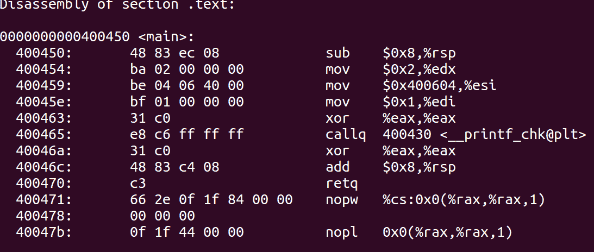

# C 中的内联功能

> 原文:[https://www.geeksforgeeks.org/inline-function-in-c/](https://www.geeksforgeeks.org/inline-function-in-c/)

**内联函数**是那些定义很小的函数，在发生函数调用的地方被替换。函数替换完全是编译器的选择。

让我们举下面的例子:

```
#include <stdio.h>

// Inline function in C
inline int foo()
{
    return 2;
}

// Driver code
int main()
{

    int ret;

    // inline function call
    ret = foo();

    printf("Output is: %d\n", ret);
    return 0;
}
```

**编译器错误:**

```
In function `main':
undefined reference to `foo'

```

**为什么会出现这个错误？**

这是 GCC 处理内联函数方式的副作用之一。编译时， **GCC 执行内联替换作为优化的一部分**。所以 main 内部没有函数调用 present (foo)。请检查下面编译器将生成的汇编代码。



通常 GCC 的文件范围是“非外部链接”。这意味着从未向链接器提供过导致链接器错误的内联函数，如上所述。

**如何消除这个错误？**

要解决此问题，请在内联之前使用“静态”。使用 static 关键字迫使编译器在链接器中考虑这个内联函数，因此程序编译并成功运行。

**示例:**

```
#include <stdio.h>

// Inline function in C
static inline int foo()
{
    return 2;
}

// Driver code
int main()
{

    int ret;

    // inline function call
    ret = foo();

    printf("Output is: %d\n", ret);
    return 0;
}
```

**Output:**

```
Output is: 2

```