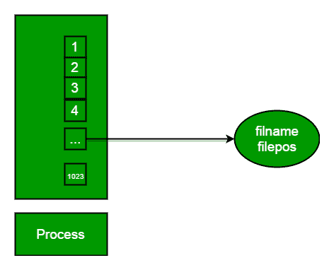
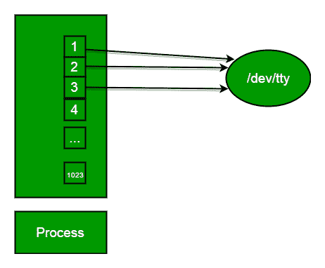

# 输入输出系统调用 C |创建、打开、关闭、读取、写入

> 原文:[https://www . geesforgeks . org/input-output-system-calls-c-create-open-close-read-write/](https://www.geeksforgeeks.org/input-output-system-calls-c-create-open-close-read-write/)

**重要术语**

**什么是文件描述符？**
文件描述符是唯一标识进程打开文件的整数。

**文件描述符表**:文件描述符表是整数数组索引的集合，整数数组索引是文件描述符，其中的元素是指向文件表条目的指针。操作系统中为每个进程提供了一个唯一的文件描述符表。

**文件表条目:**文件表条目是打开文件的内存中结构代理，当进程请求打开文件时创建，这些条目维护文件位置。



**标准文件描述符**:当任何进程启动时，该进程文件描述符表的 fd(文件描述符)0、1、2 自动打开，(默认情况下)这 3 个 fd 中的每一个都引用名为 **/dev/tty** 的文件的文件表条目

**/dev/tty** :终端
的内存代理**终端**:组合键盘/视频屏幕



**从 stdin 读取= >从 fd 0 读取**:每当我们从键盘写入任何字符时，它都会从 stdin 通过 fd 0 读取，并保存到名为/dev/tty 的文件中。
**写入 stdout = >写入 fd 1** :每当我们看到视频屏幕的任何输出，都是来自名为/dev/tty 的文件，并通过 fd 1 写入屏幕中的 stdout。
**写入 stderr = >写入 fd 2** :我们在视频屏幕上看到的任何错误，也是从那个文件通过 fd 2 写入屏幕中的 stderr。

**输入输出系统调用**

基本上总共有 5 种类型的输入/输出系统调用:

**1。创建:**用于创建新的空文件。

```cpp
Syntax in C language: 
int create(char *filename, mode_t mode)
```

**参数:**

*   **文件名:**要创建的文件的名称
*   **模式:**表示新文件的权限。

**返回:**

*   返回第一个未使用的文件描述符(当第一次创建时通常为 3，因为 0、1、2 fd 是保留的)
*   出错时返回-1

**它在操作系统中是如何工作的**

*   在磁盘上创建新的空文件
*   创建文件表条目
*   将第一个未使用的文件描述符设置为指向文件表条目
*   使用了返回文件描述符，失败时返回-1

**2。打开**:用于打开文件进行读取、写入或两者兼有。

```cpp
Syntax in C language 
#include<sys/types.h>
#include<sys/stat.h>
#include <fcntl.h>  
int open (const char* Path, int flags [, int mode ]); 
```

**参数**

*   **路径:**要使用的文件的路径
    *   当您不在文件同一目录下工作时，请使用以“/”开头的绝对路径。
    *   当您在文件的同一个目录下工作时，请使用相对路径，该路径只是带扩展名的文件名。
*   **旗帜:**你喜欢怎么用
    *   **O_RDONLY** :只读， **O_WRONLY** :只写， **O_RDWR** :读写， **O_CREAT** :不存在就创建文件，**O _ exco**:已经存在就阻止创建

**它在 OS 中的工作原理**

*   在磁盘上查找现有文件
*   创建文件表条目
*   将第一个未使用的文件描述符设置为指向文件表条目
*   使用了返回文件描述符，失败时返回-1

## C

```cpp
// C program to illustrate 
// open system call 
#include<stdio.h> 
#include<fcntl.h> 
#include<errno.h> 
extern int errno; 
int main() 
{     
    // if file does not have in directory 
    // then file foo.txt is created. 
    int fd = open("foo.txt", O_RDONLY | O_CREAT); 

    printf("fd = %d/n", fd); 

    if (fd ==-1) 
    { 
        // print which type of error have in a code 
        printf("Error Number % d\n", errno); 

        // print program detail "Success or failure" 
        perror("Program");                 
    } 
    return 0; 
} 
```

**输出:**

```cpp
fd = 3
```

**3。关闭:**告诉操作系统你已经完成了一个文件描述符，并关闭 fd 指向的文件。

```cpp
Syntax in C language
#include <fcntl.h>
int close(int fd); 
```

**参数:**

*   **fd :** 文件描述符

**返回:**

*   **0** 上成功。
*   **-1** 接通错误。

**它在操作系统中的工作原理**

*   销毁文件描述符表
    元素 fd 引用的文件表条目——只要没有其他进程指向它！
*   将文件描述符表的元素 fd 设置为**空**

## C

```cpp
// C program to illustrate close system Call 
#include<stdio.h> 
#include <fcntl.h> 
int main() 
{ 
    int fd1 = open("foo.txt", O_RDONLY); 
    if (fd1 < 0) 
    { 
        perror("c1"); 
        exit(1); 
    } 
    printf("opened the fd = % d\n", fd1); 

    // Using close system Call 
    if (close(fd1) < 0) 
    { 
        perror("c1"); 
        exit(1); 
    } 
    printf("closed the fd.\n"); 
} 
```

**输出:**

```cpp
opened the fd = 3
closed the fd.
```

## C

```cpp
// C program to illustrate close system Call 
#include<stdio.h> 
#include<fcntl.h> 
int main() 
{ 
    // assume that foo.txt is already created 
    int fd1 = open("foo.txt", O_RDONLY, 0); 
    close(fd1); 

    // assume that baz.tzt is already created 
    int fd2 = open("baz.txt", O_RDONLY, 0); 

    printf("fd2 = % d\n", fd2); 
    exit(0); 
} 
```

**输出:**

```cpp
fd2 = 3
```

这里，在这个代码中，第一个 open()返回 **3** ，因为当创建主进程时，那么 fd **0，1，2** 已经被 **stdin** 、 **stdout** 和 **stderr** 获取。所以第一个未使用的文件描述符是文件描述符表中的 **3** 。之后，在 close()系统调用中，释放该 **3** 文件描述符，然后在将 **3** 文件描述符设置为 **null** 之后。所以当我们调用第二个 open()时，那么第一个未使用的 fd 也是 **3** 。所以，这个程序的输出是 **3** 。

**4。read:** 从文件描述符 fd 指示的文件中，read()函数将 cnt 字节的输入读入 buf 指示的存储区域。成功读取()会更新文件的访问时间。

```cpp
Syntax in C language 
size_t read (int fd, void* buf, size_t cnt);  
```

**参数:**

*   **fd:** 文件描述符
*   **buf:** 读取数据的缓冲区
*   **cnt:** 缓冲液长度

**返回:实际读取了多少字节**

*   成功时返回读取的字节数
*   到达文件结尾时返回 0
*   出错时返回-1
*   信号中断时返回-1

**重要点**

*   **buf** 需要指向长度不小于指定大小的有效内存位置，因为溢出。
*   **fd** 应该是从 open()返回的执行读取操作的有效文件描述符，因为如果 fd 为空，那么读取应该会产生错误。
*   **cnt** 是请求读取的字节数，而返回值是实际读取的字节数。此外，有时读取系统调用应该比 cnt 读取更少的字节。

## C

```cpp
// C program to illustrate 
// read system Call 
#include<stdio.h> 
#include <fcntl.h> 
int main() 
{ 
int fd, sz; 
char *c = (char *) calloc(100, sizeof(char)); 

fd = open("foo.txt", O_RDONLY); 
if (fd < 0) { perror("r1"); exit(1); } 

sz = read(fd, c, 10); 
printf("called read(% d, c, 10). returned that"
        " %d bytes were read.\n", fd, sz); 
c[sz] = '\0'; 
printf("Those bytes are as follows: % s\n", c); 
} 
```

**输出:**

```cpp
called read(3, c, 10).  returned that 10 bytes  were read.
Those bytes are as follows: 0 0 0 foo.
```

**假设 foobar.txt 由 6 个 ASCII 字符“foobar”组成。那么下面程序的输出是什么呢？**

## C

```cpp
// C program to illustrate 
// read system Call 
#include<stdio.h> 
#include<unistd.h> 
#include<fcntl.h> 
#include<stdlib.h> 

int main() 
{ 
    char c; 
    int fd1 = open("sample.txt", O_RDONLY, 0); 
    int fd2 = open("sample.txt", O_RDONLY, 0); 
    read(fd1, &c, 1); 
    read(fd2, &c, 1); 
    printf("c = %c\n", c); 
    exit(0); 
} 
```

**输出:**

```cpp
c = f
```

描述符***【fd1】***和***【fd2】***每个都有自己的打开文件表条目，因此每个描述符都有自己的文件位置用于 ***foobar.txt*** 。因此，从 ***fd2*** 读取的是 ***foobar.txt*** 的第一个字节，输出是 **c = f** ，而不是 **c = o** 。

**5。write:** 将 cnt 字节从 buf 写入与 fd 相关联的文件或套接字。cnt 不应大于 INT_MAX(在 limits.h 头文件中定义)。如果 cnt 为零，write()只返回 0，不尝试任何其他操作。

```cpp
#include <fcntl.h>
size_t write (int fd, void* buf, size_t cnt); 
```

**参数:**

*   **fd:** 文件描述符
*   **buf:** 写入数据的缓冲区
*   **cnt:** 缓冲液长度

**返回:实际写入了多少字节**

*   返回成功时写入的字节数
*   到达文件结尾时返回 0
*   出错时返回-1
*   信号中断时返回-1

**重要点**

*   需要打开文件进行写操作
*   **buf** 需要至少与 cnt 规定的一样长，因为如果 buf 尺寸小于 cnt，那么 buf 将导致溢出情况。
*   **cnt** 是请求写入的字节数，返回值是实际写入的字节数。当 **fd** 要写入的字节数少于 cnt 时，就会出现这种情况。
*   如果 write()被信号中断，效果为以下之一:
    -如果 write()尚未写入任何数据，则返回-1 并将 errno 设置为 EINTR。
    -如果 write()已成功写入一些数据，它将返回中断前写入的字节数。

## C

```cpp
// C program to illustrate 
// write system Call 
#include<stdio.h> 
#include <fcntl.h> 
main() 
{ 
int sz; 

int fd = open("foo.txt", O_WRONLY | O_CREAT | O_TRUNC, 0644); 
if (fd < 0) 
{ 
    perror("r1"); 
    exit(1); 
} 

sz = write(fd, "hello geeks\n", strlen("hello geeks\n")); 

printf("called write(% d, \"hello geeks\\n\", %d)."
    " It returned %d\n", fd, strlen("hello geeks\n"), sz); 

close(fd); 
} 
```

**输出:**

```cpp
called write(3, "hello geeks\n", 12).  it returned 11
```

在这里，当你在文件 foo.txt 中看到运行完的代码后，你会得到一个“*你好极客*”。如果 foo.txt 文件中已经有了一些内容，那么写系统调用会覆盖这些内容，并且所有先前的内容都被 ***删除了*** 并且只有“*你好极客*”的内容会存在于文件中。

**不使用任何 printf 或 cout 功能，从程序中打印“hello world”。**

## C

```cpp
// C program to illustrate 
// I/O system Calls 
#include<stdio.h> 
#include<string.h> 
#include<unistd.h> 
#include<fcntl.h> 

int main (void) 
{ 
    int fd[2]; 
    char buf1[12] = "hello world"; 
    char buf2[12]; 

    // assume foobar.txt is already created 
    fd[0] = open("foobar.txt", O_RDWR);         
    fd[1] = open("foobar.txt", O_RDWR); 

    write(fd[0], buf1, strlen(buf1));         
    write(1, buf2, read(fd[1], buf2, 12)); 

    close(fd[0]); 
    close(fd[1]); 

    return 0; 
} 
```

**输出:**

```cpp
hello world
```

在这段代码中，buf1 数组的字符串 ***【你好世界】*** 首先写入 stdin fd[0]，然后这个字符串写入 stdin 到 buf2 数组。之后写入 buf2 数组到 stdout 并打印输出“ ***你好世界*** ”。
本文由 [**卡达姆·帕特尔**](https://www.facebook.com/kadam.patel.750?hc_ref=NEWSFEED) 供稿。如果你喜欢 GeeksforGeeks 并想投稿，你也可以使用[write.geeksforgeeks.org](https://write.geeksforgeeks.org)写一篇文章或者把你的文章邮寄到 review-team@geeksforgeeks.org。看到你的文章出现在极客博客主页上，帮助其他极客。
如果发现有不正确的地方，或者想分享更多关于上述话题的信息，请写评论。