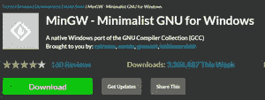
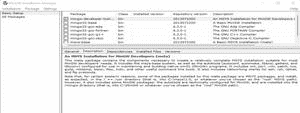
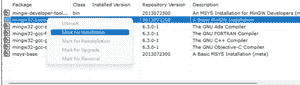
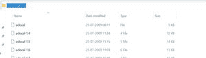
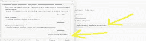
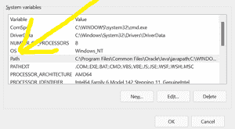

# 为 C/C++安装 MinGW 工具并更改环境变量

> 原文:[https://www . geesforgeks . org/installing-mingw-tools-for-c-c-and-changing-environment-variable/](https://www.geeksforgeeks.org/installing-mingw-tools-for-c-c-and-changing-environment-variable/)

MinGW 是一个本地的 C/C++编译器(GCC) ，它有免费的可分发的导入库和头文件来构建本地的窗口应用程序。在本教程中，我们将为 C/C++安装 MinGW。为了在我们的设备上成功安装 MinGW，我们必须执行以下几个步骤。

**<u>如何安装 C/C++的 MinGW 工具？</u>T3】**

**第一步:**前往 [MinGW](https://sourceforge.net/projects/mingw/) 网站，点击下载。它将在 5 秒后开始下载。

**第二步:**双击打开 exe MinGW 文件，点击安装。它将自动开始下载 MinGW 的所有设置。
**第三步:**完成所有设置后点击继续。现在将弹出 **MinGW 安装管理器**。

**第 4 步:**在安装管理器中右键单击每个选项，然后单击**标记安装**。

**步骤 5:** 在安装中，选项-单击应用更改。然后选择**应用。**将开始下载所有文件。需要 5-6 分钟。完成后点击**关闭。**

**<u>如何改变 MinGW 的环境变量</u>**

成功安装 MinGW 后，下一步是改变 MinGW 的环境位置。

**步骤 1:** 转到设备上的 **C 盘**并搜索 **MinGW** 文件夹。在 MinGW 文件夹中，转到**箱**文件夹并复制其路径。

**第二步**:转到**控制面板**再转到**系统**再转到**高级系统设置**再转到**环境变量。**

**第三步**:在系统变量中搜索**路径**，然后选择**编辑。**现在通过点击**新建向其添加新路径。**现在粘贴路径，点击确定。

这标志着 MinGW 在系统中的完全安装。