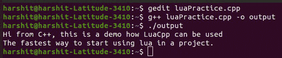
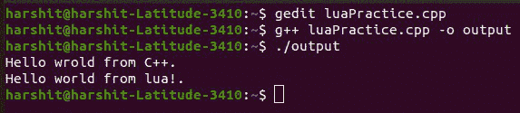

# 在 C++中集成 Lua

> 原文:[https://www.geeksforgeeks.org/integrating-lua-in-cpp/](https://www.geeksforgeeks.org/integrating-lua-in-cpp/)

[Lua](https://www.geeksforgeeks.org/difference-between-python-and-lua-programming-language/) 是一种高级的、[多范式编程语言](https://www.geeksforgeeks.org/introduction-of-programming-paradigms/)，主要用于嵌入式应用以及对现有产品的强大脚本支持。例如 NGINX、HA 代理、 [Wireshark](https://www.geeksforgeeks.org/wireshark-packet-capturing-and-analyzing/) 等的脚本增强。Lua 找到应用的另一个主要领域是游戏引擎框架。

### **为什么要用 Lua？**

选择 Lua 来提供脚本支持有多种原因:

*   与其他脚本框架相比，它占用空间小，速度快。
*   在版本 **2.0** 中，Lua 进行了一次重大的重组，带来了显著的性能提升。
*   此外，Lua 还带来了一个 JIT [编译器](https://www.geeksforgeeks.org/introduction-of-compiler-design/)，速度非常快，占用空间非常小。
*   与其他流行的脚本平台(Python)相比，Lua 占用的内存更少。
*   Lua 有一个简单但非常高效的语法。
*   它开箱即用地支持将匿名[函数作为参数](https://www.geeksforgeeks.org/passing-function-as-an-argument-in-python/)、[映射](https://www.geeksforgeeks.org/map-associative-containers-the-c-standard-template-library-stl/) / [数组](https://www.geeksforgeeks.org/introduction-to-arrays/)作为一个称为“表”、元函数和元表的概念传递，允许实现各种编程范式等。

尽管有上述所有优点，Lua 提供了一个非常低级的 C **API** ，这要求开发人员在应用程序中使用 Lua 引擎之前先了解它的内部结构。然而，随着 **Lua Cpp 库**的出现，这种情况发生了变化。

**LuaCpp:** 它是一个用于 Lua C APIs 的轻量级包装器，提供了对两个级别的 Lua 库的访问，即通过隐藏 C API 和引擎复杂性的高级 API 的访问，以及对 Lua 低级 API 的访问。

### **如何安装 Lua？**

**LuaCpp** 可以作为一个系统范围的库安装，或者作为您现有项目的子模块安装。运行下面的命令在 ubuntu 中安装 LuaCpp。

*   从以下链接克隆 LuaCpp 库:

> => git 克隆 https://github . com/Jordan vrtanoski/Lua CPP . git

*   使用以下命令，将目录更改为 luacpp，创建一个新目录作为构建，并将目录更改为再次构建:

> => cd luacpp
> = > mkdir 构建
> = > cd 构建

*   现在，使用以下命令制作信号源:

> => cmake../来源
> = > make -j `nproc `

*   现在，使用以下命令安装库:

> = >进行安装

安装库后，按如下方式构建文件:

> = > gcc hello . CPP-I/usr/local/include/Lua CPP-I/usr/include/Lua 5.3/-llu acpp-llu a 5.3-lstdc++-o hello

将文件输出为:

> = >你好

下面是同样的程序来说明同样的情况:

## C++

```cpp
// C++ program to illustrate the use of
// LuaCpp library
#include <LuaCpp.hpp>
#include <iostream>
using namespace LuaCpp::Registry;
using namespace std;

// Driver Code
int main(int argc, char** argv)
{

    cout << "Hi from C++, this is a demo"
         << " how LuaCpp can be used\n";

    LuaContext lua;

    // The simples way is to use
    // CompileStringAndRun method
    try {

        lua.CompileStringAndRun(
            "print('The fastest way to "
            "start using lua in "
            "a project')");
    }

    catch (std::runtime_error& e) {
        std::cout << e.what()
                  << '\n';
    }
}
```

**输出:**

[](https://media.geeksforgeeks.org/wp-content/uploads/20210416105738/LuaPracticeProgram1.jpg)

### **将数据从 C++传到 Lua 再传回来:**

这个例子向我们展示了如何编译和执行来自 [C++](https://www.geeksforgeeks.org/c-plus-plus/) 的 Lua 代码片段。但是，如果没有将数据从 **C++传递到 Lua** ，再从 **Lua 传递回 C++** 的能力，这种模式能够解决的现实案例并不多。

LuaCpp 到达时准备好在两个执行环境之间建立桥梁，将尽可能少地了解 Lua 的内部工作，并使用最少的代码。让我们通过添加一个将由两个执行环境共享的变量来改进**“Hello World”**示例。这引入了一个名为“**世界**”的“**字符串**”变量，并用来自 **C++上下文**的值填充它。在 Lua 上下文中，更新变量值，并在返回 C++上下文时打印变量值。

下面是同样的程序来说明:

## C++

```cpp
// C++ program to illustrate the
// above approach
#include <LuaCpp.hpp>
#include <iostream>
using namespace LuaCpp;
using namespace LuaCpp::Registry;
using namespace LuaCpp::Engine;
using namespace std;

// Driver Code
int main(int argc, char** argv)
{
    LuaContext ctx;

    shared_ptr<Engine::LuaTString> str = make_shared<Engine::LuaTString>(
        "world from C++!");

  ctx.AddGlobalVariable("world", str));
  ctx.CompileString("test",
                    "print('Hello '..world)"
                    "world = 'world from lua!'");

  // Try Catch Block
  try {
      ctx.Run("test");
  }
  catch (runtime_error& e) {
      cout << e.what() << '\n';
  }

  cout << "Hello "
       << str->getValue() << "\n";
}
```

**输出:**

[](https://media.geeksforgeeks.org/wp-content/uploads/20210416105737/LuaPracticeProgram2.jpg)

上下文允许将多个变量从 [C++范围](https://www.geeksforgeeks.org/scope-of-variables-in-c/)传递到 Lua 范围，反之亦然。上述模式允许在大多数情况下向 **C++项目**添加脚本支持。简单的 4 步流程是:

*   创建上下文。
*   创建共享变量，并将其注册到上下文中。
*   编译 Lua 脚本(从字符串、文件或文件夹中的多个文件)。
*   运行脚本。

### **支持的 Lua 类型:**

LuaCpp 提供了以下类型的变量，可以在 C++和 Lua 上下文之间传递:

*   **“LuaTString”:**相当于 C++中的“std::string”。
*   **“LuaTNumber”:**相当于 C++中的“double”。LUA 允许将**LUA _ tnnumber**(数字的内部 Lua 类型)编译为浮点数，但是，LuaCpp 将包含在 C++上下文中以双精度表示的内容，这意味着，在 Lua 库被定制为将数字定义为浮点数的情况下，可能会由于精度而丢失数据。
*   **“LuaTBoolean”:**相当于 C++中的“ **bool** ”。
*   **“Luatnil”:**Lua 引擎用来表示缺少值的空类型。
*   **“LuaTTable”:**数组/映射的混合，在 C++中实现为“std::map”。映射可以有一个字符串或数字作为键，当映射中的所有键都是数字类型时，映射代表一个数组。这遵循 Lua 表实现的逻辑。
*   **“Luatuserdata”:**一种允许实现用户定义类型的特殊类型。这是一个非常强大的类型，引擎的**Luame object**类型就是基于这个原语类型实现的。这个概念值得单独写一篇文章。

### **结论:**

向现有的 C++项目添加脚本支持为开发的应用程序带来了巨大的灵活性和可配置性。虽然 Lua C APIs 不是很复杂，但它们仍然要求开发人员充分理解 Lua 虚拟机的内部工作。正如本文所述，LuaCpp 正在抽象所有这些复杂性，并提供了一个 C++开发人员非常熟悉的界面。