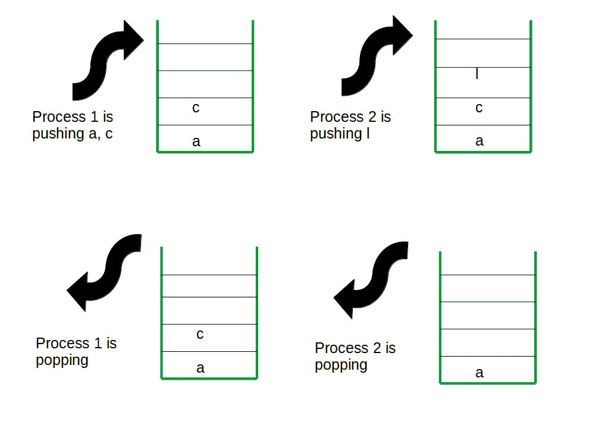
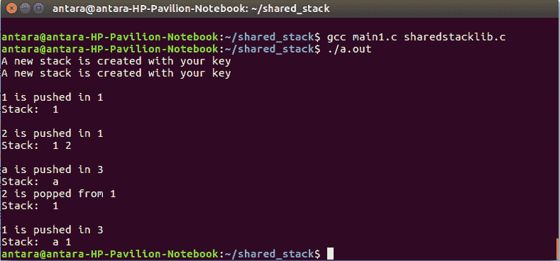
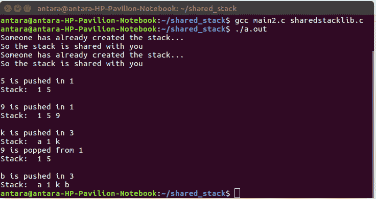

# 使用共享堆栈的进程间通信

> 原文:[https://www . geesforgeks . org/进程间通信-使用共享堆栈/](https://www.geeksforgeeks.org/inter-process-communication-using-a-shared-stack/)

通过共享内存的进程间通信是一个概念，其中两个或多个进程可以访问公共内存，通信是通过这个共享内存完成的，其中一个进程所做的更改可以被另一个进程看到。因此，我们可以使用一个堆栈作为共享内存，共享该堆栈的用户(进程)可以推送或弹出元素。他们可以创建一个新的共享堆栈，也可以删除它们。



现在，到了头文件的时候了。如果有一个标题(。h 扩展名)和一个库文件，那么所有进程都可以使用这些库函数，因此它们不需要为每个函数编写代码。所以，有 3 个程序。
1。**stack lib . h**–头文件。
2。**sharedstacklib . c**–stack lib . h 的库文件。
3。**main . c**–用户代码。
我们可以使用 4 个函数进行共享堆栈操作。
1。**shstack push()**–用于推动元件。
2。**shstack op()**–用于弹出最后一个元素。
3。**shstackget()**–用户将输入一个密钥，并使用该密钥创建共享堆栈。所有的推送、弹出或移除功能都将由特定堆栈的特定键来完成。如果任何用户输入相同的密钥，它将与之前使用该密钥创建堆栈的用户共享堆栈。
4。**shstack RM()**–用于移除堆栈。
已经使用了一些 IPC 系统调用-
**shmget()**–创建共享内存段。
**shmat()，shmdt()**–与共享内存连接和分离。
**shmctl()**–删除共享内存段。
**SEM get()**–创建信号量。
**semctl()**–控制信号量操作。
**1。**-头文件。代码如下

## C

```cpp
// C Program for header file of a shared stack
#include <stdbool.h>
#include <stdio.h>
#include <stdlib.h>
#include <string.h>
#include <sys/ipc.h>
#include <sys/sem.h>
#include <sys/sem.h>
#include <sys/shm.h>
#include <sys/types.h>
#include <unistd.h>

#ifndef _MYLIB_H_
#define _MYLIB_H_

// structure for stack descriptor
struct stack_desc {
    key_t stkey; // key for the stack
    int data_size; // integer or character
    int stack_size;
    int top;
    int ele_no;
    bool free; // stack is used by any process ot not
};
typedef struct stack_desc stack_desc;

extern void shstackget(key_t mykey, int data_size, int stack_size);
extern void shstackpush(key_t key, int ele);
extern void shstackpop(key_t key);
extern void shstackrm(key_t key);

#endif
```

**2。共享软件包-代码如下** 

## C

```cpp
// C Program for sharedstacklib.c
#include "stacklib.h"
#define NO_SEM 1

// P(s) for adding 1 with the current semaphore value
#define P(s) semop(s, &Pop, 1);

// v(s) for reducing 1 with the current semaphore value
#define V(s) semop(s, &Vop, 1);

struct sembuf Pop;
struct sembuf Vop;

int* k;
struct stack_desc (*shared_stacks)[10];
void shstackget(key_t mykey, int data_size, int stack_size)
{
    int status;

    union semun {
        int val; /* Value for SETVAL */
        struct semid_ds* buf; /* Buffer for IPC_STAT, IPC_SET */
        unsigned short* array; /* Array for GETALL, SETALL */
        struct seminfo* __buf; /* Buffer for IPC_INFO (Linux-specific) */
    } setvalArg;

    Pop.sem_num = 0;
    Pop.sem_op = -1;
    Pop.sem_flg = SEM_UNDO;

    Vop.sem_num = 0;
    Vop.sem_op = 1;
    Vop.sem_flg = SEM_UNDO;

    // creating the key for the sharedstack descriptor
    key_t key = ftok("/home/antara/shared_stack/sharedstacklib.c", 1);
    if (key == -1) {
        perror("ftok() failed");
        exit(1);
    }

    // shmid for the stack descriptor
    int shmid = shmget(key, sizeof(struct stack_desc), IPC_CREAT | 0777);

    shared_stacks = shmat(shmid, NULL, 0);
    int i;
    key_t newkey, keys;
    key_t y = ftok("/home/antara/stackkey.c", 1);

    // for attachment of a shared array of keys
    int shmidt = shmget(y, sizeof(int), IPC_CREAT | 0777);

    k = shmat(shmidt, NULL, 0);
    for (i = 0; i < 10; i++) {
        if (k[i] == mykey && shared_stacks[i]->free == true) // for already used key
        {
            printf("Someone has already created the stack...\nSo the stack is shared with you\n");
            int semid = semget(shared_stacks[i]->stkey, NO_SEM, IPC_CREAT | 0777);
            break;
        }
        else if (k[i] != mykey && shared_stacks[i]->free == false) // for new key
        {
            shared_stacks[i]->free = true;

            k[i] = mykey;
            newkey = i + 1;
            char file[] = "f_.txt";
            file[1] = '0' + (newkey - 1);
            FILE* fp;
            fp = fopen(file, "w"); // creating one .txt file for ftok() of different stack segments
            fclose(fp);
            char keyp[30];
            strcpy(keyp, "/home/antara/shared_stack/");

            strcat(keyp, file);

            keys = ftok(keyp, 1);
            if (keys == -1) {
                perror("ftok() failed");
                exit(1);
            }

            /*updating the stack_desc*/
            shared_stacks[i]->stkey = keys;
            shared_stacks[i]->top = -1;
            shared_stacks[i]->data_size = data_size;
            shared_stacks[i]->stack_size = stack_size;
            shared_stacks[i]->ele_no = 0;
            printf("A new stack is created with your key \n");
            setvalArg.val = 1;
            int semid = semget(keys, NO_SEM, IPC_CREAT | 0777);
            status = semctl(semid, 0, SETVAL, setvalArg); // making semaphore value 1
            if (status == -1) {
                perror("semctl() failed");
                exit(1);
            }
            break;
        }
    }
}

// For pushing elements in the stack
void shstackpush(key_t key, int ele)
{
    int i, j = -1;
    for (i = 0; i < 10; i++) {
        if (k[i] == key) // valid key
        {
            j = i;
            break;
        }
    }
    int semid;

    if (j == -1) // invalid key
    {
        printf("No stack with your key\nTry again with different key\n");
    }
    else if (j != -1) {
        P(semid);

        // for integer
        if (shared_stacks[j]->data_size == 4) {
            int* stack;
            key_t keys = shared_stacks[j]->stkey;
            int shmid = shmget(keys, sizeof(int) * shared_stacks[j]->stack_size, IPC_CREAT | 0777);
            int h = ele;
            stack = shmat(shmid, NULL, 0);
            int top = shared_stacks[j]->top;
            if (top == shared_stacks[j]->stack_size - 1) // empty stack
            {
                printf("No elements can be pushed\n");
            }
            else if (top < shared_stacks[j]->stack_size) {
                top++ ;
                stack[top] = h;
                printf("\n%d is pushed in %d\n", stack[top], key);

                shared_stacks[j]->top = top;
                shared_stacks[j]->ele_no = top + 1;
            }
            printf("Stack:  ");
            for (i = 0; i <= top; i++) {
                printf("%d ", stack[i]);
            }
            printf("\n");
            shmdt(stack);
        }

        // for character
        else if (shared_stacks[j]->data_size == 1) {
            char* stack;
            key_t keys = shared_stacks[j]->stkey;
            int shmid = shmget(keys, sizeof(char) * shared_stacks[j]->stack_size, IPC_CREAT | 0777);
            int semid = semget(keys, NO_SEM, IPC_CREAT | 0777);

            stack = shmat(shmid, NULL, 0);
            int top = shared_stacks[j]->top;
            if (top == shared_stacks[j]->stack_size - 1) // empty stack
            {
                printf("No elements can be pushed\n");
            }

            else if (top < shared_stacks[j]->stack_size) {
                top++ ;
                stack[top] = ele;
                printf("\n%c is pushed in %d\n", stack[top], key);

                shared_stacks[j]->top = top;
                shared_stacks[j]->ele_no = top + 1;
            }

            printf("Stack:  ");
            for (i = 0; i <= top; i++) {
                printf("%c ", stack[i]);
            }
            printf("\n");
            shmdt(stack);
        }
        V(semid);
    }
}

// Function for popping the last element out
void shstackpop(key_t key)
{
    int i, j = -1;
    for (i = 0; i < 10; i++) {
        if (k[i] == key) // valid key
        {
            j = i;
            break;
        }
    }
    int semid;
    if (j == -1) // invalid key
    {
        printf("No stack with your key\nTry again with different key\n");
    }
    else if (j != -1) {
        P(semid);
        if (shared_stacks[j]->data_size == 4) {
            key_t keys = shared_stacks[j]->stkey;
            int* stack;
            int shmid = shmget(keys, sizeof(int) * shared_stacks[j]->stack_size, IPC_CREAT | 0777);
            semid = semget(keys, NO_SEM, IPC_CREAT | 0777);

            stack = shmat(shmid, NULL, 0);
            int top = shared_stacks[j]->top;
            if (top == -1) {
                printf("No element can be popped \n");
            }
            else if (top >= -1) {
                int a = stack[top];
                top--;
                printf("%d is popped from %d\n", a, key);
                shared_stacks[j]->top = top;
                shared_stacks[j]->ele_no = top + 1;
            }
            printf("Stack:  ");
            for (i = 0; i <= top; i++) {
                printf("%d ", stack[i]);
            }
            printf("\n");
            shmdt(stack);
        }
        else if (shared_stacks[j]->data_size == 1) {
            key_t keys = shared_stacks[j]->stkey;
            char* stack;
            int shmid = shmget(keys, sizeof(char) * shared_stacks[j]->stack_size, IPC_CREAT | 0777);
            semid = semget(keys, NO_SEM, IPC_CREAT | 0777);
            stack = shmat(shmid, NULL, 0);
            int top = shared_stacks[j]->top;
            if (top == -1) {
                printf("No element can be popped \n");
            }
            else if (top >= -1) {
                int a = stack[top];
                top--;
                printf("%c is popped from %d\n", a, key);
                shared_stacks[j]->top = top;
                shared_stacks[j]->ele_no = top + 1;
            }
            printf("Stack:  ");
            for (i = 0; i <= top; i++) {
                printf("%c ", stack[i]);
            }
            printf("\n");
            shmdt(stack);
        }
        V(semid);
    }
}

// Function for removing the stack
void shstackrm(key_t key)
{
    int i;
    int j = -1;
    for (i = 0; i < 10; i++) {
        if (k[i] == key) // valid key
        {
            j = i;
            break;
        }
    }
    if (j == -1) // invalid key
    {
        printf("No stack with your key\nTry again with different key\n");
    }

    else if (j != -1) {
        key_t keys = shared_stacks[j]->stkey;
        int shmid;
        if (shared_stacks[j]->data_size == 4) {
            shmid = shmget(keys, sizeof(int) * shared_stacks[j]->stack_size, IPC_CREAT | 0777);
        }
        else if (shared_stacks[j]->data_size == 1) {
            shmid = shmget(keys, sizeof(char) * shared_stacks[j]->stack_size, IPC_CREAT | 0777);
        }
        shared_stacks[j]->free = false;
        shared_stacks[j]->top = -1;
        k[j] = 0;
        shmctl(shmid, IPC_RMID, NULL); // removing the stack
        printf("Stack is removed\n");
    }
}
```

**3。main 1 . c**-1 号流程调用功能。
代码如下

## C

```cpp
// C Program for process1
#include "stacklib.h"
#include <stdio.h>

int main()
{

    shstackget(1, 4, 10);
    shstackget(3, 1, 6);
    shstackpush(1, 1);
    shstackpush(1, 2);
    shstackpush(3, 'a');
    shstackpop(1);
    shstackpush(3, '1');

    return 0;
}
```

**3。main 2 . c**-2 号进程调用函数。
代码如下

## C

```cpp
// C Program for process2
#include "stacklib.h"
#include <stdio.h>

int main()
{
    shstackget(1, 4, 10);
    shstackget(3, 1, 6);
    shstackpush(1, 5);
    shstackpush(1, 9);
    shstackpush(3, 'k');
    shstackpop(1);
    shstackpush(3, 'b');

    return 0;
}
```

您可以使用编译代码

```cpp
gcc main1.c sharedstacklib.c 
```

```cpp
gcc main2.c sharedstacklib.c
```

**执行 main1.c
后输出:**



执行 main2.c
后

