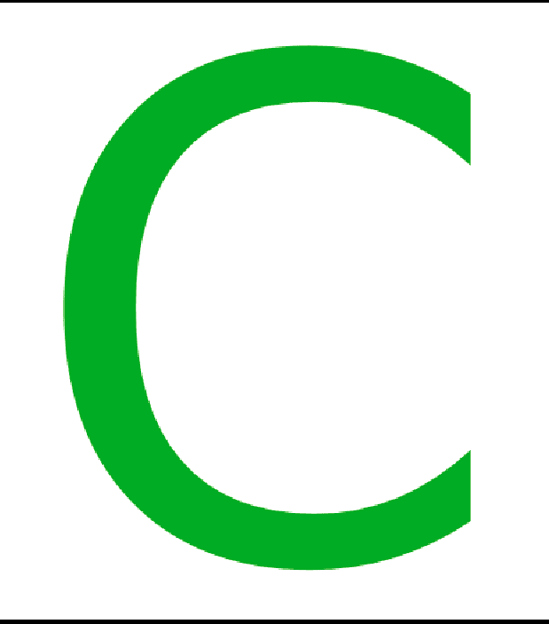

# 关于 C 语言的有趣事实

> 原文:[https://www . geesforgeks . org/interior-facts-about-c-language/](https://www.geeksforgeeks.org/interesting-facts-about-c-language/)

1.  [C 语言](https://www.geeksforgeeks.org/c-language-set-1-introduction/)刚开始不叫 C。经过许多进化阶段后，它被命名为 C。进化 C:

> 某物-> BCPL -> B ->传统 C -> K&R C -> ANSI C -> ANSI/ISO C -> C99。

2.  它是由丹尼斯·里奇于 1972 年在贝尔实验室开发的。
3.  **为什么取名为 C？**C 语言的命名背后没有这样的逻辑。
    它的开发涵盖了 B 语言的所有不可及之处(BCPL 的简化版)。所以，它被命名为 C，因为它在英文字母中紧挨着 B。
4.  c 语言是唯一存在这么长时间的编程语言，并且仍然被广泛使用。
5.  C 是很多其他编程语言的基础，比如 [C++ ](https://www.geeksforgeeks.org/c-plus-plus/) 、 [Java](https://www.geeksforgeeks.org/java/) 、 [JavaScript](https://www.geeksforgeeks.org/javascript-tutorial/) 、Go、 [C#](https://www.geeksforgeeks.org/csharp-programming-language/) 、 [PHP](https://www.geeksforgeeks.org/php/) 、 [Python](https://www.geeksforgeeks.org/python-programming-language/) 、Perl、C-shell 等等。
6.  Unix 是第一批用汇编以外的语言实现的操作系统内核之一，那就是 c 语言。
7.  以前，C 被认为是高级语言，但今天许多程序员认为它是低级语言，因为它只支持标量操作。
8.  C18 是 2018 年 6 月发布的最新版本的 C 编程语言。

**编程事实:**

1.  "?: "是 C 语言中唯一的三元运算符。
2.  “sizeof”是唯一也是关键字的运算符。
3.  在 printf()和 scanf()中，f 代表格式化的 not 函数。
4.  编译器不知道头文件，预处理器处理这些并扩展源代码。
5.  头文件名称可以包括两种方式，(a)使用尖括号(b)使用双倒逗号。
6.  编译器生成汇编代码而不是机器代码，然后汇编程序生成机器代码。
7.  sizeof 运算符不能告诉我们函数的大小，因为该运算符在编译时工作，函数在运行时加载到内存中。

**如何学习 C？**
从 2018 年 1 月 31 日开始使用免费在线课程[用 C 编程基础](https://practice.geeksforgeeks.org/courses/AKTU-First-Year?vb=125)学习 C。

[在此注册](https://practice.geeksforgeeks.org/courses/AKTU-First-Year?vb=125)