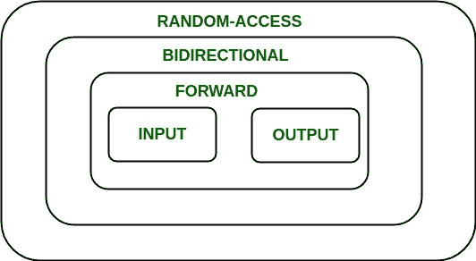
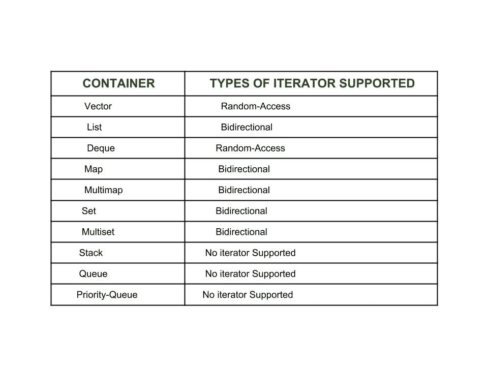
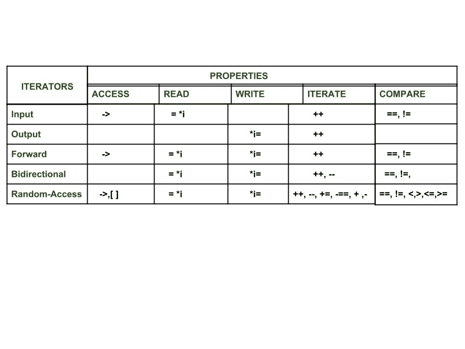

# c++ 迭代器介绍

> 原文:[https://www.geeksforgeeks.org/introduction-iterators-c/](https://www.geeksforgeeks.org/introduction-iterators-c/)

一个**迭代器**是一个指向容器内部元素的对象(像一个指针)。我们可以使用迭代器来遍历容器的内容。它们可以被可视化为类似于指向某个位置的指针，我们可以使用它们访问该特定位置的内容。

迭代器在连接算法和容器以及处理存储在容器中的数据方面起着至关重要的作用。迭代器最明显的形式是指针。指针可以指向数组中的元素，并可以使用增量运算符(++)遍历它们。但是，并非所有迭代器都具有与指针类似的功能。

根据迭代器的功能，它们可以分为五类，如下图所示，外部迭代器功能最强，因此内部迭代器功能最弱。



现在 STL 中的所有容器都不支持这些迭代器，不同的容器支持不同的迭代器，就像向量支持[随机访问迭代器](https://www.geeksforgeeks.org/random-access-iterators-in-cpp/)，而列表支持[双向迭代器。](https://www.geeksforgeeks.org/bidirectional-iterators-in-cpp/)完整列表如下:



**迭代器的类型**:根据迭代器的功能，可以分为五大类:

1.  [**输入迭代器**](https://www.geeksforgeeks.org/input-iterators-in-cpp/) :它们是所有迭代器中最弱的，功能非常有限。它们只能在单程算法中使用，即那些顺序处理容器的算法，因此没有元素被访问超过一次。
2.  [**输出迭代器**](https://www.geeksforgeeks.org/output-iterators-cpp/) :和[输入迭代器](https://www.geeksforgeeks.org/input-iterators-in-cpp/)一样，它们的功能也非常有限，只能用在单程算法中，但不能用于访问元素，只能用于被赋值元素。
3.  [**前向迭代器**](https://www.geeksforgeeks.org/forward-iterators-in-cpp/) :它们在层次上高于[输入](https://www.geeksforgeeks.org/input-iterators-in-cpp/)和[输出迭代器](https://www.geeksforgeeks.org/output-iterators-cpp/)，并且包含了这两个迭代器中存在的所有特性。但是，顾名思义，它们也只能向前移动，而且一步一个脚印。
4.  [**双向迭代器**](https://www.geeksforgeeks.org/bidirectional-iterators-in-cpp/) :它们具有[正向迭代器](https://www.geeksforgeeks.org/forward-iterators-in-cpp/)的所有特性，同时克服了[正向迭代器](https://www.geeksforgeeks.org/forward-iterators-in-cpp/)的缺点，因为它们可以双向移动，这就是为什么它们的名字是双向的。
5.  [**随机访问迭代器**](https://www.geeksforgeeks.org/random-access-iterators-in-cpp/) :它们是最强大的迭代器。它们并不局限于按顺序移动，顾名思义，它们可以随机访问容器内的任何元素。它们的功能与指针相同。

下图显示了它们在可执行的各种操作方面的功能差异。



**迭代器的好处**

肯定有很多方法表明迭代器对我们非常有用，并鼓励我们深刻地使用它。使用迭代器的一些好处如下:

1.  **Convenience in programming:** It is better to use iterators to iterate through the contents of containers as if we will not use an iterator and access elements using [ ] operator, then we need to be always worried about the size of the container, whereas with iterators we can simply use member function end() and iterate through the contents without having to keep anything in mind.

    ```cpp
    // C++ program to demonstrate iterators

    #include <iostream>
    #include <vector>
    using namespace std;
    int main()
    {
        // Declaring a vector
        vector<int> v = { 1, 2, 3 };

        // Declaring an iterator
        vector<int>::iterator i;

        int j;

        cout << "Without iterators = ";

        // Accessing the elements without using iterators
        for (j = 0; j < 3; ++ j) 
        {
            cout << v[j] << " ";
        }

        cout << "\nWith iterators = ";

        // Accessing the elements using iterators
        for (i = v.begin(); i != v.end(); ++ i)
        {
            cout << *i << " ";
        }

        // Adding one more element to vector
        v.push_back(4);

        cout << "\nWithout iterators = ";

        // Accessing the elements without using iterators
        for (j = 0; j < 4; ++ j) 
        {
            cout << v[j] << " ";
        }

        cout << "\nWith iterators = ";

        // Accessing the elements using iterators
        for (i = v.begin(); i != v.end(); ++ i) 
        {
            cout << *i << " ";
        }

        return 0;
    }
    ```

    输出:

    ```cpp
    Without iterators = 1 2 3
    With iterators = 1 2 3
    Without iterators = 1 2 3 4
    With iterators = 1 2 3 4

    ```

    **解释:**从上面的代码中可以看出，在不使用迭代器的情况下，我们需要跟踪容器中的所有元素。一开始只有三个元素，但是在再插入一个元素之后，for 循环也必须相应地修改，但是使用迭代器，for 循环的时间保持不变。所以，迭代器简化了我们的任务。

2.  **Code reusability:** Now consider if we make **v** a list in place of vector in the above program and if we were not using iterators to access the elements and only using [ ] operator, then in that case this way of accessing was of no use for list (as they don’t support [random-access iterators](https://www.geeksforgeeks.org/random-access-iterators-in-cpp/)).

    然而，如果我们使用向量迭代器来访问元素，那么只需在迭代器的声明中将向量更改为列表就可以达到目的，而不需要做任何其他事情
    所以，迭代器支持代码的可重用性，因为它们可以用来访问任何容器的元素。

3.  **Dynamic processing of the container:** Iterators provide us the ability to dynamically add or remove elements from the container as and when we want with ease.

    ```cpp
    // C++ program to demonstrate iterators

    #include <iostream>
    #include <vector>
    using namespace std;
    int main()
    {
        // Declaring a vector
        vector<int> v = { 1, 2, 3 };

        // Declaring an iterator
        vector<int>::iterator i;

        int j;

        // Inserting element using iterators
        for (i = v.begin(); i != v.end(); ++ i) {
            if (i == v.begin()) {
                i = v.insert(i, 5);
                // inserting 5 at the beginning of v
            }
        }

        // v contains 5 1 2 3

        // Deleting a element using iterators
        for (i = v.begin(); i != v.end(); ++ i) {
            if (i == v.begin() + 1) {
                i = v.erase(i);
                // i now points to the element after the
                // deleted element
            }
        }

        // v contains 5 2 3

        // Accessing the elements using iterators
        for (i = v.begin(); i != v.end(); ++ i) {
            cout << *i << " ";
        }

        return 0;
    }
    ```

    输出:

    ```cpp
    5 2 3

    ```

    **解释:**从上面的代码中可以看出，我们可以使用迭代器轻松、动态地在容器中添加和移除元素，但是，在不使用元素的情况下进行同样的操作会非常繁琐，因为每次插入之前和删除之后都需要移动元素。

本文由**姆里根德拉·辛格**供稿。如果你喜欢 GeeksforGeeks 并想投稿，你也可以使用[contribute.geeksforgeeks.org](http://www.contribute.geeksforgeeks.org)写一篇文章或者把你的文章邮寄到 contribute@geeksforgeeks.org。看到你的文章出现在极客博客主页上，帮助其他极客。

如果你发现任何不正确的地方，或者你想分享更多关于上面讨论的话题的信息，请写评论。