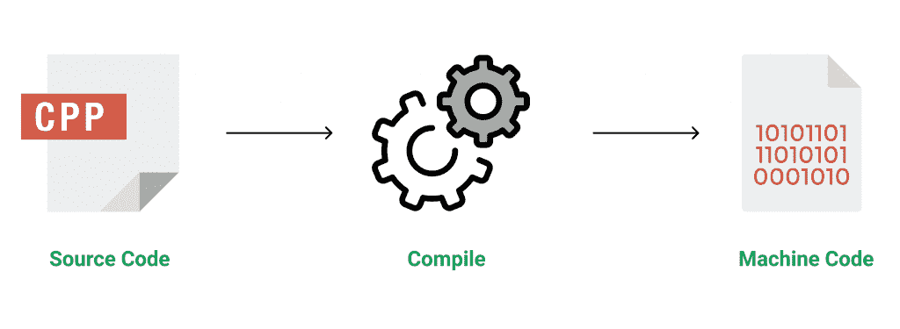

# c++ 编程语言介绍

> 原文:[https://www . geesforgeks . org/introduction-to-c-programming-language/](https://www.geeksforgeeks.org/introduction-to-c-programming-language/)

**C++** 是一种通用编程语言，它是作为 C 语言的增强而开发的，包括面向对象的范例。这是一个命令式和一个**编译的**语言。

C++ 是一种中级语言，使其具有编程低级(驱动程序、内核)甚至高级应用程序(游戏、图形用户界面、桌面应用程序等)的优势。).C 和 C++ 的基本语法和代码结构是相同的。

关于编程语言的一些 ***特性&要点*** 注意事项如下:

*   **Simple** :它是一种简单的语言，可以将程序分解成逻辑单元和部分，拥有丰富的库支持和多种数据类型。
*   **机器独立但平台依赖**:一个 C++ 可执行文件不是平台独立的(在 Linux 上编译的程序不会在 Windows 上运行)，但是它们是机器独立的。
*   **中级语言**:这是一种中级语言，因为我们可以做两个系统——编程(驱动程序、内核、网络等)。)并构建大规模用户应用程序(媒体播放器、Photoshop、游戏引擎等)。)
*   **丰富的库支持**:拥有丰富的库支持(均为标准~内置数据结构、算法等。)以及第三方库(例如 Boost 库)，以实现快速发展。
*   **执行速度** : C++ 程序执行速度出众。因为，它是一种编译过的语言，而且非常程序化。较新的语言有额外的内置默认功能，如垃圾收集、动态类型等。这总体上减慢了程序的执行。因为在 C++ 中没有像这样的额外处理开销，所以速度非常快。
*   **指针和直接内存访问** : C++ 提供指针支持，帮助用户直接操作存储地址。这有助于进行低级编程(可能需要明确控制变量的存储)。
*   **面向对象**:这种语言区别于 C 语言的最强点之一，面向对象的支持有助于 C++ 做出可维护、可扩展的程序。即可以构建大规模应用。随着代码规模的增长，过程代码变得难以维护。
*   **编译语言** : C++ 是编译语言，贡献了它的速度。

**c++ 的应用程序:**
C++ 在应用程序中有多种用法，例如:

*   操作系统和系统编程。例如*基于 Linux 的 OS (Ubuntu 等)。)*
*   浏览器 *(Chrome &火狐)*
*   图形和游戏引擎 *(Photoshop、Blender、虚幻引擎)*
*   数据库引擎〔t0〕(MySQL、MongoDB、Redis 等。)
*   云/分布式系统

[**关于 C++ 的一些有趣的事实**](https://www.geeksforgeeks.org/interesting-facts-about-c/) **:**
以下是一些可能会让你感兴趣的关于 C++ 的令人敬畏的事实:

1.  C++ 的名字表明了从 C 到变化的进化本质。“c++”是 C 的增量运算符。
2.  C++ 是开发各种技术和商业软件的主要语言之一。
3.  C++ 引入了面向对象编程，这在 C 中是没有的。像其他东西一样，C++ 支持 OOP 的四个主要特性:封装、多态、抽象和继承。
4.  C++ 从 Simula67 编程语言中获得了面向对象的特性。
5.  函数是 C++ 程序运行的最低要求。(至少主()函数)

https://youtu.be/wmje4

-UG8Lc