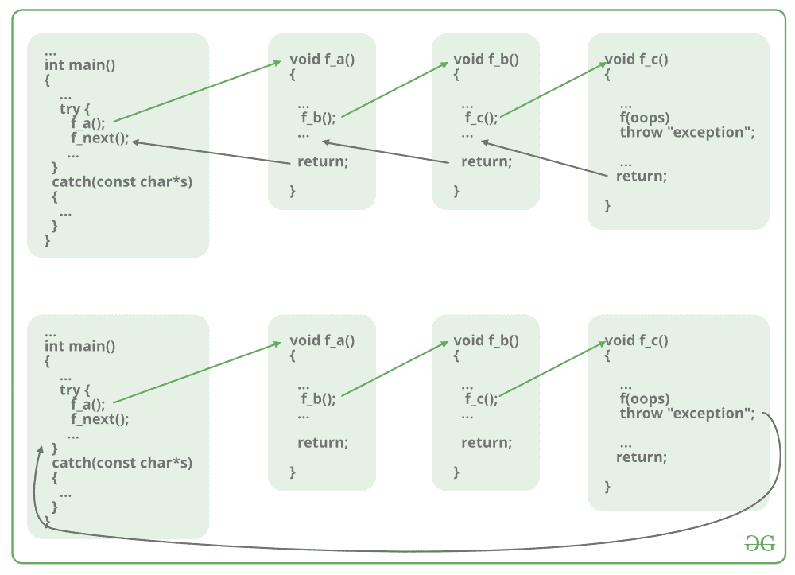

# c++中的跳转语句

> 原文:[https://www.geeksforgeeks.org/jump-statements-in-c/](https://www.geeksforgeeks.org/jump-statements-in-c/)

如果满足某些条件，跳转语句用于操纵程序的[流程。它用于终止或](https://www.geeksforgeeks.org/an-introduction-to-flowcharts/)[继续程序内的循环](https://www.geeksforgeeks.org/continue-statement-cpp/)或停止函数的执行。在 [C++](https://www.geeksforgeeks.org/c-plus-plus/) 中有四个跳转语句:**继续**、 [**断开**](https://www.geeksforgeeks.org/break-statement-cc/) 、 [**返回**](https://www.geeksforgeeks.org/return-local-array-c-function/) ，以及 [**转到**](https://www.geeksforgeeks.org/goto-statement-in-c-cpp/) 。

[**<u>Continue</u>**](https://www.geeksforgeeks.org/continue-statement-cpp/)**:**用于执行循环的其他部分，同时跳过条件内部声明的部分，而不是终止循环，而是继续执行同一循环的下一次迭代。它与必须出现在循环内部的决策语句一起使用。这种说法可以用在 [**内部为循环**](https://www.geeksforgeeks.org/range-based-loop-c/) 或 [**而**](https://www.geeksforgeeks.org/loops-in-c-and-cpp/) 或[**do-while**](https://www.geeksforgeeks.org/c-c-do-while-loop-with-examples/)**循环。**

**[](https://media.geeksforgeeks.org/wp-content/uploads/continue.png)**

****<u>语法</u> :****

```
continue;
```

****程序 1:****

**考虑这样一个场景:除了号码 **5** 之外，所有的号码都在 **1** 和 **10** 之间。所以在这种情况下，思路是在 **i** 的值为 **5** 后使用**继续语句**。下面是同样的程序:**

## **C++**

```
// C++ program to demonstrate the
// continue statement
#include <iostream>
using namespace std;

// Driver code
int main()
{
    for (int i = 1; i < 10; i++) {

        if (i == 5)
            continue;
        cout << i << " ";
    }
    return 0;
}
```

****Output:**

```
1 2 3 4 6 7 8 9

```** 

**[**<u>断开</u>**](https://www.geeksforgeeks.org/break-statement-cc/?ref=rp) **:** 用于满足条件时终止整个循环。与满足条件后的 continue 语句不同，它中断循环，并且不执行循环的剩余部分。 **Break** 语句与 [**if、if-else**](https://www.geeksforgeeks.org/decision-making-c-c-else-nested-else/) 、**或**[**switch**](https://www.geeksforgeeks.org/switch-statement-cc/)**等决策语句一起使用，该语句位于 for 循环内部，可以是 **for** 循环、 **while** 循环或 **do-while** 循环。它强制循环停止进一步迭代的执行。********

****[](https://media.geeksforgeeks.org/wp-content/uploads/break.png)****

******<u>语法</u> :******

```
**break;**
```

******程序 2:******

****考虑一个场景，其中一个数字的序列将被打印，但不是在某个值 **K** 之后。所以在这种情况下，想法是用**破语句**后的值 **i** 就是 **K** 。下面是同样的程序:****

## ****C++****

```
**// C++ program to demonstrate the
// break statement
#include <iostream>
using namespace std;

// Driver Code
int main()
{
    for (int i = 1; i < 10; i++) {

        // Breaking Condition
        if (i == 5)
            break;
        cout << i << " ";
    }
    return 0;
}**
```

******Output:**

```
1 2 3 4

```**** 

****[**<u>返回</u>**](https://www.geeksforgeeks.org/return-statement-in-c-cpp-with-examples/) **:** 它从[功能](https://www.geeksforgeeks.org/builtin-functions-gcc-compiler/)本身取得控制权。这比休息强。它用于在函数执行后或某个条件后终止整个函数。除了 [void()函数](https://www.geeksforgeeks.org/return-void-functions-c/)之外，每个函数都有一个带有返回值的返回语句。虽然 void()函数也可以有 return 语句来结束函数的执行。****

****[](https://media.geeksforgeeks.org/wp-content/cdn-uploads/20191128194949/CPP-return-statement.png)****

******<u>语法</u> :******

```
**return expression;**
```

******程序 3:******

****下面是演示返回语句的程序:****

## ****C++****

```
**// C++ program to demonstrate the
// return statement
#include <iostream>
using namespace std;

// Driver code
int main()
{
    cout << "Begin ";

    for (int i = 0; i < 10; i++) {

        // Termination condition
        if (i == 5)
            return 0;
        cout << i << " ";
    }
    cout << "end";

    return 0;
}**
```

******Output:**

```
Begin 0 1 2 3 4

```**** 

******说明:******

****上述程序通过打印“Begin”开始执行，然后 for 循环开始打印的值，它将打印从 **0** 到 **4** 的 **i** 的值，但是一旦 **i** 变得等于 **5** 它将终止整个功能，即它将永远不会打印程序的“end”语句。****

******void()函数**中的返回可以不用任何返回类型。****

******语法:******

```
****return;****
```

******程序 5:******

****以下是在功能上演示 [void](https://www.geeksforgeeks.org/void-pointer-c-cpp/) 返回类型中返回语句的程序:****

## ****C++****

```
**// C++ program to demonstrate the return
// statement in void return type function
#include <iostream>
using namespace std;

// Function to find the greater element
// among x and y
void findGreater(int x, int y)
{
    if (x > y) {
        cout << x << " "
             << "is greater"
             << "\n";
        return;
    }
    else {
        cout << y << " "
             << "is greater"
             << "\n";
        return;
    }
}

// Driver Code
int main()
{
    // Function Call
    findGreater(10, 20);

    return 0;
}**
```

******Output:**

```
20 is greater

```**** 

****[**<u>转到</u>**](https://www.geeksforgeeks.org/continue-statement-cpp/) **:** 这个语句用来直接跳转到程序中被调用的那一部分。每个 **goto** 语句都与标签相关联，该标签将它们带到调用它们的程序的一部分。标签语句可以写在程序中的任何地方，不需要在**转到**语句之前或之后使用。这种说法很难理解程序的流程，因此避免在程序中使用它。****

********

******语法:******

```
**goto label_name;
.
.
.
label_name:** 
```

******程序 6:******

****下面是演示 goto 语句的程序:****

## ****C++****

```
**// C++ program to demonstrate the
// goto statement
#include <iostream>
using namespace std;

// Driver Code
int main()
{
    int n = 4;

    if (n % 2 == 0)
        goto label1;
    else
        goto label2;

label1:
    cout << "Even" << endl;
    return 0;

label2:
    cout << "Odd" << endl;
}**
```

******Output:**

```
Even

```**** 

******说明:**以上程序用于检查数字是偶数还是奇数如果用户按下的数字说是 **4** 那么条件被 **if 语句**满足，控制转到**label 1****label 1**打印数字为**偶数**。这里不需要在 **goto** 语句之后写标签语句，我们可以在 **goto** 语句之前写，也可以。****