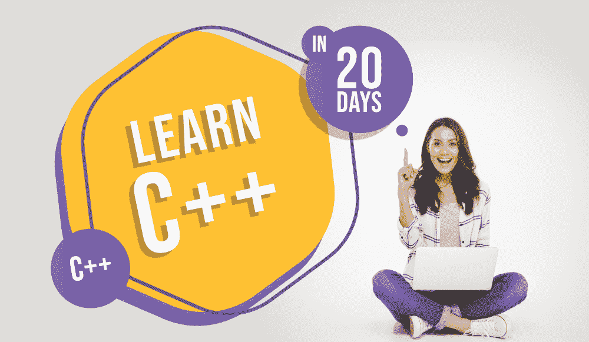

# 循序渐进学习 C++编程——20 天课程！

> 原文:[https://www . geesforgeks . org/learn-CPP-programming-按部就班的 20 天课程/](https://www.geeksforgeeks.org/learn-cpp-programming-step-by-step-a-20-day-curriculum/)

虽然市场上有许多编程语言可供使用，但是 **C++** 从诞生之日起就从未失去它的魅力，并且仍然在开发领域有着强大的影响力。根据报道， **C++** 属于世界上几个顶尖的编程语言。与 C 编程语言一样，C++也使您更容易理解编程的底层架构，尽管它还支持其他附加功能，如面向对象编程、异常处理等。而且各种 IT 巨头*谷歌**亚马逊**微软*等。给 C++专业人士提供无数的职业机会，因此强烈建议你尝试一下**开始学习 C++编程**。

**[比雅尼·斯特劳斯特鲁普开发的 c++](https://www.geeksforgeeks.org/c-plus-plus/)***，是一种**通用编程语言**，被认为是 C 编程语言的高级版本。它以**标准模板库**的形式提供丰富的库支持。该语言广泛应用于各种 *GUI 平台*、*云/分布式系统*、*操作系统*、*实时仿真*等。此外，由于 C++是一种面向对象的编程语言，它允许您通过 OOPS 概念实现实时问题。在这篇文章中，让我们讨论一下一个人在 20 天内学习 C++语言应该遵循的 ***完整的课程或路线图！*T21】***

### 1.C++编程入门(第 1 天)

不用说，你需要**开始学习 C++编程语言**有了语言的介绍和基础。你需要了解 C++语言的*特性，*有哪些应用*。此外，你需要知道如何设置一个环境来编译&运行你的 C++程序。你也可以**创建你的第一个 C++程序**来获得更多的基础知识。同时可以探索其他几个相关的话题，如*区别 b/w C & C++* 、 *C++ vs JAVA* 等。*

*   [c++编程语言介绍](https://www.geeksforgeeks.org/introduction-to-c-programming-language/)
*   [设置 C++开发环境](https://www.geeksforgeeks.org/setting-c-development-environment/)
*   [C vs C++](https://www.geeksforgeeks.org/c-plus-plus/#C%20vs%20C++)
*   [C++ vs JAVA](https://www.geeksforgeeks.org/c-plus-plus/#C++vsJava)
*   [第一个 C++程序:你好世界](https://www.geeksforgeeks.org/writing-first-c-program-hello-world-example/)

### 2.学习数据类型、变量和运算符(第 2-3 天)

现在你需要了解 C++编程的构建模块–**数据类型，变量&操作符**。你需要彻底了解数据类型以及它们是如何使用的，变量是什么，它们是如何声明和初始化的，C++中运算符的使用等等。它将帮助你熟悉 **C++编程**的基本结构和语法。这里还需要考虑其他几个主题，如*参考变量*、*操作员重载*、*可选参数*等。

*   [数据类型](https://www.geeksforgeeks.org/c-data-types/)|[c++中的变量](https://www.geeksforgeeks.org/variables-in-c/)
*   [c++中的运算符](https://www.geeksforgeeks.org/operators-c-c/)
*   [c++中的参考变量](https://www.geeksforgeeks.org/references-in-c/)
*   [c++中的运算符重载](https://www.geeksforgeeks.org/operator-overloading-c/)
*   [c++中的默认参数](https://www.geeksforgeeks.org/default-arguments-c/)

### 3.学习条件和控制语句(第 4-5 天)

好了，现在转到 C++编程语言的控制流语句。准确地说，控制流语句涉及到类似重复执行语句块–**循环**、基于决策的代码执行–**决策语句**等概念。你需要彻底涵盖这些概念，例如所有类型的循环，如 *For Loop* 、 *While Loop* 、 *Do While loop* 等。类似地，所有决策陈述，如 *if* 、 *if..否则*、*嵌套 if* 等。C++编程中还有几个与控制流语句相关的主题，如*跳转语句*、*开关语句*等。

*   [c++中的循环](https://www.geeksforgeeks.org/loops-in-c-and-cpp/)
*   [c++中的决策](https://www.geeksforgeeks.org/decision-making-c-c-else-nested-else/)
*   [c++中的开关语句](https://www.geeksforgeeks.org/switch-statement-cc/)
*   [继续声明](https://www.geeksforgeeks.org/decision-making-c-c-else-nested-else/#cont) | [中断声明](https://www.geeksforgeeks.org/decision-making-c-c-else-nested-else/#brk)
*   [在 C++中执行 if 和 else 语句](https://www.geeksforgeeks.org/execute-else-statements-cc-simultaneously/)

### 4.理解 C++中的数组、字符串和指针(第 6-8 天)

一旦您完成了数据类型、变量和其他主题，现在您需要**理解 C++** 中的数组&字符串概念。C++中的数组用于存储类似类型的元素，字符串用于存储文本或字符序列。此外，您还需要了解用于存储另一个变量地址的**指针**。此外，还有其他几个重要的主题，如*名称空间*、*c++中的野生指针*等。这可以考虑。

*   [数组](https://www.geeksforgeeks.org/arrays-in-c-cpp/)|[c++中的字符串](https://www.geeksforgeeks.org/strings-in-c-and-how-to-create-them/)
*   [c++中的指针](https://www.geeksforgeeks.org/pointers-c-examples/)
*   [c++中的指针与引用](https://www.geeksforgeeks.org/pointers-vs-references-cpp/)
*   [c++中的命名空间](https://www.geeksforgeeks.org/namespace-in-c/)
*   [c++中的野指针](https://www.geeksforgeeks.org/what-are-wild-pointers-how-can-we-avoid/?ref=lbp)

### 5.浏览 C++中的函数和 OOPs 概念(第 9-12 天)

现在，它来到了 C++编程旅程中最关键的部分: ***函数&c++中的 OOPS 概念*** 。您需要了解 C++中的函数，它是为执行特定任务而创建的一组语句。你必须了解*函数声明*、*函数重载*，以及其他与 C++中的函数有关的主题。同时要求你深入了解 C++的面向对象编程本质，有*类*、*对象*、*继承*、*多态*、*抽象*、*封装*等各种概念。

*   [c++中的函数](https://www.geeksforgeeks.org/functions-in-c/)
*   [c++中的函数重载](https://www.geeksforgeeks.org/function-overloading-c/)
*   [C++类和对象](https://www.geeksforgeeks.org/c-classes-and-objects/)
*   [c++中的面向对象编程](https://www.geeksforgeeks.org/object-oriented-programming-in-cpp/)
*   [c++中的构造函数](https://www.geeksforgeeks.org/constructors-c/)

### 6.学习 C++中的输入/输出流、动态内存和 STL(第 13-16 天)

好吧，让我们更深入地探讨 C 编程的世界。现在，您需要理解几个基本概念，如 C++中的**输入/输出流&文件处理**、**C/c++中的动态内存分配**等。您还需要查看 C++中的**标准模板库(STL)** ，这是该语言的一个著名特性。一般来说，C++中的 STL 是一组提供通用编程数据结构和功能的 C++模板类，如*栈*、*数组*等。此外，你必须有模板类的知识才能在 C++中处理 STL。

*   [c++中的文件和流](https://www.geeksforgeeks.org/file-handling-c-classes/)
*   [c++中的动态内存分配](https://www.geeksforgeeks.org/new-and-delete-operators-in-cpp-for-dynamic-memory/)
*   [malloc()vs c++中的 new](https://www.geeksforgeeks.org/malloc-vs-new/)
*   [c++中的模板](https://www.geeksforgeeks.org/templates-cpp/)
*   [C++标准模板库(STL)](https://www.geeksforgeeks.org/the-c-standard-template-library-stl/)

### 7.理解 C++中的异常处理、信号处理和多线程(第 17-20 天)

此外，还需要你调出一些更高级的话题，比如**异常处理**、**信号处理**、**c++多线程**等。简而言之，异常处理倾向于处理可能引发异常或错误的代码，而信号处理关注迫使操作系统停止正在进行的任务并处理已发送中断的任务的信号。此外，在 C++中，多线程需要使用 **POSIX 线程**。

*   [c++中的异常处理](https://www.geeksforgeeks.org/exception-handling-c/)
*   [c++中的信号处理](https://www.geeksforgeeks.org/c-signal-handling/)
*   [堆叠展开](https://www.geeksforgeeks.org/stack-unwinding-in-c/)
*   [c++中的多线程](https://www.geeksforgeeks.org/multithreading-in-cpp/)
*   [POSIX 螺纹](https://www.geeksforgeeks.org/multithreading-c-2/)

因此，这是一个为期 20 天的课程，适合所有想学习的人&在 C++编程中大展拳脚。同时，在遵循上述路线图后，您还可以选择构建几个小项目和大项目来提高您的技能，并获得更多的 C++编程经验。因此，在接下来的 20 天里，从你的时间表中抽出一些时间，以极大的奉献精神和一致性开始学习 C++吧！！