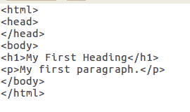
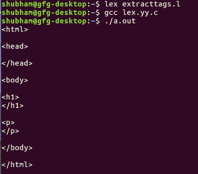

# 从文件中提取 HTML 标签的 LEX 代码

> 哎哎哎:# t0]https://www . geeksforgeeks . org/lex 代码提取 html 标记文件/

Lex 是一个生成词法分析器的计算机程序，由 Mike Lesk 和 Eric Schmidt 编写。
Lex 读取指定词法分析器的输入流，并输出用 C 编程语言实现 lexer 的源代码。
**先决条件:** [Flex(快速词汇分析器生成器)](https://www.geeksforgeeks.org/flex-fast-lexical-analyzer-generator/)

**方法:**
提取是基于标签用 HTML 编写的方式。所有标签都包含在 **< >** 中。这将设置从给定输入文件中提取 HTML 标签的规则。

**输入文件:tags.txt**


下面是从文件中提取 HTML 标签的实现:

```cpp
/* Declaration section*/
%{
%}

%%
"<"[^>]*> {printf("%s\n", yytext); }  /* if anything enclosed in 
                                      these < > occur print text*/
. ;  // else do nothing
%%    

int yywrap(){}

int main(int argc, char*argv[])
{
    // Open tags.txt in read mode
    extern FILE *yyin = fopen("tags.txt","r"); 

    // The function that starts the analysis
    yylex(); 

    return 0;
}
```

**输出:**
