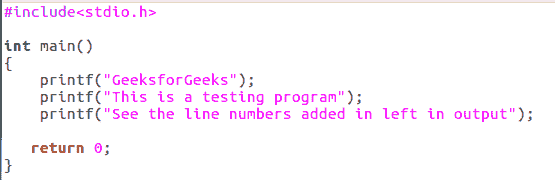
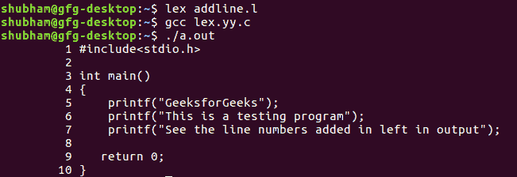

# LEX 程序给给定文件添加行号

> 原文:[https://www . geesforgeks . org/lex-program-add-line-numbers-given-file/](https://www.geeksforgeeks.org/lex-program-add-line-numbers-given-file/)

Lex 是一个生成词法分析器的计算机程序，由 Mike Lesk 和 Eric Schmidt 编写。
Lex 读取指定词法分析器的输入流，并输出用 C 编程语言实现 lexer 的源代码。

**先决条件:** [Flex(快速词汇分析器生成器)](https://www.geeksforgeeks.org/flex-fast-lexical-analyzer-generator/)

**示例:**

```
Input:
#include<stdio.h>
// Driver Code
int main()
{
int a; 
/* we have to delete comments */
return 0;
}

Output:
1 #include<stdio.h>
2 // Driver Code
3 int main()
4 {
5 int a; 
6 /* we have to delete comments */
7 return 0;
8 }

```

**进场:**
因 **/n** 遇到新线路。要计算行数，只要存在初始单行，就计算初始值为 1 的 **/n** 出现的次数。其他都可以忽略，重点是 **/n** 的数量。取一个初始设置为 1 的计数器，每当出现一个新行(/n)时递增它。

**输入文件:testtest.c**


下面是给定文件添加行号的实现。

```
/* Program to add line numbers
 to a given file*/
%{
int line_number = 1;  // initializing line number to 1
%}

/* simple name definitions to simplify
the scanner specification name 
definition of line*/
line .*\n    

%%
{line} { printf("%10d %s", line_number++, yytext); } 

 /* whenever a line is encountered increment count*/

 /* 10 specifies the padding from left side to 
                    present the line numbers*/

 /* yytext The text of the matched pattern is stored
                           in this variable (char*)*/
%%

int yywrap(){} 

int main(int argc, char*argv[])
{
extern FILE *yyin;    // yyin as pointer of File type

yyin = fopen("testtest.c","r");  /* yyin points to the file 
                                   testtest.c and opens it
                                   in read mode.*/

yylex();   // The function that starts the analysis.

return 0;
}
```

**输出:**
