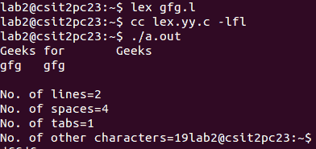

# Lex 程序统计行数、空格数和制表符数

> 原文:[https://www . geesforgeks . org/lex-program-to-count-行数-空格-制表符/](https://www.geeksforgeeks.org/lex-program-to-count-the-number-of-lines-spaces-and-tabs/)

[Lex](https://www.geeksforgeeks.org/flex-fast-lexical-analyzer-generator/) 是一个生成词法分析器的计算机程序，由 Mike Lesk 和 Eric Schmidt 编写。Lex 读取指定词法分析器的输入流，并输出用 C 编程语言实现 lexer 的源代码。
我们来了解一下如何使用 Lex 统计行数、空格数和制表符数。
**例:**

```cpp
Input:
Geeks for       Geeks 
gfg  gfg

Output:
No. of lines=2 
No. of spaces=3 
No. of tabs=1 
No. of other characters=19

Input:
Hello
How    are    you?

Output:
No. of lines=2 
No. of spaces=4 
No. of tabs=1 
No. of other characters=15
```

下面是实现:

## C

```cpp
/*lex code to count the number of lines,
    tabs and spaces used in the input*/

%{
#include<stdio.h>
int lc=0, sc=0, tc=0, ch=0; /*Global variables*/
%}

/*Rule Section*/
%%
\n lc++ ; //line counter
([ ])+ sc++ ; //space counter
\t tc++ ; //tab counter
. ch++ ;     //characters counter
%%

int main()
{
    // The function that starts the analysis
    yylex();

    printf("\nNo. of lines=%d", lc); 
    printf("\nNo. of spaces=%d", sc);
    printf("\nNo. of tabs=%d", tc);
    printf("\nNo. of other characters=%d", ch);

}
```

**输出:**

