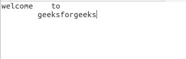
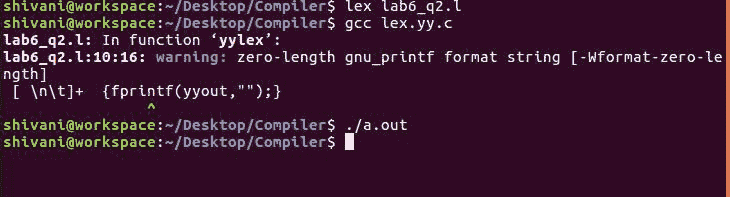

# Lex 程序从文件中获取输入并删除多个空格、行和制表符

> 原文:[https://www . geesforgeks . org/lex-program-to-take-input-from-file-and-remove-multi-spaces-line-and-tab/](https://www.geeksforgeeks.org/lex-program-to-take-input-from-file-and-remove-multiple-spaces-lines-and-tabs/)

[FLEX(快速词法分析器生成器)](https://www.geeksforgeeks.org/flex-fast-lexical-analyzer-generator/)是 Vern Paxson 在 1987 年前后用 C 语言编写的一个用于生成词法分析器(扫描仪或 lexers)的工具/计算机程序。Lex 读取指定词法分析器的输入流，并输出用 C 编程语言实现 lexer 的源代码。函数 yylex()是运行规则部分的主要灵活函数。

**先决条件:** [FLEX(快速词汇分析器生成器)](https://www.geeksforgeeks.org/flex-fast-lexical-analyzer-generator/)

**示例:**

```
Input:
hello      how
    are       
you?

Output:
hellohowareyou?

Input:
Welcome      to
Geeks    for
      Geeks

Output:
WelcometoGeeksforGeeks

```

**方法:**
以读取模式打开输入文件，每当解析器遇到换行符(\n)、空格( )或制表符(\t)时，将其删除，并将所有其他字符写入输出文件。

**输入文件:** **Input.txt** (本程序使用的输入文件)


以下是实施方案:

```
/*Lex program to take input from file and 
remove multiple spaces, newline and tab
and write output in a separate file*/

% {
    /*Definition section */
    %
}

/* Rule: whenever space, tab or 
newline is encounterd, remove it*/
% %
[ \n\t]+ {fprintf(yyout, "");}
.       { fprintf(yyout, "%s", yytext); }
% %

int yywrap(){}

// driver code 
int main()
{

    /* yyin and yyout as pointer
    of File type */
    extern FILE *yyin, *yyout;

    /* yyin points to the file input.txt
    and opens it in read mode*/
    yyin = fopen("Input.txt", "r");

    /* yyout points to the file output.txt
    and opens it in write mode*/
    yyout = fopen("Output.txt", "w");

    yylex();
    return 0;
}
```

**输出:**

