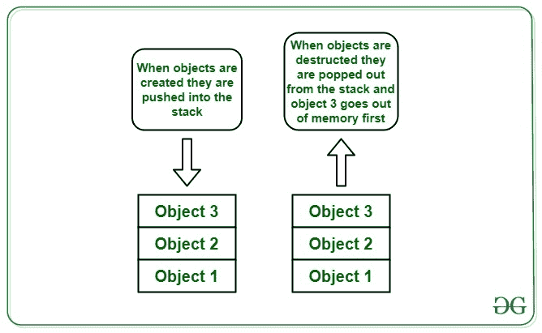

# c++中对象的生命周期，示例

> 原文:[https://www . geesforgeks . org/c-in-objects-life-cycle-with-example/](https://www.geeksforgeeks.org/life-cycle-of-objects-in-c-with-example/)

在[面向对象编程](https://www.geeksforgeeks.org/object-oriented-programming-in-cpp/)、 [**对象**](https://www.geeksforgeeks.org/c-classes-and-objects/) 是[类](https://www.geeksforgeeks.org/c-classes-and-objects/)的实例，该类有自己的**状态(变量)**和**行为(方法)**。


每个类都有两个与类对象的创建和销毁相关的特殊方法- [构造器](https://www.geeksforgeeks.org/difference-between-constructor-and-destructor-in-c/)和[析构器](https://www.geeksforgeeks.org/difference-between-constructor-and-destructor-in-c/)。

### **<u>C++对象生命周期:</u>**

[](https://media.geeksforgeeks.org/wp-content/cdn-uploads/20200827160616/FlowChartObjectLifeCycle1.png)

完成一个对象的生命周期需要遵循各种步骤:

1.  首先，需要一些类来定义基于类的对象。因此，在上图中创建了一个示例类。
2.  构造函数构造类类型的值。是一个[成员函数](https://www.geeksforgeeks.org/some-interesting-facts-about-static-member-functions-in-c/)，名字和类名一样。这个过程包括初始化数据成员，并且经常使用新的。
3.  可以初始化如上创建的**示例**对象。初始化需要调用[新关键字](https://www.geeksforgeeks.org/new-vs-operator-new-in-cpp/)，为这个对象分配一些内存。
4.  可以在构造函数中使用一些逻辑，这些逻辑将在初始化期间执行。
5.  执行完成后，调用析构函数。[析构函数](https://www.geeksforgeeks.org/destructors-c/)是一个成员函数，其目的是破坏类类型的值。这是一个成员函数，其名称前面带有**波浪号(~)** 字符。
6.  在整个生命周期中，请记住以下事实:
    *   [构造函数可以重载](https://www.geeksforgeeks.org/constructor-overloading-c/)。
    *   当定义中使用了构造函数的关联类型时，将调用构造函数。
    *   当对象超出范围时，析构函数被隐式调用。
    *   构造函数和析构函数没有返回类型，不能使用[返回语句](https://www.geeksforgeeks.org/return-statement-in-c-cpp-with-examples/)。

下面是 C++中[构造函数和析构函数如何工作的程序:](https://www.geeksforgeeks.org/difference-between-constructor-and-destructor-in-c/) 

## C++

```
// C++ program to demonstrate the
// object allocation & deallocation

#include <iostream>
using namespace std;

class object {
public:
    // Constructor
    object()
    {
        // Constructor has same name
        // as that of class name
        cout << "The object is created"
             << "\n";
    }

    // Destructor
    ~object()
    {
        // Destructor has same name as
        // class and is preceded by ~ sign
        cout << "The object is destructed"
             << "\n";
    }
};

// Driver Code
int main()
{
    // Object creation
    object obj1;

    return 0;
}
```

**Output:** 

```
The object is created
The object is destructed
```

### **<u>涉及多个对象时:</u>**

[](https://media.geeksforgeeks.org/wp-content/cdn-uploads/20200828100221/LifeCycleObjectStackImage.jpg)

当从同一个类创建多个对象时，对象的构造以创建它们的相同方式进行。但是，销毁遵循[后进先出](https://www.geeksforgeeks.org/lifo-last-in-first-out-approach-in-programming/)方法，即首先创建的对象将被最后销毁。因为，当使用单个类时，每个新对象都独立于前一个对象，所以销毁的顺序并不重要。然而，当使用[继承](https://www.geeksforgeeks.org/inheritance-in-c/)时，这种后进先出顺序确实有意义。

下面是同样的程序来说明:

## C++

```
// C++ program to illustrate the
// constructor and destructor when
// multiple objects are created

#include <iostream>
using namespace std;

// obj Class
class obj {
public:
    // Declare class variable to
    // keep count on objects
    static int obj_count;

    // Constructor
    obj()
    {
        obj_count++;
        cout << "The obj - "
             << obj_count
             << " - is created"
             << "\n";
    }

    // Destructor
    ~obj()
    {
        cout << "The obj - "
             << obj_count
             << " - is destructed"
             << "\n";
        obj_count--;
    }
};

// Static members are always defined
// outside of the class
int obj::obj_count = 0;

// Driver Code
int main()
{
    // Creating objects
    obj obj1{};
    obj obj2{};

    return 0;
}
```

**Output:** 

```
The obj - 1 - is created
The obj - 2 - is created
The obj - 2 - is destructed
The obj - 1 - is destructed
```

### **<u>继承情况下的物体建造和破坏行为:</u>**

[c++](https://www.geeksforgeeks.org/inheritance-in-c/)中的继承遵循 **IS-A** 方法。当一个类 **B** 继承一个类 **A** 时，我们说**B**T10】IS-A。我们说类 **B** 为派生类，类 **A** 为基类。除了状态和行为，类 **B** 还继承了类 **A** 的构造函数和析构函数。有一些规则指导构造函数和析构函数的继承。

*   派生类**不能重写或重载基类的**构造函数和析构函数。
*   基类的构造首先发生，然后是派生类的构造。
*   派生类的销毁首先发生。

下面是同样的程序来说明:

## C++

```
// C++ program to demonstrates the
// object Allocation and deallocation
// during inheritance B stands for base
// class and D stands for derived class

#include <iostream>
using namespace std;

// Class B
class B {
public:
    // Constructor
    B(int b = 0)
        : _b(b)
    {
        cout << "constructor of base class "
             << "created with value - "
             << _b << '\n';
    }

    // Destructor
    ~B()
    {
        cout << "Destructor of base class "
             << "called \n";
    }
    int _b;
};

// Inherit class D from class B
class D : public B {

public:
    D(int d)
        : _d(d)
    {
        // Default constructor of b
        // Is called automatically
        cout << "constructor of derived "
             << " class created with value - "
             << _d << '\n';
    }

    // Overloaded Constructor
    D(int b, int d)
        : B(b), _d(d)
    {
        cout << "constructor of derived class "
             << "created with value - "
             << _d << '\n';
    }

    // Destructor
    ~D()
    {
        cout << "Destructor of derived class "
             << "called \n";
    }

private:
    int _d;
};

// Driver Code
int main()
{
    // Object of class B
    B b(34);

    // Objects of class D
    D d2(89);
    D d1(56, 78);

    return 0;
}
```

**Output:** constructor of base class created with value – 34 constructor of base class created with value – 0 constructor of derived class created with value – 89 constructor of base class created with value – 56 constructor of derived class created with value – 78 Destructor of derived class called Destructor of base class called Destructor of derived class called Destructor of base class called Destructor of base class called  

### **<u>为什么在对象销毁时使用后进先出法？</u>T3】**

由于子类是从父类继承状态和行为，所以首先子类的所有工作都要完成**然后只销毁基类的对象**是有意义的。假设子类从父类访问一个状态，但是父对象已经被析构，在这种情况下，将会发生错误，因此在析构中遵循**后进先出**顺序。即使在处理单个类的多个对象时，这也很好。