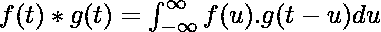
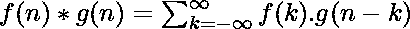
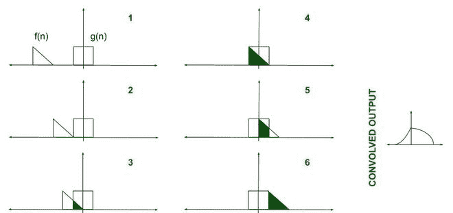
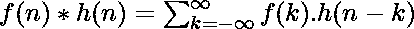
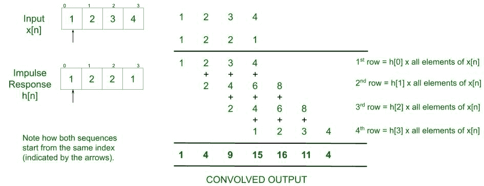
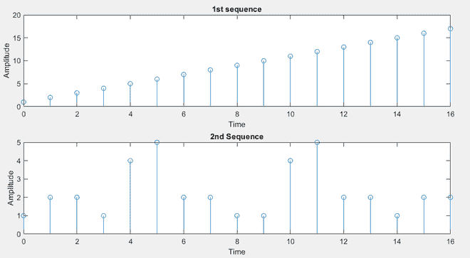
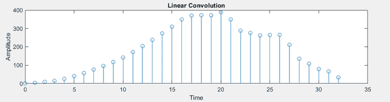
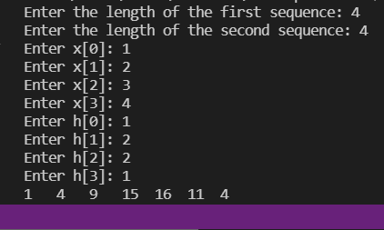

# 使用 C 和 MATLAB 进行线性卷积

> 原文:[https://www . geeksforgeeks . org/linear-卷积-使用-c-and-matlab/](https://www.geeksforgeeks.org/linear-convolution-using-c-and-matlab/)

线性卷积是那些追求电子工程的人经常遇到的一个关键概念。这是[数字信号处理](https://www.geeksforgeeks.org/advantages-and-disadvantages-of-digital-signals/)和[信号和系统](https://www.geeksforgeeks.org/introduction-to-signals-and-systems-properties-of-systems/)的重要组成部分。考虑到一般的兴趣和学术含义，本文介绍了这个概念及其应用，并使用 [C](https://www.geeksforgeeks.org/c-programming-language/) 和 [MATLAB](https://www.geeksforgeeks.org/applications-of-matlab/) 实现了它。

**卷积:**纯粹从数学上讲，卷积是可以计算两个图形重叠的过程。事实上，卷积也被解释为两个[图](https://www.geeksforgeeks.org/graph-and-its-representations/)随着时间的推移所共享的面积。打个比方，它是两种[功能的融合，一种功能超越另一种功能。因此，给定两个函数 F(n)和 G(n)，两者的卷积由以下数学表达式表示和给出:](https://www.geeksforgeeks.org/functions-in-c/)

> 
> 
> 或者
> 
> 



所以，虽然看起来很直观，但我们必须考虑时间。卷积涉及随时间混合的函数。这是在使用时移的表达式中引入的，即 g(t-u)是 g(t)向右移动的‘u’倍)。此外，我们如何描述这段时间也很重要。在继续下一步之前，让我们编译一下相关的先决条件:

*   **函数:**数学上，我们看函数或图。然而，需要注意的是，这里的实际等价物是信号。我们处理两个信号的卷积。
*   **LTI 系统:**线性时不变系统是产生线性和时不变输出的系统或过程，即输出满足线性(叠加规则)且不随时间变化。卷积是 LTI 系统的输入和输出之间的关系。
*   **脉冲响应:**如果所考虑的系统受到短时时域信号的作用，通常会得到脉冲响应。不同的 LTI 系统具有不同的脉冲响应。
*   **时间系统:**我们可以使用[连续时间信号](https://www.geeksforgeeks.org/introduction-to-signals-and-systems-properties-of-systems/)或[离散时间信号](https://www.geeksforgeeks.org/generating-basic-discrete-time-signals/)。假设读者知道并理解这种差异。可以为 CT 和 DT 信号定义卷积。

**线性卷积:**线性卷积是一种在给定系统脉冲响应的情况下，可以将 LTI 系统的输出和输入联系起来的方法。显然，需要将输入信号与系统的脉冲响应进行卷积。使用前面的表达式，可以形成以下等式-

> 

表达式被无穷多次求和的原因只是为了保证两个函数重叠的概率为 1。脉冲响应是无休止的时移，因此在一段时间内，这两个函数肯定会重叠。代表程序员运行一个无限循环似乎是粗心的——只要这两个函数不重叠，代码就可能继续执行。

解决办法在于使用 LTI 系统。由于这些函数不会随时间改变它们的值/形状(时间不变)，它们可以简单地彼此滑动得更近。请记住，只需要输出，接收输出的“时间”并不重要。所有人工计算也依赖于同样的想法。

**解释:**这里有一个计算输出时可能用到的技巧:

*   将输入信号和脉冲响应视为两个独立的单行矩阵。
*   脉冲响应的第一个元素与输入信号的每个元素相乘。该结果被存储。
*   脉冲响应的第二个元素与输入信号的每个元素相乘。结果向右移动一步并存储。
*   以上两个步骤是针对脉冲响应中的其余元素完成的。
*   所有元素相乘后，将所有结果相互对齐。参考下图。
*   垂直添加每列中的所有元素。
*   得到的单行矩阵是卷积输出。



**进场:**

*   将输入信号和脉冲响应作为两个不同的[阵列](https://www.geeksforgeeks.org/introduction-to-arrays/)获得。
*   获取时间索引序列。时间索引序列是一种通知 MATLAB 我们的功能何时启动的方式。默认情况下从 0 开始，即[0 1 2 3 ……..].然而，第二序列或脉冲响应不必同时开始。人们可以选择推迟或提前开始。如果它早一秒引入，那么它的时间索引序列应该输入为[-1 0 1 2……]。].
*   使用用户定义的函数。函数 **findconv()** 定义如何计算输出的长度。将“T2”定义为输出中 x 轴的长度。它早先被定义为从“ **nybegin** 开始，一直延伸到“**ny 和**的数组。函数 **calconv()** 在 **findconv()** 中引用，通过取 k 和 n 的不同值，使用 2 个不同的[进行循环](https://www.geeksforgeeks.org/loops-in-c-and-cpp/)，依次计算实际输出。
*   对于 n 的每个值，输出的总和是通过在每次迭代中取不同的 X(k)值来计算的。
*   该结果存储在数组-y(n)中。
*   画出结果。由于输入本质上是离散的，因此在绘图时使用了函数 stem()。如果要绘制连续时间输出，使用 stem()没有任何意义，因为它会使输出看起来像是采样的。在绘制连续值时，建议使用**绘制(x 轴，y 轴)**。
*   注意:不要改变时间索引序列以及第一和第二序列的长度。**杆()**返回一个错误，表示无法在输出中确定 x 轴的长度。

下面是实现上述方法的 Matlab 程序:

## 矩阵实验室

```cpp
% Matlab program to implement
% the above approach
clc;
x = input('Enter the 1st sequence: ');
nx = input('Enter the Time Index sequence: ');
h = input('Enter the second sequence: ');
nh = input('Enter the Time Index sequence: ');

% Sending parameters to a separate function
[y, ny] = findconv(x, nx, h, nh);

figure;
stem(ny, y);
xlabel('Time');
ylabel('Amplitude');
title('Linear Convolution');
disp(y);
disp(ny);

% Function to find the length of our output
function [y, ny] = findconv(x, nx, h, nh)
    nybegin = nx(1) + nh(1);
    nyend = nx(length(nx)) + nh(length(nh));
    ny = nybegin : nyend;

    % Calling a function within a function
    y = calconv(x, h);
end

% Here is where the summation is calculated
function [y] = calconv(x, h)
    l1 = length(x);
    l2 = length(h);
    N = l1 + l2 - 1;
    for n = 1 : 1 : N
        y(n) = 0;
        for k = 1 : 1 : l1
            if(n - k + 1 >= 1 & n - k + 1 <= l2)
                y(n) = y(n) + x(k) * h(n - k + 1);
            end
        end
    end
end
```

**输入(任意一组数字):**

```cpp
>> Enter the 1st Sequence: [1 2 3 4 5 6 7 8 9 10 11 12 13 14 15 16 17]
>> Enter the Time Index sequence: [0 1 2 3 4 5 6 7 8 9 10 11 12 13 14 15 16]
>> Enter the second sequence: [1 2 2 1 4 5 2 2 1 1 4 5 2 2 1 2 2]
>> Enter the Time Index sequence: [0 1 2 3 4 5 6 7 8 9 10 11 12 13 14 15 16]
```

**输出:**

```cpp
>> Columns 1 through 17
    1     4     9    15    25    40    57    76    96   117   142   172   204   238   273   310   349

>> Columns 18 through 33

   370   372   372   388   349   288   276   262   264   265   211   135   108    79    66    34
```



这些是输入序列。请注意，它们是离散时间序列。



输出。这也是时间上的离散。

**注意:**鼓励读者使用连续时间信号进行尝试。在这些情况下，输入被视为预定义的连续信号，如 y = sin x。此外，使用 plot(x 轴，y 轴)而不是 stem(x 轴，y 轴)。

下面是实现上述方法的 [C 程序](https://www.geeksforgeeks.org/c/):

## C

```cpp
// C program for the above approach
#include <math.h>
#include <stdio.h>

void calc_conv(int*, int*);

// Chose any length. They must
// all be equal though.
int x[10], h[10], y[10];

int l1, l2 = 0;

// Driver code
void main()
{
    printf("Enter the length of "
           "the first sequence: ");
    scanf("%d", &l1);
    printf("Enter the length of the"
           " second sequence: ");
    scanf("%d", &l2);

    // Delegating calculation to a
    // separate function.
    calc_conv(l1, l2);
}

void calc_conv(int* len1, int* len2)
{
    int l = (*len1) + (*len2) - 1;
    int i, j, n, k = 0;

    // Getting values of 1st sequence
    for (i = 0; i < *len1; i++) {
        scanf("%d", &x[i]);
    }

    // Getting values of 2nd sequence
    for (j = 0; j < *len2; j++) {
        scanf("%d", &h[i]);
    }

    for (n = 0; n < l; n++) {
        y[n] = 0;
        for (k = 0; k < len1; k++) {

            // To right shift the impulse
            if ((n - k) >= 0
                && (n - k) < *len2) {

                // Main calculation
                y[n] = y[n] + x[k] * h[n - k];
            }
            printf("%d\t", y[n]);
        }
    }
}
```

**输入:**

```cpp
Enter the length of the first sequence: 4
Enter the length of the second sequence: 4
Enter x[0]: 1
Enter x[1]: 2
Enter x[2]: 3
Enter x[3]: 4
Enter h[0]: 1
Enter h[1]: 2
Enter h[2]: 2
Enter h[3]: 1
```

**输出:**

```cpp
1    4    9    15    16    11    4
```

