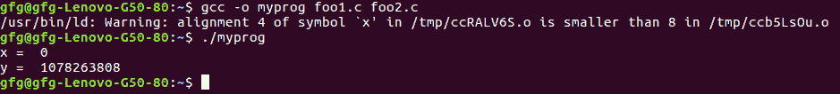

# 在 C

中链接变量相同但数据类型不同的文件

> 原文:[https://www . geeksforgeeks . org/link-file-具有相同变量的不同数据类型-in-c/](https://www.geeksforgeeks.org/linking-files-having-same-variables-with-different-data-types-in-c/)

假设有两个代码 foo1.c 和 foo2.c，如下所示，这里的任务是链接 foo1.c 和 foo2.c，它们具有相同的变量名 x，但数据类型不同，即 foo1.c 中的 int 和 foo2.c 中的 double。
注意，没有一个变量被声明为 extern。

**在给定两个程序的情况下，您期望以下命令的输出是什么？**

```cpp
$ gcc -o myprog foo1.c foo2.c
$ ./myprog

```

```cpp
// foo1.c
#include<stdio.h>
void f(void);
int x = 38;
int y = 39;

int main() 
{
    f();
    printf("x = % d\n", x);
    printf("y = % d\n", y);
    return 0;
}
```

```cpp
// foo2.c
double x;
void f() 
{
    x = 42.0;
}
```

输出:

```cpp
x = 0
y = 1078263808

```



**输出解释:**程序的输出看起来不可预测，但原因是:在 foo1.c 中，有两个变量 x 和 y，每个变量有 4 个字节(总共 8 个字节)。在 foo2.c 中，x 变量是双精度的。
执行时，foo1 中的**x(4 字节)被 foo2 中的 x(8 字节)**替换。最终，foo1 中 x 和 y 的内存(总共 8 个字节)被 foo2 中的 x(8 个字节)覆盖。

1078263808 值是双精度 42 的浮点表示。

**注意:**foo 1 . c 中的 x 和 y 地址是连续的。

**相关文章:**[C](https://www.geeksforgeeks.org/internal-linkage-external-linkage-c/)内外联系