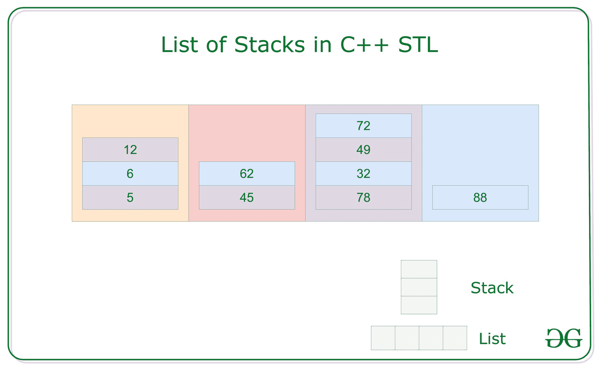

# c++ STL 中的栈列表

> 原文:[https://www.geeksforgeeks.org/list-of-stacks-in-c-stl/](https://www.geeksforgeeks.org/list-of-stacks-in-c-stl/)

**先决条件:** [列表](https://www.geeksforgeeks.org/list-cpp-stl/)[堆叠](https://www.geeksforgeeks.org/stack-data-structure/)

**列表**是允许[非连续内存分配](https://www.geeksforgeeks.org/non-contiguous-allocation-in-operating-system/)的序列容器。与[向量](https://www.geeksforgeeks.org/vector-in-cpp-stl/)相比，列表遍历慢，但是一旦找到位置，插入和删除都很快。

**语法:**

> 列表<类型>列表名称 _ of _ list

是一种容器适配器与后进先出(LIFO)类型的工作的一种类型，其中在一端添加新元素，并且(顶部)仅从该端移除元素。

**语法:**

> 栈<type>名称 _ of _ stack</type>

**堆叠列表**是一种具有一系列堆叠的容器，这是一个二维容器，其中 **N** 行列表和 **M** 列堆叠，两个维度的大小都是不固定的。可以使用 [迭代器](https://www.geeksforgeeks.org/iterators-c-stl/) 遍历和访问。

**语法:**

> 列表<stack>>容器名称(大小)；
> 尺寸可选</stack>

[](https://media.geeksforgeeks.org/wp-content/uploads/20200928102759/ListofStacks.jpg)

**示例:**

> 列出<stack>> ls(10)；
> 堆栈列表的大小为 10</stack>

**<u>插入</u> :** [在堆栈的列表](https://www.geeksforgeeks.org/linked-list-set-2-inserting-a-node/)中的插入是使用 **push()** 功能完成的。

**示例:**

## C++

```cpp
// Loop to push element
// into a stack
for
    i in[0, n]
    {
        s.push(i)
    }

// Push Stack into the list
ls.push_back(s);
```

**<u>遍历</u> :** [使用](https://www.geeksforgeeks.org/recursive-insertion-and-traversal-linked-list/)[迭代器](https://www.geeksforgeeks.org/iterators-c-stl/)遍历堆栈的列表。

## C++

```cpp
// Loop to iterate over list
for (iterator it = ls.begin();
     it != ls.end(); it++) {

    // Stack of the List
    stack<int>
        st = *it;

    while (!st.empty()) {
        cout << st.top();
        st.pop();
    }
}
```

上面的代码使用开始迭代器 **ls.begin()** 和结束迭代器 **ls.end()** 在每个索引处遍历**列表< int > ls** 。为了访问元素，它使用 **(*it)** 作为堆栈，其中[指针](https://www.geeksforgeeks.org/pointers-in-c-and-c-set-1-introduction-arithmetic-and-array/)指向**列表<堆栈< int > > ls** 中的元素。

下面是说明堆栈列表中插入和遍历的程序:

## C++

```cpp
// C++ program for implementation
// of the lists of stack

#include <bits/stdc++.h>
using namespace std;

// Function for printing the
// elements in a list
void showlist(list<stack<int> > ls)
{

    // Traverse the list and
    // print row wise stack
    for (list<stack<int> >::iterator it1
         = ls.begin();
         it1 != ls.end(); ++ it1) {

        // Copy rows in stack
        stack<int> it2 = *it1;

        // Print stack elements while
        // it is not empty
        while (!it2.empty()) {
            cout << it2.top() << " ";
            it2.pop();
        }
        cout << endl;
    }
}

// Driver Code
int main()
{
    // List of stacks
    list<stack<int> > ls;

    // Insert rows in list
    for (int i = 0; i < 10; ++ i) {
        // Insert element in
        // stack as column
        stack<int> s;

        for (int j = i; j < 10; j++) {
            s.push(j);
        }

        ls.push_back(s);
    }

    cout << "List of stack is : \n";
    showlist(ls);

    return 0;
}
```

**Output:**

```cpp
List of stack is : 
9 8 7 6 5 4 3 2 1 0 
9 8 7 6 5 4 3 2 1 
9 8 7 6 5 4 3 2 
9 8 7 6 5 4 3 
9 8 7 6 5 4 
9 8 7 6 5 
9 8 7 6 
9 8 7 
9 8 
9

```