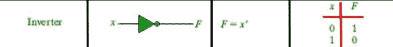

# 逻辑不！C 中的操作员，示例

> 原文:[https://www . geesforgeks . org/logic-not-operator-in-c-with-examples/](https://www.geeksforgeeks.org/logical-not-operator-in-c-with-examples/)

**！**是[逻辑运算符](https://www.geeksforgeeks.org/operators-in-java/)的一种，读作“**非**”或“**逻辑非**”。该运算符用于执行“逻辑非”操作，即类似于数字电子中 **[逆变器门](https://www.geeksforgeeks.org/digital-logic-logic-gates/)** 的功能。

[](https://media.geeksforgeeks.org/wp-content/uploads/20191015155207/Inverter-gate.jpg)

**语法:**

```cpp
!Condition

// returns true if the conditions is false
// else returns false

```

下面是一个演示的例子！操作员:

**示例:**

```cpp
// C program to demonstrate working
// of logical NOT '!' operators

#include <stdio.h>

int main()
{

    // Taking a variable a
    // and set it to 0 (false)
    int a = 0;

    // logical NOT example

    // Since 0 is considered to be false
    // !a will yield true
    if (!a)
        printf("Condition yielded True\n");
    else
        printf("Condition yielded False\n");

    // set a to non-zero value (true)
    a = 1;

    // Since a non-zero value is considered to be true
    // !a will yield false
    if (!a)
        printf("Condition yielded True\n");
    else
        printf("Condition yielded False\n");

    return 0;
}
```

**Output:**

```cpp
Condition yielded True
Condition yielded False

```