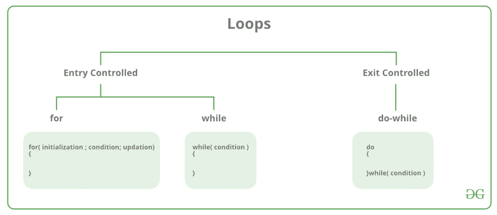
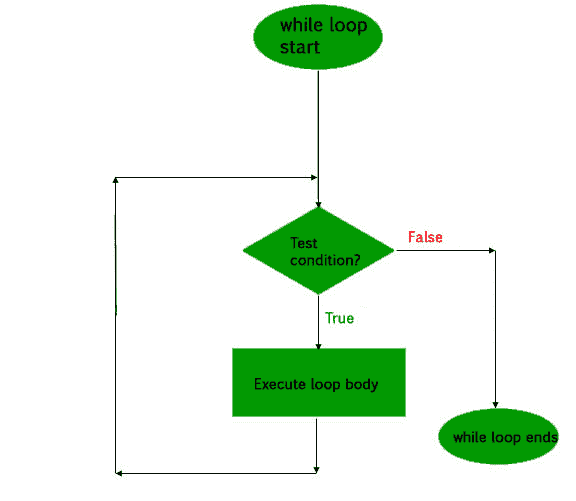
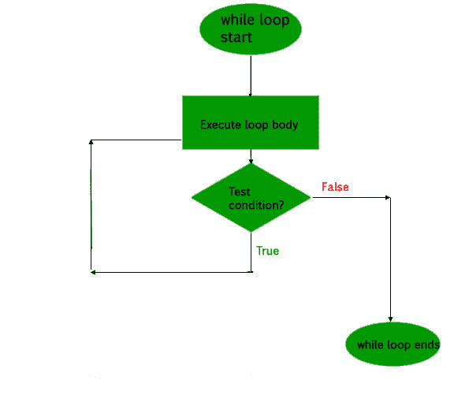

# C 和 C++中的循环

> 原文:[https://www.geeksforgeeks.org/loops-in-c-and-cpp/](https://www.geeksforgeeks.org/loops-in-c-and-cpp/)

当我们需要重复执行一段语句时，编程中的循环就开始使用了。比如:假设我们要把《你好世界》打印 10 遍。这可以通过两种方式完成，如下所示:

**迭代法**

一个迭代的方法是写 10 次 printf()语句。

## C

```cpp
// C program to illustrate need of loops
#include <stdio.h>

int main()
{
    printf( "Hello World\n");
    printf( "Hello World\n");
    printf( "Hello World\n");
    printf( "Hello World\n");
    printf( "Hello World\n");
    printf( "Hello World\n");
    printf( "Hello World\n");
    printf( "Hello World\n");
    printf( "Hello World\n");
    printf( "Hello World\n");

    return 0;
}
```

## C++

```cpp
// C++ program to illustrate need of loops
#include <iostream>
using namespace std;

int main()
{
    cout << "Hello World\n";
    cout << "Hello World\n";
    cout << "Hello World\n";
    cout << "Hello World\n";
    cout << "Hello World\n";
    cout << "Hello World\n";
    cout << "Hello World\n";
    cout << "Hello World\n";
    cout << "Hello World\n";
    cout << "Hello World\n";
    return 0;
}
```

**Output:**

```cpp
Hello World
Hello World
Hello World
Hello World
Hello World
Hello World
Hello World
Hello World
Hello World
Hello World

```

**使用循环**

在循环中，语句只需要写一次，循环将执行 10 次，如下所示。
在计算机编程中，循环是一个指令序列，重复执行直到达到某个条件。

*   完成一项操作，例如获取一项数据并对其进行更改，然后检查某些条件，例如计数器是否达到了规定的数值。
*   **计数器未达到:**如果计数器未达到所需的数值，序列中的下一条指令将返回序列中的第一条指令并重复执行。
*   **计数器达到:**如果条件已经达到，下一条指令“通过”到下一条顺序指令或循环外的分支。

主要有两种类型的循环:

1.  **进入受控回路**:在这种类型的回路中，测试条件在进入回路主体之前进行测试。**为循环**和**而循环**为入口控制循环。
2.  **退出受控循环**:在这种类型的循环中，测试条件在循环体的末端进行测试或评估。因此，不管测试条件是真还是假，循环体都将至少执行一次。**do–while 循环**是出口控制循环。

[](https://media.geeksforgeeks.org/wp-content/cdn-uploads/20191128194516/Cpp-loops.png)

回路的

**for 循环是一种重复控制结构，它允许我们编写一个执行特定次数的循环。该循环使我们能够在一行中一起执行 n 个步骤。
**语法:****

```cpp
for (initialization expr; test expr; update expr)
{    
     // body of the loop
     // statements we want to execute
} 
```

**在 for 循环中，循环变量用于控制循环。首先将这个循环变量初始化为某个值，然后检查这个变量是小于还是大于计数器值。如果语句为真，则执行循环体并更新循环变量。重复这些步骤，直到退出条件到来。**

*   ****初始化表达式**:在这个表达式中，我们必须将循环计数器初始化为某个值。例如:int I = 1；**
*   ****测试表达式**:在这个表达式中我们要测试条件。如果条件评估为真，那么我们将执行循环体并更新表达式，否则我们将退出 for 循环。比如:我<= 10；**
*   ****更新表达式**:执行循环体后，该表达式将循环变量增加/减少某个值。例如:i++；**

**回路等效流程图:
**

****示例:****

## **C**

```cpp
// C program to illustrate for loop
#include <stdio.h>

int main()
{
    int i=0;

    for (i = 1; i <= 10; i++)
    {
        printf( "Hello World\n");    
    }

    return 0;
}
```

## **C++**

```cpp
// C++ program to illustrate for loop
#include <iostream>
using namespace std;

int main()
{
    for (int i = 1; i <= 10; i++)
    {
        cout << "Hello World\n";
    }

    return 0;
}
```

****Output:**

```cpp
Hello World
Hello World
Hello World
Hello World
Hello World
Hello World
Hello World
Hello World
Hello World
Hello World

```** 

****同时循环****

**在研究循环的**时，我们已经看到迭代次数是预先已知的，即循环体需要执行的次数是我们已知的。而循环用于我们事先不知道循环迭代的确切次数的情况。基于测试条件终止循环执行。****

****语法** :
我们已经说过一个循环主要由三个语句组成——初始化表达式、测试表达式、更新表达式。三个循环的语法——For、while 和 do while 主要在这三个语句的位置上有所不同。**

```cpp
**initialization expression;**
while (**test_expression**)
{
   // statements

  **update_expression;**
} 
```

****流程图** :
**

****示例:****

## **C**

```cpp
// C program to illustrate while loop
#include <stdio.h>

int main()
{
    // initialization expression
    int i = 1;

    // test expression
    while (i < 6)
    {
        printf( "Hello World\n");    

        // update expression
        i++;
    }

    return 0;
}
```

## **C++**

```cpp
// C++ program to illustrate while loop
#include <iostream>
using namespace std;

int main()
{
    // initialization expression
    int i = 1;

    // test expression
    while (i < 6)
    {
        cout << "Hello World\n";

        // update expression
        i++;
    }

    return 0;
}
```

****Output:**

```cpp
Hello World
Hello World
Hello World
Hello World
Hello World

```** 

****边做边循环****

**在 do while 循环中，循环执行也根据测试条件终止。do while 循环和 while 循环的主要区别在于 do while 循环在循环体的末端测试条件，即 do while 循环是出口控制的，而其他两个循环是入口控制的循环。
**注意**:在 do while 循环中，不管测试条件如何，循环体都将至少执行一次。**

****语法**:**

```cpp
**initialization expression;**
do
{
   // statements

   **update_expression;**
} while (**test_expression**); 
```

****注意**:注意分号(；))在循环结束时。**

****流程图** :
**

****示例:****

## **C**

```cpp
// C program to illustrate do-while loop
#include <stdio.h>

int main()
{
    int i = 2; // Initialization expression

    do
    {
        // loop body
        printf( "Hello World\n");    

        // update expression
        i++;

    }  while (i < 1);   // test expression

    return 0;
}
```

## **C++**

```cpp
// C++ program to illustrate do-while loop
#include <iostream>
using namespace std;

int main()
{
    int i = 2; // Initialization expression

    do
    {
        // loop body
        cout << "Hello World\n";

        // update expression
        i++;

    }  while (i < 1);   // test expression

    return 0;
}
```

****Output:**

```cpp
Hello World

```** 

**在上述程序中，测试条件(i<1)评估为假。但是当循环被退出控制时，循环体将执行一次。**

****无限循环怎么样？****

**无限循环(有时称为循环)是一段没有功能出口的代码，因此它会无限重复。当条件的计算结果总是为真时，就会出现无限循环。通常，这是一个错误。**

## **C**

```cpp
// C program to demonstrate infinite loops
// using for and while
// Uncomment the  sections to see the output

#include <stdio.h>

int main ()
{
    int i;

    // This is an infinite for loop as the condition
    // expression is blank
    for ( ; ; )
    {
       printf("This loop will run forever.\n");
    }

    // This is an infinite for loop as the condition
    // given in while loop will keep repeating infinitely
    /*
    while (i != 0)
    {
        i-- ;
        printf( "This loop will run forever.\n");
    }
    */

    // This is an infinite for loop as the condition
    // given in while loop is "true"
    /*
    while (true)
    {
        printf( "This loop will run forever.\n");
    }
    */
}
```

## **C++**

```cpp
// C++ program to demonstrate infinite loops
// using for and while
// Uncomment the  sections to see the output

#include <iostream>
using namespace std;
int main ()
{
    int i;

    // This is an infinite for loop as the condition
    // expression is blank
    for ( ; ; )
    {
        cout << "This loop will run forever.\n";
    }

    // This is an infinite for loop as the condition
    // given in while loop will keep repeating infinitely
    /*
    while (i != 0)
    {
        i-- ;
        cout << "This loop will run forever.\n";
    }
    */

    // This is an infinite for loop as the condition
    // given in while loop is "true"
    /*
    while (true)
    {
        cout << "This loop will run forever.\n";
    }
    */
}
```

 **Output:

```cpp
This loop will run forever.
This loop will run forever.
................... 

```

**更高级的循环技术**

*   [c++中基于范围的循环](https://www.geeksforgeeks.org/range-based-loop-c/)
*   C++中每个循环的

**要点:**

*   当迭代次数事先已知，即循环体需要执行的次数已知时，用于循环。
*   在不知道确切迭代次数但知道循环终止条件的情况下，使用 while 循环。
*   如果代码需要像菜单驱动程序一样至少执行一次，请使用 do while 循环

**相关文章:**

*   [如果循环到 C/C++中有符号和无符号的最大值会发生什么？](https://www.geeksforgeeks.org/what-happens-if-loop-runs-till-maximum-of-signed-and-unsigned-in-c/)
*   [循环测验](https://www.geeksforgeeks.org/c-language-2-gq/loops-control-structure-gq/)

本文由 **Harsh Agarwal** 供稿。如果你喜欢 GeeksforGeeks 并想投稿，你也可以使用[write.geeksforgeeks.org](https://write.geeksforgeeks.org)写一篇文章或者把你的文章邮寄到 review-team@geeksforgeeks.org。看到你的文章出现在极客博客主页上，帮助其他极客。

如果你发现任何不正确的地方，或者你想分享更多关于上面讨论的话题的信息，请写评论。**