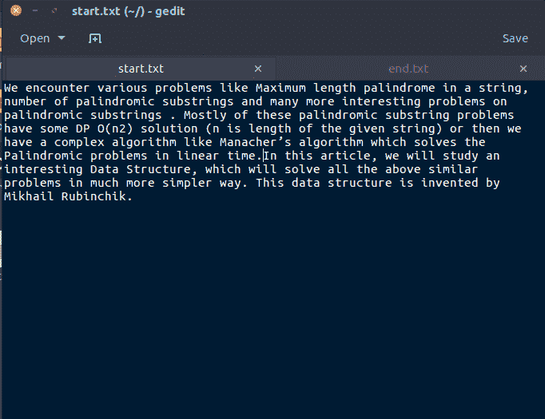
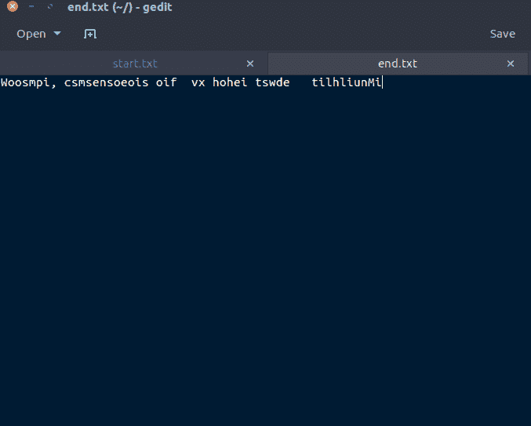

# C/c++中的 lseek()读取第 n 个备用字节，并将其写入另一个文件

> 原文:[https://www . geesforgeks . org/lseek-in-c-to-read-alternate-n-byte-and-write-it-in-other-file/](https://www.geeksforgeeks.org/lseek-in-c-to-read-the-alternate-nth-byte-and-write-it-in-another-file/)

从给定文件(例如 input.txt)中读取第 n 个备用字节，并在“lseek”的帮助下将其写入另一个文件。
**lseek (C 系统调用)** : lseek 是一个系统调用，用来改变文件描述符的读/写指针的位置。位置可以绝对或相对设置。
**功能定义**

> off_t lseek(int fildes，off_t offset，int what)；
> 
> **字段描述**
> int fildes:将要移动的指针的文件描述符
> off_t offset:指针的偏移量(以字节为单位)。
> int front:解释偏移量的方法
> (rela，absolute 等)。).这个变量的合法值在最后提供。
> 返回值:返回指针从文件
> 开始的偏移量(以字节为单位)。如果返回值为-1，
> 则移动指针时出错。

比如说我们的输入文件如下:
[](https://media.geeksforgeeks.org/wp-content/uploads/Screenshot-from-2017-03-29-22-24-46.png)

```cpp
// C program to read nth byte of a file and
// copy it to another file using lseek
#include <stdio.h>
#include <unistd.h>
#include <sys/types.h>
#include <fcntl.h>

void func(char arr[], int n)
{
    // Open the file for READ only.
    int f_write = open("start.txt", O_RDONLY);

    // Open the file for WRITE and READ only.
    int f_read = open("end.txt", O_WRONLY);

    int count = 0;
    while (read(f_write, arr, 1))
    {
        // to write the 1st byte of the input file in
        // the output file
        if (count < n)
        {
            // SEEK_CUR specifies that
            // the offset provided is relative to the
            // current file position
            lseek (f_write, n, SEEK_CUR);
            write (f_read, arr, 1);
            count = n;
        }

        // After the nth byte (now taking the alternate
        // nth byte)
        else
        {
            count = (2*n);
            lseek(f_write, count, SEEK_CUR);
            write(f_read, arr, 1);
        }
    }
    close(f_write);
    close(f_read);
}

// Driver code
int main()
{
    char arr[100];
    int n;
    n = 5;

    // Calling for the function
    func(arr, n);
    return 0;
}
```

**输出文件**
[](https://media.geeksforgeeks.org/wp-content/uploads/Screenshot-from-2017-03-29-22-24-35.png)

本文由**基什莱·维尔马**供稿。如果你喜欢 GeeksforGeeks 并想投稿，你也可以使用[contribute.geeksforgeeks.org](http://www.contribute.geeksforgeeks.org)写一篇文章或者把你的文章邮寄到 contribute@geeksforgeeks.org。看到你的文章出现在极客博客主页上，帮助其他极客。

如果你发现任何不正确的地方，或者你想分享更多关于上面讨论的话题的信息，请写评论。