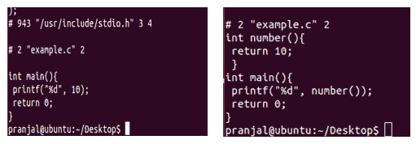

# 宏与功能

> 原文:[https://www.geeksforgeeks.org/macros-vs-functions/](https://www.geeksforgeeks.org/macros-vs-functions/)

宏是作为预处理器指令赋予一个 C 语句块的名称。作为一个预处理器，代码块在进入实际编码(main()函数)之前被传递给编译器。宏是用预处理器指令定义的。宏是**预处理的**，这意味着所有的宏都会在你的程序编译之前被处理。但是，函数不是经过预处理的**，而是经过编译的**。

**见以下宏示例:**

## C

```
#include<stdio.h>
#define NUMBER 10
int main()
{
     printf("%d", NUMBER);
     return 0;
}
```

## C++

```
#include<iostream>
#define NUMBER 10
using namespace std;
int main()
{
     cout<<NUMBER;
     return 0;
}
//This code is contributed by Mayank Tyagi
```

**输出:**

```
10
```

**见功能示例如下:**

## C

```
#include<stdio.h>
int number()
{
    return 10;
}
int main()
{
    printf("%d", number());
    return 0;
}
```

## C++

```
#include<iostream>
using namespace std;
int number()
{
    return 10;
}
int main()
{
    cout<<number();
    return 0;
}
//This code is contributed by Mayank Tyagi
```

**输出:**

```
10
```

现在使用以下命令编译它们:

```
gcc –E file_name.c
```

这将为您提供如图所示的可执行代码:



这表明宏是预处理的，而函数不是。
在宏中，不进行类型检查(操作数不兼容等)。)完成，因此在某些情况下使用宏会导致错误/副作用。然而，函数却不是这样。此外，宏不会检查编译错误(如果有)。考虑以下两个代码:

**宏:**

## C

```
#include<stdio.h>
#define CUBE(b) b*b*b
int main()
{
     printf("%d", CUBE(1+2));
     return 0;
}
```

**输出:意外输出**

```
7
```

**注意:**此宏展开如下

CUBE(1+2)= = 1+2 * 1+2 * 1+2 等于 7[正确但意外的结果取决于数学运算符的执行]

为了解决这个问题，我们需要将**#定义立方体(b) b*b*b** 替换为**#定义立方体(b) (b)*(b)*(b)。**随着宏的更新，立方体(1+2)将扩展为

CUBE(1+2) === (1+2)*(1+2)*(1+2)等于 27[正确且预期的结果]

**功能:**

## C

```
#include<stdio.h>
int cube(int a)
{
     return a*a*a;
}
int main()
{
    printf("%d", cube(1+2));
    return 0;
}
```

**输出:如预期**

```
27
```

*   宏通常是一行。但是，它们可以由多行组成，单击此处的查看用法。函数中没有这样的约束。
*   宏和函数不同的速度。宏通常比函数快，因为它们不涉及实际的函数调用开销。

**结论:**
宏不再推荐，因为它们会导致以下问题。现代编译器中有一种更好的方法，那就是内联函数和常量变量。以下是宏的缺点:
a)没有类型检查
b)难以调试，因为它们导致简单的替换。
c)宏没有命名空间，所以一段代码中的一个宏会影响其他段。
d)宏会产生副作用，如上例 CUBE()所示。

<figure class="table">T31 在任何情况下都会导致任何副作用

| grand | function |
| --- | --- |
| Macro preprocessed | The function is compiled |
| No type checking is done in the macro. | Type checking is done in the function. |
| Use macros to increase code length. | Use function to keep code length unaffected. |
| Use macros to execute faster. | The execution speed of using functions is slower. |
| Before compilation, the macro name is changed by macro value. | Instead of transferring control during function call. |
| Macros are useful when small code is repeated many times. | Functions are useful when writing large code. |

</figure>

有关宏的更多详细信息，请参见以下内容:
[关于宏和预处理程序的有趣事实](https://www.geeksforgeeks.org/interesting-facts-preprocessors-c/)

本文由**普拉哈尔·马图尔提供。**如果你喜欢 GeeksforGeeks，想投稿，也可以写一篇文章，把文章发到 review-team@geeksforgeeks.org。看到你的文章出现在极客博客主页上，帮助其他极客。

如果你发现任何不正确的地方，或者你想分享更多关于上面讨论的话题的信息，请写评论。