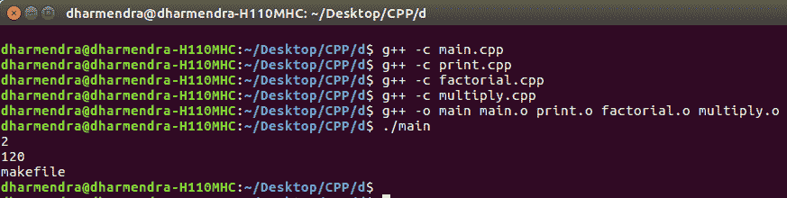

# c++中的 MakeFile 及其应用

> 原文:[https://www . geesforgeks . org/makefile-in-c-and-its-applications/](https://www.geeksforgeeks.org/makefile-in-c-and-its-applications/)

给定一个 C++程序，任务是以 Makefile 的形式分解整个程序。
基本上是用来创造的。cpp 文件和。为每个类/函数及其功能创建一个. h 文件，然后通过 C++中可用的 Makefile 命令将它们链接起来。

**优势:**

*   它使代码阅读和调试更加简洁明了。
*   每当你对一个功能或者一个类进行改变时，不需要每次都编译整个程序。Makefile 将只自动编译那些已经发生更改的文件。
*   通常，在长代码或项目中，Makefile 被广泛使用，以便以更系统和有效的方式呈现项目。

**示例:**创建一个程序，找到数字的阶乘和乘法并打印出来。

**传统方式**

```
// Program to calculate factorial and
// multiplication of two numbers.
#include<bits/stdc++.h>
using namespace std;

// Function to find factorial
int factorial(int n)
{
    if (n == 1)
        return 1;
    // Recursive Function to find 
    // factorial
    return n * factorial(n - 1);
}

// Function to multiply two numbers
int multiply(int a, int b)
{
    return a * b;
}

// Function to print
void print()
{
    cout << "makefile" << endl;
}

// Driver code
int main()
{
    int a = 1;
    int b = 2;
    cout << multiply(a, b) << endl;
    int fact = 5;
    cout << factorial(5) << endl;
    print();
    return 0;
}
```

**输出:**

```
2
120
makefile
```

**使用 Makefile 运行上述程序:**

*   **文件名:main.cpp**

    ```
    #include <bits/stdc++.h>

    // Note function.h which has all functions
    // definations has been included
    #include "function.h"

    using namespace std;

    // Main program
    int main()
    {
        int num1 = 1;
        int num2 = 2;
        cout << multiply(num1, num2) << endl;
        int num3 = 5;
        cout << factorial(num3) << endl;
        print();
    }
    ```

*   **文件名:print.cpp**

    ```
    #include <bits/stdc++.h>

    // Definition of print function is
    // present in function.h file
    #include "function.h"
    using namespace std;

    void print()
    {
        cout < "makefile" << endl;
    }
    ```

*   **文件名:阶乘**

    ```
    #include <bits/stdc++.h>

    // Definition of factorial function
    // is present in function.h file
    #include "function.h"
    using namespace std;

    // Recursive factorial program
    int factorial(int n)
    {
        if (n == 1)
            return 1;
        return n * factorial(n - 1);
    }
    ```

*   **文件名:乘法. cpp**

    ```
    #include <bits/stdc++.h>

    // Definition of multiply function 
    // is present in function.h file
    #include "function.h"
    using namespace std;

    int multiply(int a, int b)
    {
        return a * b;
    }
    ```

*   **文件名:functions.h**

    ```
    #ifndef FUNCTIONS_H
    #define FUNCTIONS_H

    void print();
    int factorial(int);
    int multiply(int, int);

    #endif
    ```

**编译和运行上述程序的命令:**

```
Open Terminal and type commands:
g++ -c main.cpp
g++ -c print.cpp
g++ -c factorial.cpp
g++ -c multiply.cpp
g++ -o main main.o print.o factorial.o multiply.o
./main

Note: g++ -c filename.cpp is used to create object file.

```

