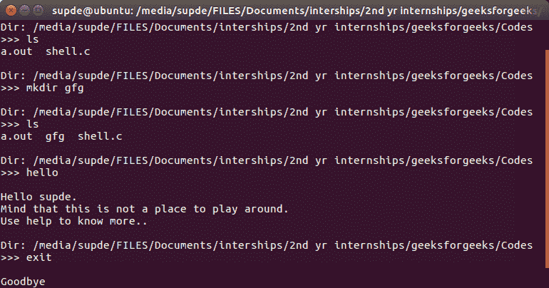
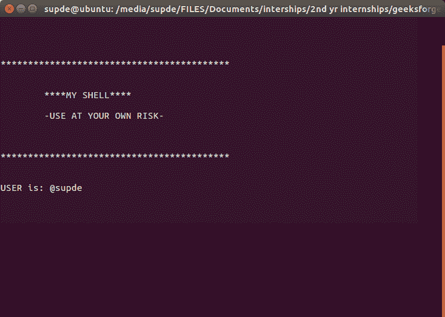

# 用 C 语言制作自己的 Linux Shell

> 原文:[https://www.geeksforgeeks.org/making-linux-shell-c/](https://www.geeksforgeeks.org/making-linux-shell-c/)

要了解更多关于什么是外壳的信息，请点击这里的。

我们在 Linux 发行版中都使用内置的终端窗口，比如 Ubuntu、Fedora 等。但是它们实际上是如何工作的呢？在这篇文章中，我们将在引擎盖下处理一些**特性和算法，它们实际上在一个外壳中工作。所有的 Linux 操作系统都有一个终端窗口来写入命令。但是输入后如何正确执行呢？
另外，如何处理额外的功能，如保存命令历史和显示帮助？所有这些都可以通过创建自己的外壳来理解。
[](http://contribute.geeksforgeeks.org/?attachment_id=218532)**

 ****基础知识****

****输入命令后，进行以下操作:****

1.  **输入命令，如果长度非空，将其保留在历史记录中。**
2.  **解析:解析是将命令分解成单独的单词和字符串**
3.  **检查特殊字符，如管道等已经完成**
4.  **检查是否需要内置命令。**
5.  **如果[管道](https://www.geeksforgeeks.org/pipe-system-call/)存在，搬运管道。**
6.  **通过将分叉为一个孩子并调用[执行](https://www.geeksforgeeks.org/exec-family-of-functions-in-c/)来执行系统命令和库。**
7.  **打印当前目录名并要求下一次输入。**

**为了保留命令的历史，使用箭头键恢复历史，以及使用 tab 键处理自动完成，我们将使用 GNU 提供的 readline 库。**

****实施****

**要安装 readline 库，请打开终端窗口并写入**

```
sudo apt-get install libreadline-dev
```

**它会询问你的密码。输入它。下一步按 y。**

*   **可以使用 **getcwd** 打印目录。**
*   **获取用户名可以通过 **getenv【用户】**完成**
*   **解析可以通过使用**strep(" "**)来完成。它会根据空格分隔单词。总是跳过零长度的单词，以避免存储额外的空间。**
*   **解析后，检查内置命令列表，如果有，就执行它。如果不是，请将其作为系统命令执行。要检查内置命令，请将命令存储在字符指针数组中，并与 **strcmp()** 进行比较。
    注意:“cd”在使用 execvp 时无法正常工作，因此它是一个内置命令，使用 **chdir()** 执行。**
*   **为了执行系统命令，将创建一个新的子对象，然后通过使用 execvp，执行该命令，并等待直到它完成。**
*   **检测管道也可以使用**strsep(“|”**)完成。要处理管道，首先将命令的第一部分与第二部分分开。然后在解析每个部分之后，使用 execvp 在两个独立的新子部分中调用这两个部分。管道是指将第一个命令的输出作为第二个命令的输入传递。

    1.  声明一个大小为 2 的整数数组来存储文件描述符。文件描述符 0 用于读取，1 用于写入。
    2.  使用 pipe()函数打开管道。
    3.  创造两个孩子。
    4.  在子 1->

        ```
        Here the output has to be taken into the pipe.
        Copy file descriptor 1 to stdout.
        Close  file descriptor 0.
        Execute the first command using execvp()

        ```

    5.  在子 2->

        ```
        Here the input has to be taken from the pipe.
        Copy file descriptor 0 to stdin.
        Close file descriptor 1.
        Execute the second command using execvp()

        ```

    6.  等两个孩子在家长里说完。** 

```
// C Program to design a shell in Linux
#include<stdio.h>
#include<string.h>
#include<stdlib.h>
#include<unistd.h>
#include<sys/types.h>
#include<sys/wait.h>
#include<readline/readline.h>
#include<readline/history.h>

#define MAXCOM 1000 // max number of letters to be supported
#define MAXLIST 100 // max number of commands to be supported

// Clearing the shell using escape sequences
#define clear() printf("\033[H\033[J")

// Greeting shell during startup
void init_shell()
{
    clear();
    printf("\n\n\n\n******************"
        "************************");
    printf("\n\n\n\t****MY SHELL****");
    printf("\n\n\t-USE AT YOUR OWN RISK-");
    printf("\n\n\n\n*******************"
        "***********************");
    char* username = getenv("USER");
    printf("\n\n\nUSER is: @%s", username);
    printf("\n");
    sleep(1);
    clear();
}

// Function to take input
int takeInput(char* str)
{
    char* buf;

    buf = readline("\n>>> ");
    if (strlen(buf) != 0) {
        add_history(buf);
        strcpy(str, buf);
        return 0;
    } else {
        return 1;
    }
}

// Function to print Current Directory.
void printDir()
{
    char cwd[1024];
    getcwd(cwd, sizeof(cwd));
    printf("\nDir: %s", cwd);
}

// Function where the system command is executed
void execArgs(char** parsed)
{
    // Forking a child
    pid_t pid = fork(); 

    if (pid == -1) {
        printf("\nFailed forking child..");
        return;
    } else if (pid == 0) {
        if (execvp(parsed[0], parsed) < 0) {
            printf("\nCould not execute command..");
        }
        exit(0);
    } else {
        // waiting for child to terminate
        wait(NULL); 
        return;
    }
}

// Function where the piped system commands is executed
void execArgsPiped(char** parsed, char** parsedpipe)
{
    // 0 is read end, 1 is write end
    int pipefd[2]; 
    pid_t p1, p2;

    if (pipe(pipefd) < 0) {
        printf("\nPipe could not be initialized");
        return;
    }
    p1 = fork();
    if (p1 < 0) {
        printf("\nCould not fork");
        return;
    }

    if (p1 == 0) {
        // Child 1 executing..
        // It only needs to write at the write end
        close(pipefd[0]);
        dup2(pipefd[1], STDOUT_FILENO);
        close(pipefd[1]);

        if (execvp(parsed[0], parsed) < 0) {
            printf("\nCould not execute command 1..");
            exit(0);
        }
    } else {
        // Parent executing
        p2 = fork();

        if (p2 < 0) {
            printf("\nCould not fork");
            return;
        }

        // Child 2 executing..
        // It only needs to read at the read end
        if (p2 == 0) {
            close(pipefd[1]);
            dup2(pipefd[0], STDIN_FILENO);
            close(pipefd[0]);
            if (execvp(parsedpipe[0], parsedpipe) < 0) {
                printf("\nCould not execute command 2..");
                exit(0);
            }
        } else {
            // parent executing, waiting for two children
            wait(NULL);
            wait(NULL);
        }
    }
}

// Help command builtin
void openHelp()
{
    puts("\n***WELCOME TO MY SHELL HELP***"
        "\nCopyright @ Suprotik Dey"
        "\n-Use the shell at your own risk..."
        "\nList of Commands supported:"
        "\n>cd"
        "\n>ls"
        "\n>exit"
        "\n>all other general commands available in UNIX shell"
        "\n>pipe handling"
        "\n>improper space handling");

    return;
}

// Function to execute builtin commands
int ownCmdHandler(char** parsed)
{
    int NoOfOwnCmds = 4, i, switchOwnArg = 0;
    char* ListOfOwnCmds[NoOfOwnCmds];
    char* username;

    ListOfOwnCmds[0] = "exit";
    ListOfOwnCmds[1] = "cd";
    ListOfOwnCmds[2] = "help";
    ListOfOwnCmds[3] = "hello";

    for (i = 0; i < NoOfOwnCmds; i++) {
        if (strcmp(parsed[0], ListOfOwnCmds[i]) == 0) {
            switchOwnArg = i + 1;
            break;
        }
    }

    switch (switchOwnArg) {
    case 1:
        printf("\nGoodbye\n");
        exit(0);
    case 2:
        chdir(parsed[1]);
        return 1;
    case 3:
        openHelp();
        return 1;
    case 4:
        username = getenv("USER");
        printf("\nHello %s.\nMind that this is "
            "not a place to play around."
            "\nUse help to know more..\n",
            username);
        return 1;
    default:
        break;
    }

    return 0;
}

// function for finding pipe
int parsePipe(char* str, char** strpiped)
{
    int i;
    for (i = 0; i < 2; i++) {
        strpiped[i] = strsep(&str, "|");
        if (strpiped[i] == NULL)
            break;
    }

    if (strpiped[1] == NULL)
        return 0; // returns zero if no pipe is found.
    else {
        return 1;
    }
}

// function for parsing command words
void parseSpace(char* str, char** parsed)
{
    int i;

    for (i = 0; i < MAXLIST; i++) {
        parsed[i] = strsep(&str, " ");

        if (parsed[i] == NULL)
            break;
        if (strlen(parsed[i]) == 0)
            i--;
    }
}

int processString(char* str, char** parsed, char** parsedpipe)
{

    char* strpiped[2];
    int piped = 0;

    piped = parsePipe(str, strpiped);

    if (piped) {
        parseSpace(strpiped[0], parsed);
        parseSpace(strpiped[1], parsedpipe);

    } else {

        parseSpace(str, parsed);
    }

    if (ownCmdHandler(parsed))
        return 0;
    else
        return 1 + piped;
}

int main()
{
    char inputString[MAXCOM], *parsedArgs[MAXLIST];
    char* parsedArgsPiped[MAXLIST];
    int execFlag = 0;
    init_shell();

    while (1) {
        // print shell line
        printDir();
        // take input
        if (takeInput(inputString))
            continue;
        // process
        execFlag = processString(inputString,
        parsedArgs, parsedArgsPiped);
        // execflag returns zero if there is no command
        // or it is a builtin command,
        // 1 if it is a simple command
        // 2 if it is including a pipe.

        // execute
        if (execFlag == 1)
            execArgs(parsedArgs);

        if (execFlag == 2)
            execArgsPiped(parsedArgs, parsedArgsPiped);
    }
    return 0;
}
```

****运行代码–****

```
 gcc shell.c -lreadline
./a.out 
```

**输出:
[](http://contribute.geeksforgeeks.org/?attachment_id=218531) 
[](http://contribute.geeksforgeeks.org/?attachment_id=218532)**

**本文由**T1 掌门人**供稿。如果你喜欢 GeeksforGeeks 并想投稿，你也可以使用[contribute.geeksforgeeks.org](http://www.contribute.geeksforgeeks.org)写一篇文章或者把你的文章邮寄到 contribute@geeksforgeeks.org。看到你的文章出现在极客博客主页上，帮助其他极客。**

**如果你发现任何不正确的地方，或者你想分享更多关于上面讨论的话题的信息，请写评论。**