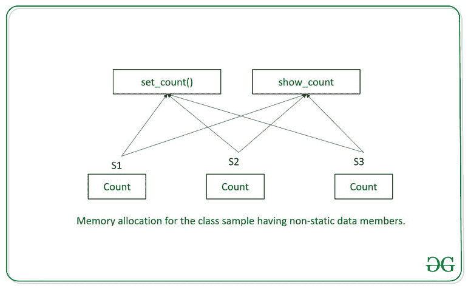
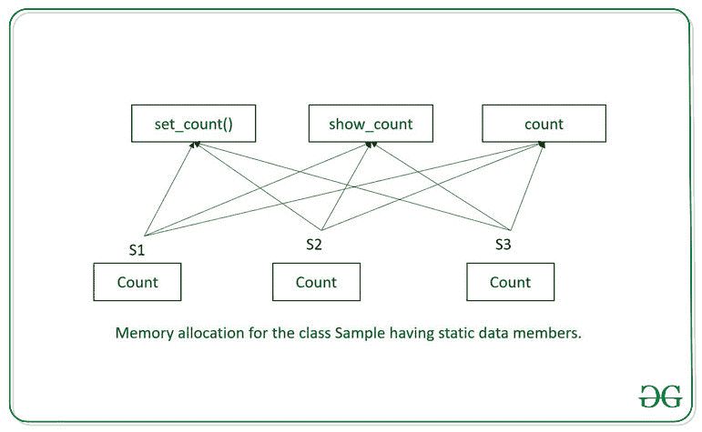

# c++ 中静态数据成员的内存分配

> 原文:[https://www . geesforgeks . org/memory-allocation-in-static-data-members-in-c/](https://www.geeksforgeeks.org/memory-allocation-in-static-data-members-in-c/)

[C++ ](https://www.geeksforgeeks.org/c-plus-plus/) 允许使用[静态](https://www.geeksforgeeks.org/static-variables-in-c/) [关键字](https://www.geeksforgeeks.org/variables-and-keywords-in-c/)在[类](https://www.geeksforgeeks.org/c-classes-and-objects/)中定义[静态数据成员](https://www.geeksforgeeks.org/static-data-members-c/)。
当数据成员被声明为静态时，我们必须记住以下注意事项:

*   不管创建了多少个对象，在内存中只创建静态成员的一个副本。
*   一个类的所有对象共享静态成员。
*   创建该类的第一个对象时，所有静态数据成员都被初始化为零。
*   静态数据成员仅在类中可见，但它们的生命周期是整个程序。

**相关性:**
静态数据成员通常用于维护整个类共有的值。**例如，**记录一个特定类有多少对象被创建。

**存储位置:**
虽然静态数据成员是在类内部声明的，但它们不被认为是对象的一部分。因此，它们在类中的声明不被认为是它们的定义。静态数据成员是在类外部定义的。这意味着，即使静态数据成员是在类范围内声明的，它们的定义仍然存在于整个文件中。静态成员具有文件范围。但是，由于静态数据成员是在类中声明的，因此只能通过使用类名和范围解析运算符来访问它们。

下面是说明**静态**和**非静态**数据成员内存分配的程序:

**程序 1:说明非静态成员**

```cpp
// C++ program to illustrate
// non-static data members
using namespace std;
#include <iostream>

// Class
class GfG {
private:
    // Created a variable
    int count = 0;

public:
    // Member function to increment
    // value of count
    void set_count()
    {
        count++ ;
    }

    // Member function to access the
    // private members of this class
    void show_count()
    {

        // print the count variable
        cout << count << '\n';
    }
};

// Driver Code
int main()
{
    // Objects of class GfG
    GfG S1, S2, S3;

    // Set count variable to 1
    // for each object
    S1.set_count();
    S2.set_count();
    S3.set_count();

    // Function to display count
    // for each object
    S1.show_count();
    S2.show_count();
    S3.show_count();

    return 0;
}
```

**Output:**

```cpp
1
1
1

```

下图为上述程序的内存分配图解:
[](https://media.geeksforgeeks.org/wp-content/uploads/20200602114045/non-static.jpg)

**解释:**
GfG 类的所有三个对象 S1、S2 和 S3 共享成员函数，但拥有数据成员计数的单独副本。在 [main()](https://www.geeksforgeeks.org/executing-main-in-c-behind-the-scene/) 中，明确调用 **set_count()** 将 count 的值设置为 1。现在，每个对象的计数值为 1。

**程序二:说明静态成员:**

```cpp
// C++ program to illustrate
// non-static data members
using namespace std;
#include <iostream>

// Class
class GfG {
private:
    // Created a static variable
    static int count;

public:
    // Member function to increment
    // value of count
    void set_count()
    {
        count++ ;
    }

    // Member function to access the
    // private members of this class
    void show_count()
    {

        // print the count variable
        cout << count << '\n';
    }
};

int GfG::count = 0;

// Driver Code
int main()
{
    // Objects of class GfG
    GfG S1, S2, S3;

    // Increment count variable
    // by 1 for each object
    S1.set_count();
    S2.set_count();
    S3.set_count();

    // Function to display count
    // for each object
    S1.show_count();
    S2.show_count();
    S3.show_count();

    return 0;
}
```

**Output:**

```cpp
3
3
3

```

下图为上述程序的内存分配图解:
[](https://media.geeksforgeeks.org/wp-content/uploads/20200602114521/static.jpg)

**说明:**
类的三个对象 **GfG** S1、S2、S3 共享成员函数和静态数据成员。内存中只存在静态数据成员的一个副本。函数不需要显式设置 count 的值，因为静态数据成员的值已经在类定义之外初始化为 0。现在，每个对象增加计数值，从而增加输出。
**注意:**成员函数和静态数据成员的内存是按类分配的，而不是按对象分配的。类样本没有数据成员(静态计数除外)，但这并不意味着没有内存空间分配给样本的对象。在这种情况下，为对象留出最少的内存。因此，S1、S2 和 S3 的大小是 1 字节。