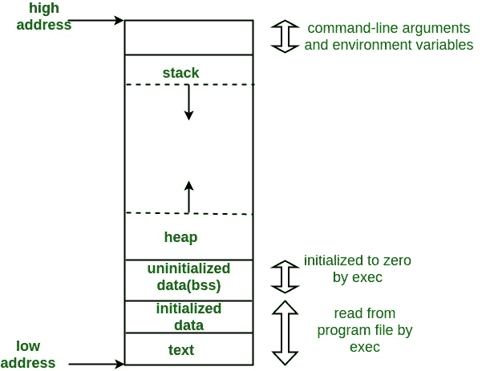

# C 程序的内存布局

> 原文:[https://www.geeksforgeeks.org/memory-layout-of-c-program/](https://www.geeksforgeeks.org/memory-layout-of-c-program/)

C 程序的典型内存表示包括以下几个部分。
1。文本段(即说明)
2。初始化数据段
3。未初始化的数据段(bss)
4。堆
5。堆叠



运行进程的典型内存布局
**1。文本段:**
文本段，也称为代码段或简称为文本，是目标文件或内存中程序的一部分，其中包含可执行指令。
作为内存区域，可以在堆或栈下放置一个文本段，以防止堆和栈溢出覆盖它。

通常，文本段是可共享的，因此对于频繁执行的程序，例如文本编辑器、C 编译器、shells 等，只需要在内存中保存一个副本。此外，文本段通常是只读的，以防止程序意外修改其指令。

**2。初始化数据段:**
初始化数据段，通常简称为数据段。数据段是程序虚拟地址空间的一部分，它包含由程序员初始化的全局变量和静态变量。
请注意，数据段不是只读的，因为变量的值可以在运行时更改。
该段可进一步分为初始化只读区和初始化读写区。
例如，在 C 语言中由 char s[]=“hello world”定义的全局字符串，以及在 main 之外的类似 int debug=1 的 C 语句(即全局)将被存储在初始化的读写区域中。像 const char * string =“hello world”这样的全局 C 语句使字符串文字“hello world”存储在初始化的只读区域，字符指针变量 string 存储在初始化的读写区域。
Ex:静态 int i = 10 将存储在数据段中，全局 int i = 10 也将存储在数据段中

**3。未初始化的数据段:**
未初始化的数据段通常被称为“ **bss** 段，以一个古代汇编运算符命名，该运算符代表以符号开头的“**块。”在程序开始执行
之前，内核将该段中的数据初始化为算术 0，未初始化的数据从数据段的末尾开始，包含所有初始化为零或在源代码中没有显式初始化的全局变量和静态变量。
例如，声明为静态 int i 的变量；将包含在基站服务部分中。
例如，声明为 int j 的全局变量；将包含在基站服务部分中。**

**4。**
栈区传统上与堆区相邻，向相反方向生长；当堆栈指针遇到堆指针时，空闲内存耗尽。(借助现代的大地址空间和虚拟内存技术，它们几乎可以放在任何地方，但它们通常仍会向相反的方向发展。)
堆栈区域包含程序堆栈，这是一种 LIFO 结构，通常位于内存的较高部分。在标准的 PC x86 计算机架构上，它向地址零增长；在其他一些架构上，它的增长方向相反。“堆栈指针”寄存器跟踪堆栈的顶部；每次将值“推”到堆栈上时，都会对其进行调整。为一个函数调用推送的一组值被称为“堆栈帧”；堆栈帧至少包含一个返回地址。
堆栈，存储自动变量，以及每次调用函数时保存的信息。每次调用函数时，要返回的地址和关于调用方环境的某些信息(如一些机器寄存器)都会保存在堆栈中。然后，新调用的函数在堆栈上为其自动变量和临时变量分配空间。这就是 C 语言中递归函数的工作原理。每次递归函数调用自己时，都会使用一个新的堆栈框架，因此一组变量不会干扰来自函数另一个实例的变量。

**5。堆:**
堆是动态内存分配通常发生的部分。
堆区从 BSS 段的末尾开始，并从那里扩展到更大的地址。Heap 区域由 malloc、realloc 和 free 管理，它们可能会使用 brk 和 sbrk 系统调用来调整其大小(注意，履行 malloc/realloc/free 的契约不需要使用 brk/sbrk 和单个“Heap area”；它们也可以使用 mmap 来实现，以将虚拟存储器的潜在非连续区域保留到进程的虚拟地址空间中)。堆区域由进程中的所有共享库和动态加载的模块共享。

例子。
size(1)命令报告文本、数据和 bss 段的大小(以字节为单位)。(更多详情请参考尺寸手册(1))

1.检查以下简单的 C 程序

## C

```cpp
#include <stdio.h>

int main(void)
{
    return 0;
}
```

```cpp
[narendra@CentOS]$ gcc memory-layout.c -o memory-layout
[narendra@CentOS]$ size memory-layout
text       data        bss        dec        hex    filename
960        248          8       1216        4c0    memory-layout
```

2.让我们在程序中添加一个全局变量，现在检查 bss 的大小(用红色突出显示)。

## C

```cpp
#include <stdio.h>

int global; /* Uninitialized variable stored in bss*/

int main(void)
{
    return 0;
}
```

```cpp
[narendra@CentOS]$ gcc memory-layout.c -o memory-layout
[narendra@CentOS]$ size memory-layout
text       data        bss        dec        hex    filename
 960        248         12       1220        4c4    memory-layout
```

3.让我们添加一个静态变量，它也存储在 bss 中。

## C

```cpp
#include <stdio.h>

int global; /* Uninitialized variable stored in bss*/

int main(void)
{
    static int i; /* Uninitialized static variable stored in bss */
    return 0;
}
```

```cpp
[narendra@CentOS]$ gcc memory-layout.c -o memory-layout
[narendra@CentOS]$ size memory-layout
text       data        bss        dec        hex    filename
 960        248         16       1224        4c8    memory-layout
```

4.让我们初始化静态变量，然后将其存储在数据段中

## C

```cpp
#include <stdio.h>

int global; /* Uninitialized variable stored in bss*/

int main(void)
{
    static int i = 100; /* Initialized static variable stored in DS*/
    return 0;
}
```

```cpp
[narendra@CentOS]$ gcc memory-layout.c -o memory-layout
[narendra@CentOS]$ size memory-layout
text       data        bss        dec        hex    filename
960         252         12       1224        4c8    memory-layout
```

5.让我们初始化全局变量，然后将其存储在数据段中

## C

```cpp
#include <stdio.h>

int global = 10; /* initialized global variable stored in DS*/

int main(void)
{
    static int i = 100; /* Initialized static variable stored in DS*/
    return 0;
}
```

```cpp
[narendra@CentOS]$ gcc memory-layout.c -o memory-layout
[narendra@CentOS]$ size memory-layout
text       data        bss        dec        hex    filename
960         256          8       1224        4c8    memory-layout
```

本文由**纳伦德拉·康拉尔卡尔**整理。如果你发现任何不正确的地方，或者你想分享更多关于上面讨论的话题的信息，请写评论。

**来源:**

[http://en . Wikipedia . org/wiki/data _ segment](http://en.wikipedia.org/wiki/Data_segment)

[http://en . Wikipedia . org/wiki/code _ segment](http://en.wikipedia.org/wiki/Code_segment)

[http://en . Wikipedia . org/wiki/。BSS〔t1〕](http://en.wikipedia.org/wiki/.bss)

[http://www . Amazon . com/Advanced-Programming-UNIX-Environment-2nd/DP/0201433079](http://www.amazon.com/Advanced-Programming-UNIX-Environment-2nd/dp/0201433079)