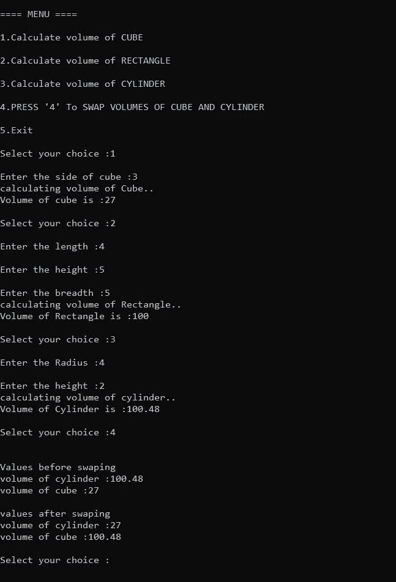

# 基于菜单的程序，使用功能重载找到 3D 形状的体积

> 原文:[https://www . geesforgeks . org/基于菜单的程序查找三维形状的体积-使用-函数-重载/](https://www.geeksforgeeks.org/menu-based-program-to-find-the-volume-of-3d-shapes-using-function-overloading/)

给定像**立方体**、**长方体**或**圆柱体**这样的三维形状的尺寸，任务是使用[函数重载](https://www.geeksforgeeks.org/function-overloading-c/)来查找所有三维形状的体积。

**示例:**

> **输入:**立方体:L = 3，长方体:L = 3，B = 4，H = 3，圆柱体:R = 2，H = 7
> **输出:**
> 立方体体积:27
> 长方体体积:36
> 圆柱体体积:176
> 
> **输入:**立方体:L = 2，长方体:L = 3，B = 2，H = 3，圆柱体:R = 1，H = 7
> T3】输出:T5】立方体体积:8
> 长方体体积:18
> 圆柱体体积:22

**方法:**给定的问题可以通过创建不同的[函数](https://www.geeksforgeeks.org/functions-in-c/)来解决，这些函数名称相同，比如**卷**但是函数定义不同。然后通过传递不同的参数重载所有的函数，然后借助[开关语句](https://www.geeksforgeeks.org/switch-statement-cc/)从主函数调用所有的函数。

下面是 [C++程序](https://www.geeksforgeeks.org/c-plus-plus/)使用函数重载查找不同 3D 形状的体积:

## C++

```cpp
// C++ program to find the volume of
// 2D Shapes using the function
// overloading
#include <iostream>
#define PI 3.14
using namespace std;

// Function to find volume of cube
float volume(float side)
{
    cout << "calculating volume of Cube..";
    float calculate_volume;

    calculate_volume
        = side * side * side;

    // Return the volume
    return calculate_volume;
}

// Function to find volume of rectangle
float volume(float length, float breadth,
             float height)
{
    cout << "calculating volume of "
         << "Rectangle..";
    int calculate_volume;
    calculate_volume
        = length * breadth * height;

    // Return the volume
    return calculate_volume;
}

// Function to find volume of cylinder
float volume(double radius,
             double height)
{
    cout << "calculating volume of"
         << " cylinder..";
    float calculate_volume;
    calculate_volume
        = PI * radius * radius * height;

    // Return the volume
    return calculate_volume;
}

// Function to swap the values of
// volume of cube and cylinder
void swapvalues(float cylinder, float cube)
{
    float third_variable;
    if (cylinder == 0 || cube == 0) {

        cout << "\nvalues are not assign";
        return;
    }

    cout << "\n\nValues before swaping";
    cout << "\nvolume of cylinder :"
         << cylinder;
    cout << "\nvolume of cube :"
         << cube;

    // Perform Swap Operation
    third_variable = cube;
    cube = cylinder;
    cylinder = third_variable;

    cout << "\n\nvalues after swaping ";

    cout << "\nvolume of cylinder :"
         << cylinder;

    cout << "\nvolume of cube :"
         << cube;
}

// Driver Code
int main()
{
    float height, radius, length;
    float breadth, rectangleHeight;
    float volumeCube = 0;
    float volumeRectangle = 0;
    float volumeCylinder = 0;
    float side;

    int choice;

    // Main menu
    cout << "\n\n==== MENU ====";
    cout << "\n\n1.Calculate volume "
         << "of CUBE";
    cout << "\n\n2.Calculate volume "
         << "of RECTANGLE";
    cout << "\n\n3.Calculate volume "
         << "of CYLINDER";
    cout << "\n\n4.PRESS '4' To SWAP "
         << "VOLUMES OF CUBE AND "
            "CYLINDER";
    cout << "\n\n5.Exit";

    while (1) {

        cout << "\n\nSelect your choice :";
        cin >> choice;

        // Switch Case
        switch (choice) {

        case 1:
            cout << "\nEnter the side"
                 << " of cube :";
            cin >> side;
            volumeCube = volume(side);

            cout << "\nVolume of cube is :"
                 << volumeCube;
            break;

        case 2:
            cout << "\nEnter the length :";
            cin >> length;

            cout << "\nEnter the height :";
            cin >> rectangleHeight;

            cout << "\nEnter the breadth :";
            cin >> breadth;

            volumeRectangle
                = volume(length, breadth,
                         rectangleHeight);

            cout << "\nVolume of Rectangle is :"
                 << volumeRectangle;

            break;

        case 3:
            cout << "\nEnter the Radius :";
            cin >> radius;

            cout << "\nEnter the height :";
            cin >> height;

            volumeCylinder = volume(
                radius, height);

            cout << "\nVolume of Cylinder is :"
                 << volumeCylinder;
            break;

        case 4:

            swapvalues(volumeCylinder,
                       volumeCube);
            break;

        case 5:
            exit(0);
        }
    }
}
```

**输出:**

[](https://media.geeksforgeeks.org/wp-content/uploads/20210503213148/area.JPG)