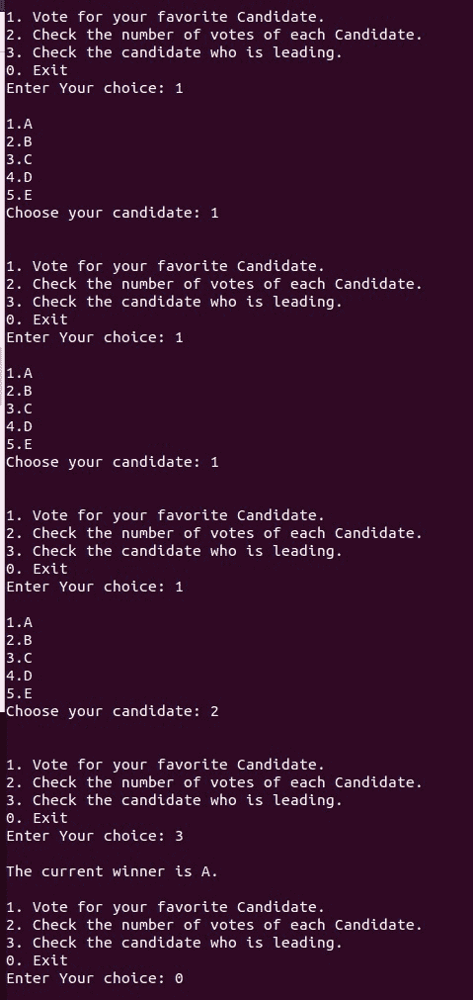

# 投票系统菜单驱动程序

> 原文:[https://www . geesforgeks . org/菜单驱动程序投票系统/](https://www.geeksforgeeks.org/menu-driven-program-for-voting-system/)

在本文中，我们将编写一个[菜单驱动程序](https://www.geeksforgeeks.org/menu-driven-program-using-switch-case-c/)来实现投票系统。该程序必须包含以下属性:

*   投票。
*   显示每个候选人的票数。
*   显示得票最多的候选人姓名。

**方法:**按照以下步骤解决问题:

1.  如下所示，向正在访问的人员提供以下选项:
    *   投票给你最喜欢的候选人。
    *   检查每个候选人的票数。
    *   检查领先的候选人，然后[退出](https://www.geeksforgeeks.org/understanding-exit-abort-and-assert/)。
2.  用户选择其中一个选项。
3.  如果用户选择 1，则显示候选列表，用户现在可以从该候选列表中进行选择。
4.  如果用户选择 2，则显示候选人列表及其当前票数。
5.  如果用户选择 3，将显示得票最多的候选人姓名。如果拥有最多票数的候选人不止一个，则显示一条[错误信息](https://www.geeksforgeeks.org/error-handling-c-programs/)，说明“没有获胜者”。
6.  该程序一直持续到用户选择 **0** 到**退出()**为止。

下面是上述方法的实现:

## C++

```cpp
// C++ program for the above approach
#include <bits/stdc++.h>
using namespace std;

// Driver Code
int main()
{
    int choice, i, N;

    // Stores the names of candidates
    vector<string> candidates
        = { "A", "B", "C", "D", "E" };
    N = candidates.size();

    // Stores the votes of candidates
    vector<int> votes(N);
    do {
        cout << "\n1\. Vote for your "
             << "favorite Candidate.\n";
        cout << "2\. Check the number "
             << "of votes of each "
                "Candidate.\n";
        cout << "3\. Check the candidate "
             << "who is leading.\n";
        cout << "0\. Exit\n";

        // Take input of options
        cout << "Enter Your choice: ";
        cin >> choice;
        cout << "\n";

        // Switch Statement
        switch (choice) {

        case 1: {
            int candidatechoice;

            // Display the names of
            // all the candidates
            for (i = 0; i < N; i++)
                cout << i + 1 << "."
                     << candidates[i]
                     << "\n";

            cout << "Choose your candidate: ";

            // Taking user's vote
            cin >> candidatechoice;
            cout << "\n";

            // Update the vote of the
            // chosen candidate
            votes[candidatechoice - 1]++ ;
            break;
        }
        case 2: {

            // Display the name and votes
            // of each
            // candidate
            for (i = 0; i < N; i++)
                cout << i + 1 << "."
                     << candidates[i] << " "
                     << votes[i] << "\n";
            break;
        }
        case 3: {
            int mx = 0;
            string winner;

            // Find the candidate with
            // maximum votes
            for (int i = 0; i < N; i++)
                if (votes[i] > mx) {
                    mx = votes[i];
                    winner = candidates[i];
                }
            int flag = 0;

            // Check whether there are
            // more than one candidates
            // with maximum votes
            for (int i = 0; i < N; i

                if (votes[i] == mx
                    && winner != candidates[i]) {
                flag = 1;
                break;
                }
            if (!flag)
                cout << "The current winner is "
                 << winner    << ".\n";
            else
                cout << "No clear winner\n";
        }
        default:
            "Select a correct option";
        }
    } while (choice != 0);

    return 0;
}
```

**输出:**

[](https://media.geeksforgeeks.org/wp-content/cdn-uploads/20210318142229/569860.jpg)