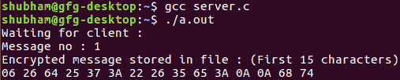
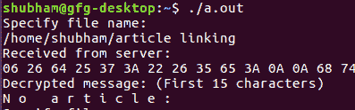

# 使用 UDP 服务器的消息加密和解密

> 原文:[https://www . geesforgeks . org/message-加密-解密-使用-udp-server/](https://www.geeksforgeeks.org/message-encryption-decryption-using-udp-server/)

使用 UDP 服务器进行客户端-服务器通信时，消息加密和解密的过程如下:

*   客户端向服务器请求一个文件名。
*   服务器打开相应的文件，并使用数据报套接字发送该文件。
*   发送方用固定长度的密钥发送加密文本(Xoring)。
*   接收者接收加密文本(密文)。
*   接收者使用相同的密钥(私钥)解密文件。

先决条件:[插座编程](https://www.geeksforgeeks.org/socket-programming-cc/)

**示例**:

```cpp
Input :  file.txt
Output : ClientSide : Received from server: 
                      00 2C 28 28 2A 6E 3B 24 37 64 65 79 0A 00 00 
                      Decrypted message: Hello People 
         ServerSide : Encrypted message stored in file: 
                      00 2C 28 28 2A 6E 3B 24 37 64 65 79 0A 00  
```

**客户端程序**:

## C

```cpp
// Client side code
#include <netinet/in.h>
#include <stdio.h>
#include <string.h>
#include <sys/socket.h>

// Driver code
int main()
{
    int clientSocket, portNum, nBytes;
    char file_buffer[3000], path[1024], buffer[3000];

    // This key array stores the hidden key
    char const key[3000] = "HIDDENKEY";
    struct sockaddr_in serverAddr;
    socklen_t addr_size;
    int i;
    clientSocket = socket(PF_INET, SOCK_DGRAM, 0);

    serverAddr.sin_family = AF_INET;
    serverAddr.sin_port = htons(5004);
    serverAddr.sin_addr.s_addr = inet_addr("127.0.0.1");
    memset(serverAddr.sin_zero, '\0', sizeof serverAddr.sin_zero);

    addr_size = sizeof serverAddr;

    while (1) {
        printf("Specify file name: \n");
        gets(path);

        // printf("%s\n", path);
        FILE* fp;
        fp = fopen(path, "r");
        if (fp == NULL) {
            printf("file does not exist\n");
        }

        fseek(fp, 0, SEEK_END);
        size_t file_size = ftell(fp);
        fseek(fp, 0, SEEK_SET);

        if (fread(file_buffer, file_size, 1, fp) <= 0) {
            printf("unable to copy file into buffer\n");
            exit(1);
        }

        if (sendto(clientSocket, file_buffer, 3000, 0, (struct sockaddr*)&serverAddr,
                                                                    addr_size) < 0) {
            printf("error in sending the file\n");
            exit(1);
        }

        bzero(file_buffer, sizeof(file_buffer));

        nBytes = recvfrom(clientSocket, buffer, 1024, 0, NULL, NULL);

        printf("Received from server: \n");

        // printing some of the character to have a feel of encryption
        for (i = 0; i < 15; ++ i)
            printf("%02X ", buffer[i]);
        printf("\n");

        char x[3000];
        for (i = 0; i < nBytes - 1; ++ i)
            x[i] = (char)(buffer[i] ^ key[i]);

        // printing some of the character to have a feel of decryption
        printf("Decrypted message: (First 15 characters)\n");
        for (i = 0; i < 11; ++ i)
            printf("%c ", x[i]);

        printf("\n");
    }

    return 0;
}
```

**服务器端程序**:

## C

```cpp
// C server code
#include <memory.h>
#include <netinet/in.h>
#include <stdio.h>
#include <stdlib.h>
#include <string.h>
#include <sys/socket.h>

// Driver code
int main()
{
    int udpSocket, nBytes;
    char buffer[3000], xor[3000];
    char const key[1024] = "HIDDENKEY";
    struct sockaddr_in serverAddr, clientAddr;
    struct sockaddr_storage serverStorage;
    socklen_t addr_size, client_addr_size;
    int i;

    udpSocket = socket(PF_INET, SOCK_DGRAM, 0);

    serverAddr.sin_family = AF_INET;
    serverAddr.sin_port = htons(5004);
    serverAddr.sin_addr.s_addr = inet_addr("127.0.0.1");
    memset(serverAddr.sin_zero, '\0', sizeof serverAddr.sin_zero);

    bind(udpSocket, (struct sockaddr*)&serverAddr, sizeof(serverAddr));

    addr_size = sizeof serverStorage;
    puts("Waiting for client :");
    int count = 0;

    while (1) {
        nBytes = recvfrom(udpSocket, buffer, 3000, 0, (struct sockaddr*)&serverStorage,
                                                                            &addr_size);
        printf("Message no : %d\n", ++ count);

        for (i = 0; i < nBytes - 1; i++) {
            if (buffer[i] != '\n')
                xor[i] = (char)(buffer[i] ^ key[i]);
            else
                xor[i] = buffer[i];
        }

        printf("Encrypted message stored in file : (First 15 characters)\n");

        // printing some of the character to have a feel of encryption
        for (i = 0; i < 15; ++ i)
            printf("%02X ", xor[i]);
        printf("\n");

        FILE* fp;
        fp = fopen("temp.txt", "w+");

        for (i = 0; i < nBytes - 1; i++) {
            if (xor[i] != '\n')
                fprintf(fp, "%X", xor[i]);
            else
                fprintf(fp, "%c", xor[i]);
        }

        fclose(fp);
        sendto(udpSocket, xor, nBytes, 0, (struct sockaddr*)&serverStorage,
                                                                 addr_size);
    }

    return 0;
}
```

**输出**:



