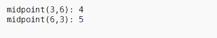
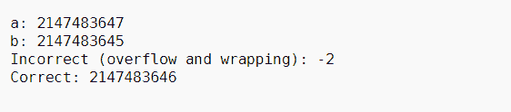
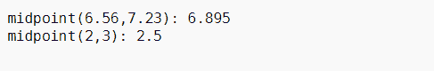
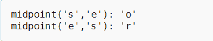

# c++ 20 中的中点()，示例

> 原文:[https://www . geesforgeks . org/中点在 CPP-20-带示例/](https://www.geeksforgeeks.org/midpoint-in-cpp-20-with-examples/)

函数**中点()**计算整数、浮点或[指针](https://www.geeksforgeeks.org/pointers-in-c-and-c-set-1-introduction-arithmetic-and-array/) a 和 b 的中点。
**头文件:**

```
<numeric>
```

**参数:**该函数接受两种[数据类型](https://www.geeksforgeeks.org/data-types-in-c/)，如整数、浮点、指针值。

**返回:**

它返回给定数据类型的中点。
**<u>算法该功能实现</u> :**

*   a 和 b 之和的一半没有任何[溢出](https://www.geeksforgeeks.org/overflow-in-arithmetic-addition-in-binary-number-system/)。同， *(a + b)/2。*
*   如果 a 和 b 是整数类型，并且和是奇数，则结果向 a 舍入。
*   如果 a 和 b 是浮点类型，最多会发生一次不精确的运算(四舍五入为零)。
*   如果 a 和 b 分别指向同一个数组对象 **x** 的**x【I】**和**x【j】**(出于[指针运算](https://www.geeksforgeeks.org/pointer-arithmetics-in-c-with-examples/)的目的)，那么结果将是指向**x【I+(j–I)/2】**(或者，等效地，x【STD::中点(I，j)】)的指针，在这里除法向零舍入。如果 a 和 b 没有指向同一个数组对象的元素，则行为是未定义的。

**<u>使用中点()功能</u> :**

*   **两个整数的中点使用中点():**下面是 [C++程序](https://www.geeksforgeeks.org/c-plus-plus/)演示两个整数的中点使用**中点()**:

## C++

```
// C++ program to demonstrate the
// midpoint function
#include <iostream>
#include <numeric>
using namespace std;

// Driver Code
int main()
{
    // a and b both of integer type
    int a = 3;
    int b = 6;

    cout << "midpoint(" << a << ", "
         << b << "): "
         << midpoint(a, b) << endl;

    a = 6;
    b = 3;
    cout << "midpoint(" << a
         << ", " << b << "): "
         << midpoint(a, b) << endl;

    return 0;
}
```

**输出:**



*   **中点()可以处理像溢出这样的情况:**下面是 C++程序，演示如何使用**中点()** :
    处理溢出

## C++

```
// C++ program for the above approach
#include <climits>
#include <iostream>
#include <numeric>
using namespace std;

// Driver Code
int main()
{
    // a stores maximum storable
    // value of integer
    int a = INT_MAX;

    // b stores maximum storable
    // value of integer - 2
    int b = INT_MAX - 2;

    cout << "a: " << a << endl
         << "b: " << b << endl
         << "Incorrect (overflow"
         << " and wrapping): "
         << (a + b) / 2 << endl
         << "Correct: "
         << midpoint(a, b) << "\n\n";

    return 0;
}
```

**输出:**



*   **两个浮点数的中点使用中点():**下面是 C++程序演示如何使用**中点()**找到两个浮点数的中点:

## C++

```
// C++ program for the above approach
#include <iostream>
#include <numeric>

using namespace std;

int main()
{
    // x and y both floating type
    float x = 6.56;
    float y = 7.23;

    cout << "midpoint(" << x
         << ", " << y << "): "
         << midpoint(x, y) << endl;

    x = 2.0;
    y = 3.0;

    cout << "midpoint(" << x
         << ", " << y << "): "
         << midpoint(x, y)
         << endl
         << endl;
}
```

**输出:**



*   **指向同一对象的两个指针之间的中点** **使用中点():**下面是 C++程序演示如何使用**中点()** :
    找到指向同一对象的两个指针的中点

## C++

```
// C++ program for the above approach
#include <iostream>
#include <numeric>
using namespace std;

// Driver Code
int main()
{
    // str is a character array
    char str[] = "GeeksforGeeks";

    // str1 is pointing to the
    // 5-th element in str
    char* str1 = &str[4];

    // str2 is pointing to the
    // 10-th element in str
    char* str2 = &str[9];

    // str1 and str2 is pointing same
    // object str therefore, we can
    // logically compute and point a
    // middle element in str
    cout << "midpoint('" << *str1
         << "', '" << *str2 << "'): '"
         << *midpoint(str1, str2)
         << "'" << endl;

    cout << "midpoint('" << *str2
         << "', '" << *str1 << "'): '"
         << *midpoint(str2, str1)
         << "'" << endl;
}
```

**输出:**

