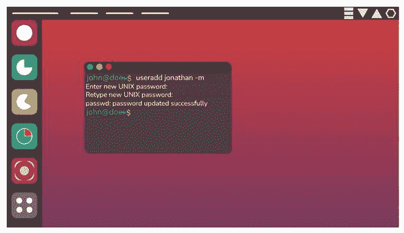
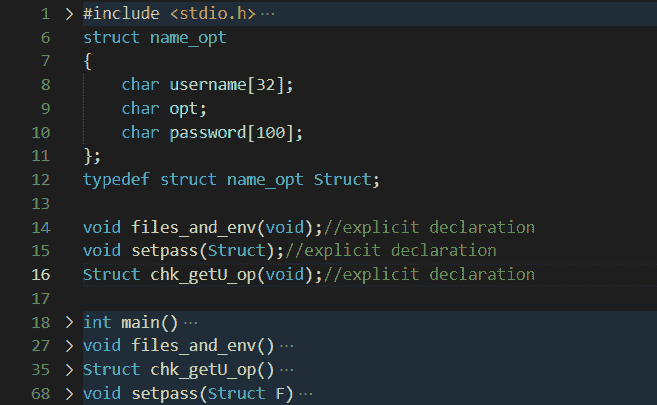

# 模仿 C

中的 Linux adduser 命令

> 原文:[https://www . geesforgeks . org/mimic-the-Linux-adduser-command-in-c/](https://www.geeksforgeeks.org/mimic-the-linux-adduser-command-in-c/)

[为了好玩而编程](https://www.geeksforgeeks.org/competitive-programming-a-complete-guide/)也可以在悠闲的编码练习作品中体现出来。尽管在学术上不足，但这项任务确实有助于程序员理解语言的足智多谋。在这里，让我们看看一个独特的编程活动，它也转化为一个低层次的洞察力和流畅性建设练习。

**问题陈述:**模仿 Linux 上的 [adduser](https://www.geeksforgeeks.org/adduser-command-in-linux-with-examples/) 命令，使用 [C 程序](https://www.geeksforgeeks.org/c-language-set-1-introduction/)作为编程语言创建一个普通或系统用户。以下是这个问题作为一个解决方案的隐含要求，以便程序员坚持命令的正式执行:

*   在执行过程中，必须在 [Linux 终端](https://www.geeksforgeeks.org/what-is-terminal-console-shell-and-kernel/)上提供 [CLI](https://www.geeksforgeeks.org/linux-operating-system-cli-command-line-interface-and-gui-graphic-user-interface/) 的精确复制。
*   一个人必须处理一个 [*密码*文件](https://www.geeksforgeeks.org/passwd-command-in-linux-with-examples/)。
*   还必须处理一个*阴影*文件。
*   两个文件的执行必须通过指定 **PFILE** 环境变量来控制。

**先决条件:**在开始处理代码之前，让我们快速了解一下先决条件。首先，从把握 ***passwd*** 文件背后的思想开始。另外，请随意参考 Linux 手册页。

**1。passwd 文件:**技术上表示为/etc/passwd 文件，该文件的主要目的是监视或存储已被授予系统访问权限的注册用户的记录。它记录了 7 个重要领域。


[UID](https://www.geeksforgeeks.org/real-effective-and-saved-userid-in-linux/) 本质上是用户 ID，GID 是组 ID。同时，GECOS 是用于存储用户真实姓名和电话号码的字段。登录外壳是一个负责读取文件和设置[环境变量](https://www.geeksforgeeks.org/environment-variables-in-linux-unix/)的字段。

每个字段都用冒号分隔。出于本程序的目的，详细信息将一直存储到 GECOS 字段。然而，我们鼓励读者进一步探索，将其他领域也纳入其中。

**2。影子文件:**正式定义为/etc/shadow 文件，该文件扮演类似 passwd 文件的角色。但是，它关注的是 passwd 文件中与加密密码相关的所有内容。与 passwd 文件不同，它只对根用户可读。通常，它包含 9 个字段的记录。


密码必须保持加密格式——这里有一个有趣的地方，我们将开发自己的加密算法(基本算法)。第 3 个和第 4 个字段是指密码更改之间的最小和最大间隔天数(默认为 0)。第 5 和第 6 个字段定义了用户必须在多长时间后提示密码到期和帐户禁用通知。所有这些字段都是完全可定制的。请记住加密进入此文件的所有数据。

**3。环境变量的目的是影响程序或软件的行为方式。例如，$LANG 变量将与用户理解特定语言的软件进行通信，因此它必须在接口级别提供相同的语言。这里我们将使用一个 PATH 变量来模拟系统查找 passwd 和影子文件的位置。我们将把它命名为 PFILE。**

**命令选项:**在终端上输入 useradd 后，通常会指定另一个值，称为“选项”。选项可以是各种字母。但是，要限制该程序，只能使用 **-r** 和 **-m** 选项。

*   -r 选项创建一个系统用户。
*   -m 选项将主目录与用户帐户相关联。

**语法:**



**注:**

*   useradd 长度为 7 个字符。
*   useradd 后面是一个空格，然后是用户名，它一直延伸到下一个空格字符。
*   在第二个空格之后，字符是连字符和选项字符。
*   一旦输入命令，密码就设置好了。

下面是用 C 程序实现的步骤:

**1。main.c:** 这里指定所有头文件和变量，并给出所有函数调用。它将作为编译器的蓝图。



快速查看要遵循的代码布局。

这里，定义一个[结构](https://www.geeksforgeeks.org/structures-c/)，它将保存所有必须更新的数据。任何其他方法都会引入额外的代码行，并使跟踪代码变得困难。此外，将您创建的**结构重新命名为**也是一个很好的建议。当使用 struct 作为参数和返回类型时，不重命名将在编译期间导致大量引用和标识符错误。

[**int main()**](https://www.geeksforgeeks.org/difference-int-main-int-mainvoid/)**是调用所有[函数](https://www.geeksforgeeks.org/functions-in-c/)并加载程序的基础。 **void files_and_env()** 是 PATH 变量分配给 **PFILE** 并初始化文件的地方。请记住插入为 f1 和 f2 创建的文件的有效位置或路径。接下来， **Struct chk_getU_op()** 是一个检查终端上输入命令的函数，从命令和选项中获取用户名。它返回一个类型为**结构**的对象。**

****注意:**在 Struct 中使用大写的 S(当声明返回类型时)，因为 [typedef](https://www.geeksforgeeks.org/typedef-versus-define-c/) 正被用于重命名第 12 行中的结构。最后，void **setpass()** 提示用户将密码与已创建的新用户相关联。这个函数是参数化的，也就是说，它接受了之前从 **chk_getU_op()** 返回的对象。**

**下面是实现上述方法的 [C 程序](https://www.geeksforgeeks.org/c/):**

## **C**

```cpp
// C program to implement
// the above approach
#include "server.h"
#include <ctype.h>
#include <stdio.h>
#include <stdlib.h>
#include <string.h>
struct name_opt {
    char username[32];
    char opt;
    char password[100];
};

typedef struct name_opt Struct;

// Explicit declaration
void files_and_env(void);
void setpass(Struct);
Struct chk_getU_op(void);

// Driver code
int main()
{
    Struct fn;

    // Additional character denoting
    // the option
    char opt;

    // Function to declare files and
    // set environment variables
    files_and_env();
    fn = chk_getU_op();
    setpass(fn);
    return (0);
}

void files_and_env()
{
    FILE *f1, *f2;

    // Assigning environment variable
    // PFILE for protecting and
    // restricting access
    putenv(
        "PFILE = -/Environment/rms");

    // Displays the path of the
    // environment variable
    printf("PFILE: %s\n",
           getenv("PFILE"));
    f1 = fopen("Location of file\\passwd.txt", "r");
    f2 = fopen("Location of file\\shadow.txt", "r");
}

Struct chk_getU_op()
{
    int i = 8;
    int ctr = 0;
    int x, l = 0;
    char command[] = { 'u', 's', 'e', 'r',
                       'a', 'd', 'd' };

    // Linux accepts only 42 char
    // usernames
    char FunctionCall[42];
    Struct send;
    gets(FunctionCall);

    for (x = 0; x < 7; x++) {
        if (FunctionCall[x] == command[x]) {
            ctr += 1;
        }
    }
    if (ctr != 7) {
        printf("Invalid command.\n");
        exit(0);
    }
    else {
        // Ends when space char is reached
        while ((int)FunctionCall[i] != 32) {
            send.username[i - 8] = FunctionCall[i];
            i++;
        }
        l = strlen(send.username);
        send.opt = FunctionCall[10 + l];
    }
    return send;
}

void setpass(Struct F)
{
    char pass[100];
    char UID[4];
    printf("Changing password for user.....\n");
    printf("New UNIX password: ");
    scanf("%s\n", *(F.password));

    if (F.opt == 'r') {
        printf("UID: ");
        scanf("%s", UID);
        if (strlen(UID) == 2) {
            // Calling password function
            passwd(F.username, F.password,
                   UID);

            // Calling shadow function
            shadow(F.username, F.password,
                   UID);
        }

        // When the UID is not 2 characters long
        else {
            while (strlen(UID) != 2) {
                printf("Invalid UID. Retype UID: ");
                scanf("%s", UID);
            }

            // Calling password function
            passwd(F.username, F.password,
                   UID);

            // Calling shadow function
            shadow(F.username, F.password,
                   UID);
        }
    }

    // If the option is 'm'
    else {
        printf("UID: ");
        scanf("%s", UID);
        if (strlen(UID) <= 2) {
            printf("Normal Users not allowed this UID!\n");
            printf("Retype UID: ");
            scanf("%s", UID);
            passwd(F.username, F.password, UID);
            shadow(F.username, F.password, UID);
        }
        else {
            passwd(F.username, F.password, UID);
            shadow(F.username, F.password, UID);
        }

        // end of setpass
    }

    // end of main.c
}
```