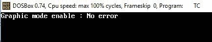
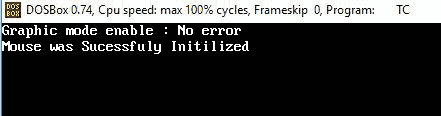

# C/c++ 中的鼠标编程

> 原文:[https://www.geeksforgeeks.org/mouse-programming-in-c-c/](https://www.geeksforgeeks.org/mouse-programming-in-c-c/)

直到现在我们在[**C**](https://www.geeksforgeeks.org/c/)**/**[**c++**](https://www.geeksforgeeks.org/c-plus-plus/)中只看到了黑色窗口上的静态输出，没有任何外围设备交互(比如鼠标)。这里的静态是指通过鼠标与输出屏幕交互来运行动态事件或任务。目标是让鼠标指针在我们的输出屏幕上可见，当鼠标在同一个输出窗口上被点击时，通过它可以看到任何新的事件。

> **需求:** [Turbo C++ IDE](https://www.geeksforgeeks.org/difference-between-turbo-c-and-dev-c/) 或 DOS BOX

**基础知识:**
这个想法是告诉鼠标在输出屏幕上做任何事情。实际上，直接与鼠标通信是不可能的，而是通过提供的驱动程序。想法是使用**中断**来访问这个驱动程序。计算机提供的每个设备都有一个[唯一端口](https://www.geeksforgeeks.org/tcp-ip-ports-and-its-applications/)，这是一个[十六进制值](https://www.geeksforgeeks.org/program-for-hexadecimal-to-decimal/)，旨在独立于机器，增强程序的可移植性。鼠标上有端口 ***0X33*** 。访问这些端口也需要使用地址寄存器。这些基本上都是 [dos.h](https://www.geeksforgeeks.org/dos-h-header-in-c-with-examples/) 中定义的 **REGS** 类型的 **UNION** 。使用两个寄存器与设备驱动程序通信，一个用于输入，一个用于输出，通过输入寄存器向设备驱动程序发送值，并接收嵌入输出寄存器的信息。

现在有两种方法可以在 C/C++ 屏幕上显示鼠标指针。首先是非图形模式，其次是图形模式，这里我们使用图形模式。要在图形模式下切换我们的输出窗口，步骤如下:
**启用图形模式:**要启用图形模式，请使用 **initgraph()** 功能，该功能用于初始化图形模式。该功能存在于**[**graphics . h**](https://www.geeksforgeeks.org/include-graphics-h-codeblocks/)**[头文件](https://www.geeksforgeeks.org/header-files-in-c-cpp-and-its-uses/)中。****

******initgraph()的语法:******

> ****见 initgraph(int *gdriver，int *gmode，char * pathtodriver)；****

*   ******gdriver:** 它是一个整数，指定要使用哪个图形驱动程序。使用**检测**表示编译器根据需要自动选择合适的驱动程序。****
*   ******gmode:** 也是指定初始图形模式的整数。当 gdriver = DETECT 时在这种情况下，initgraph()将 gmode 设置为检测到的驱动程序可用的最高分辨率。****
*   ******path to drive:**表示 initgraph 必须查找图形驱动程序的目录路径。****

******程序 1:******

## ****C****

```cpp
**// C program to show how to
// enable Graphics mode
#include <conio.h>
#include <graphics.h>

// Driver Code
int main()
{
    int gdriver = DETECT, gmode, errorcode;
    initgraph(&gdriver, &gmode, "C:\\TC\\BGI");

    errorcode = graphresult();

    // If error occurs
    if (errorcode == grOk)
        printf("Graphics enabled: %s\n",
               grapherrormsg(errorcode));
    else
        printf("Graphics error: %s\n",
               grapherrormsg(errorcode));

    getch();

    // Close the graph init()
    closegraph();
    return 0;
}**
```

## ****C++****

```cpp
**// C++ program to show how to
// enable Graphics mode
#include <bits/stdc++.h>
#include <conio.h>
#include <graphics.h>

// Driver Code
int main()
{
    int gdriver = DETECT, gmode, errorcode;
    initgraph(&gdriver, &gmode, "C:\\TC\\BGI");

    errorcode = graphresult();

    // If error occurs
    if (errorcode == grOk)
        cout << "Graphics enabled: \n"
             << grapherrormsg(errorcode);
    else
        cout << "Graphics error: \n"
             << grapherrormsg(errorcode);

    getch();

    // Close the graph init()
    closegraph();
    return 0;
}**
```

******输出:******

********

### ****鼠标编程的先决条件:****

******<u>AX 寄存器</u> :** 可以使用 **AX** 输入寄存器的不同值访问各种鼠标功能，并使用中断将这些值传递到鼠标端口。下表列出了功能:****

****这里***AX******BX******CX***和 ***DX*** 都是 ***UNION REGS*** 的成员。****

<figure class="table">

| **中断** | **服务** | 描述 |
| ***0X33***运筹学***51*** | **0** | 

*   Reset the mouse to get the status.
*   九月 ax= 0
*   Call **AX = ffffh** , or **AX = 0** if there is mouse support.

 |
| **1** | 

*   Show the mouse pointer.

 **AX = 1** 

*   Return nothing.

 |
| **2** | 

*   Hide the mouse pointer.

 **AX = 2** 

*   Nothing is returned.

 |
| **3** | 

*   Get the mouse position and key state.

 **AX = 3** 

*   Return **BX** = mouse button state.
*   BX bit meaning:
    *   **0** button is not pressed.
    *   **1** Left button is pressed.
    *   **2** Right button is pressed.
    *   **3** The center button is pressed.
    *   **CX** = x coordinate
    *   T34] dx = y coordinate

 |
| **4** | 

*   Set the mouse pointer position.

 **AX = 4** 

*   **CX** = x coordinate
*   **dx** = y coordinate
*   Nothing is returned.

 |
| **7** | 

*   Set the pointer horizontal limit.

 **AX = 7** 

*   **CX** = minimum x coordinate.
*   **dx** = maximum x coordinate.
*   Nothing is returned.

 |
| **8** | 

*   Set the vertical limit of the pointer.

 **AX = 8** 

*   **CX** = minimum y coordinate.
*   **dx** = maximum y coordinate.
*   Nothing is returned.

 |

</figure>

******<u>int86()函数</u>:****int 86()**是一个 C 库函数，方便访问裸机 DOS 和 BIOS 服务中断。它是内联程序集中断调用的包装。它将带有对象的 [CPU 寄存器](https://www.geeksforgeeks.org/different-classes-of-cpu-registers/)值带到[结构](https://www.geeksforgeeks.org/structures-c/)，其中成员变量相当于 CPU 寄存器。它需要三个参数。****

> ****//声明语法
> int int86(int intno，union REGS* inregs，union REGS * outregs)；
> //intno–中断向量/服务号
> //inregs–输入参数注册为 regs
> //outregs–输出参数注册为 REGS****

### ****<u>鼠标编程用例</u>:****

****下面列出了鼠标编程的各种用例:****

1.  ****检测鼠标****
2.  ****在图形模式下显示鼠标指针****
3.  ****隐藏指针****
4.  ****确定当前位置****
5.  ****已识别单击了哪个鼠标按钮****
6.  ****限制鼠标指针****
7.  ****手绘(所有功能的使用)****

******程序 2:**
下面是检查鼠标驱动是否加载的程序:****

## ****C****

```cpp
**// C program to check mouse status
#include <conio.h>
#include <dos.h>
#include <graphics.h>
#include <stdio.h>
union REGS in, out;

// Function to implement the functionality
// of detecting Mouse
void detectMouse()
{
    in.x.ax = 0;

    // Invoke interrupt (in86 method
    // description mentioned above)
    int86(0X33, &in, &out);

    if (out.x.ax == 0)
        printf("\nMouse Failed To Initialize");
    else
        printf("\nMouse was Successfully Initialized");
}

// Driver Code
int main()
{
    clrscr();

    int gdriver = DETECT, gmode;

    // Method to enable graphics
    initgraph(&gdriver, &gmode, "c:\tc\bgi");

    // Function Call
    detectMouse();
    getch();

    // Close graphics mode
    closegraph();

    return 0;
}**
```

## ****C++****

```cpp
**// C++ program to check mouse status
#include <bits/stdc++.h>
#include <conio.h>
#include <dos.h>
#include <graphics.h>
#include <stdio.h>
union REGS in, out;

// Function to implement the functionality
// of detecting Mouse
void detectMouse()
{
    in.x.ax = 0;

    // Invoke interrupt (in86 method
    // description mentioned above)
    int86(0X33, &in, &out);

    if (out.x.ax == 0)
        cout << "\nMouse Failed To"
             << " Initialize";
    else
        cout << "\nMouse was Successfully"
             << " Initialized";
}

// Driver Code
int main()
{
    clrscr();

    int gdriver = DETECT, gmode;

    // Method to enable graphics
    initgraph(&gdriver, &gmode, "c:\tc\bgi");

    // Function Call
    detectMouse();

    getch();

    // Close graphics mode
    closegraph();

    return 0;
}**
```

******输出:******

********