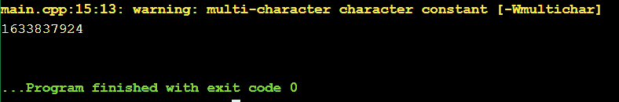
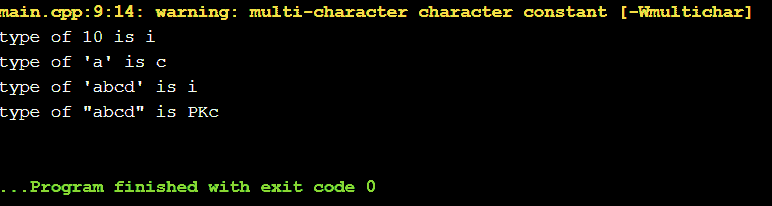
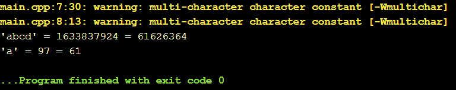

# C/c++ 中的多字符文字

> 原文:[https://www . geesforgeks . org/多字符-literal-in-c-cpp/](https://www.geeksforgeeks.org/multi-character-literal-in-c-cpp/)

[C](https://www.geeksforgeeks.org/c-programming-language/) 和 C++ 的字符文字是字符、字符串以及它们的 Unicode 和 Raw 类型。此外，还有一个包含多个 c 字符的**多字符文字**。单个 c 字符文字具有类型字符，多字符文字是*有条件支持的*，具有类型 *int* ，并且具有*实现定义的值*。

**示例:**

```cpp
'a' is a character literal.
"abcd" is a string literal.
'abcd' is a multicharacter literal.
```

大多数 C/C++ [编译器](https://www.geeksforgeeks.org/phases-of-a-compiler/)支持多字符文字。下面是演示[多字](https://www.geeksforgeeks.org/assigning-multiple-characters-int-c-language/)字面意思的例子。

**例 1:**

## C

```cpp
// C program to demonstrate 
// Multicharacter literal
#pragma GCC diagnostic ignored "-Wmultichar"

// This disables the 
// multi-character warning
#include <stdio.h>

// Driver code
int main()
{
  printf("%d", 'abcd');
  return 0;
}
```

**Output**

```cpp
1633837924
```

**例 2:**

## C++

```cpp
// C++ program to demonstrate
// multi-character literal
#include <iostream>

// Due to a bug we can't disable
// multi-character warning in C++
// using #pragma GCC diagnostic
// ignored "-Wmultichar"
using namespace std;

// Driver code
int main()
{
    cout << 'abcd' << endl;
    return 0;
}
```

**输出:**



这可以很好地编译和运行，多字符文字存储为一个整数值(从这里你可以找到下面的数字)。由于**学究式的**编译器标志通常会被传递，因此它会对所有多字符文本发出警告。这个警告有助于指出我们是否错误地使用了**“**而不是**“**。警告是:

```cpp
warning: multi-character character constant [-Wmultichar]
```

您可以直接从源代码中使用 **#pragma GCC 诊断忽略“-Wmultichar”**禁用警告。

**以下是关于多字符文字的一些重要信息:**

**1。多字符文字不同于字符串:**多字符文字不同于字符串或字符数组，它们是完全不同的。多字符文字是**整数类型的**而不是字符类型。

## C++

```cpp
#include <iostream>
#include <typeinfo>
using namespace std;

int main()
{
    auto a = 10;
    auto b = 'a';
    auto c = 'abcd';
    auto d = "abcd";

    // 10 is of type i or int
    cout << "type of 10 is "
      << typeid(a).name() << endl;

    // 'a' is of type c or char
    cout << "type of \'a\' is "
      << typeid(b).name() << endl;

    // Multicharacter literals
    // 'abcd' is of type i or int
    cout << "type of \'abcd\' is "
      << typeid(c).name() << endl;

    // "abcd" is of type string
    cout << "type of \"abcd\" is "
      << typeid(d).name() << endl;

    return 0;
}
```

**输出:**



虽然 [**typeid()**](https://www.geeksforgeeks.org/typeid-operator-in-c-with-examples/) 不应该用来区分类型，因为标准有时会保证给你错误的答案。但是这里 **typeid()** 足以指出多字符存储为整数类型，不同于字符和字符串。

**2。多字符文字是实现定义的，不是错误:**

C++ 语义的一个方面，为每个实现定义，而不是在每个实现的标准中指定。一个例子是 int 的大小(它必须至少为 16 位，但可以更长)。尽可能避免实现定义的行为。

任何依赖于实现定义的行为的代码都只能保证在特定的平台和/或编译器下工作。
例:

*   **sizeof(int)；**可能是 4 字节，也可能是 8 字节，具体取决于编译器。
*   **int * p = malloc(0 * sizeof * o)；**这可能导致 **p** 为空或唯一指针(如 C99 标准 7.20.3 中所规定)。

**C++** 从 **C** 继承了多字符文字， **C** 从 **B 编程语言**继承了多字符文字。大多数编译器(MSVC 除外)按照 **B** 中的规定实现多字符文字。

并不是 C 或 C++ 的创作者不知道这一点，他们只是把它交给编译器来处理。

**3。多字符文字存储为 int 而不是 char (C 标准):**现在的问题是整数值从哪里来。在 int 为 4 字节的编译器上，Multi-characters 存储 4 字节，这取决于编译器。对于 4 字节多字符文字，每个字符初始化结果整数的连续字节([大端字节，](https://www.geeksforgeeks.org/little-and-big-endian-mystery/)零填充，右调整顺序)。例如，将 ASCII 字符的值转换为 4 字节整数，

这里，整数有 4 个字节的存储:

<figure class="table">

|  |  |  |  |
| --- | --- | --- | --- |

</figure>

现在左边第一个字符的 ASCII 码终于被存储了。基本上，“大端”字节排序:

<figure class="table">

|  |  |  | one |
| --- | --- | --- | --- |

</figure>

然后对于下一个字符，整数值左移 1 字节:

<figure class="table">b

|  |  | a |
| --- | --- | --- |

</figure>

以此类推，

<figure class="table">

| a | b | c | d |
| --- | --- | --- | --- |

</figure>

现在，这 4 个字节代表一个整数，计算如下:

```cpp
'abcd' = (('a'*256 + 'b')*256 + `c`)*256 + 'd' = 1633837924 = 0x61626364 = '0xa0xb0xc0xd'
```

## C++

```cpp
#include <iostream>
using namespace std;

// Driver code
int main()
{
    cout << "\'abcd\' = " << 'abcd' << " = " << hex
         << 'abcd' << endl;

    cout << "\'a' = " << dec << (int)'a' << " = " << hex
         << (int)'a';

    return 0;
}
```

**输出:**



如果多字符文本中有 4 个以上的字符，则只存储最后 4 个字符，因此，“abcdefgh”= =“efgh”，尽管编译器会对溢出的文本发出警告。

## C++

```cpp
#include <iostream>
using namespace std;

// Driver code
int main()
{
    cout << "\'abcd\' = " << 'abcd' << endl;
    cout << "\'efgh\' = " << 'efgh' << endl;
    cout << "\'abcdefgh\' = " << 'abcdefgh' << endl;
    return 0;
}
```