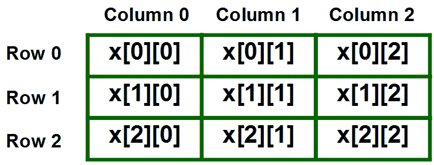
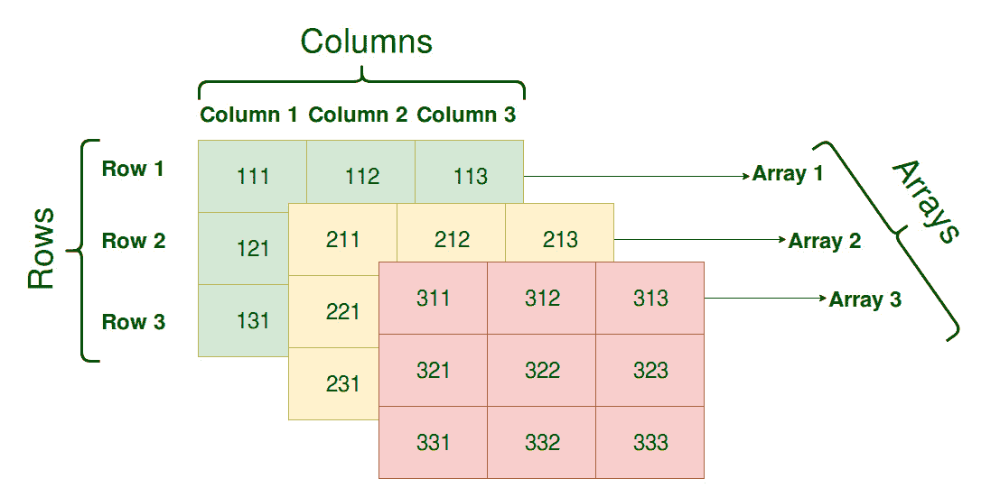

# C/c++ 中的多维数组

> 原文:[https://www . geesforgeks . org/多维-数组-c-cpp/](https://www.geeksforgeeks.org/multidimensional-arrays-c-cpp/)

[数组-基础](https://www.geeksforgeeks.org/arrays-in-c-language-set-1-introduction/)
在 C/C++ 中，我们可以用简单的话把多维数组定义为数组的数组。多维数组中的数据以表格形式存储(按主要行顺序)。
申报 N 维数组的一般形式:

```cpp
data_type  array_name[size1][size2]....[sizeN];

data_type: Type of data to be stored in the array. 
           Here data_type is valid C/C++ data type
array_name: Name of the array
size1, size2,... ,sizeN: Sizes of the dimensions
```

**示例** :

```cpp
Two dimensional array:
int two_d[10][20];

Three dimensional array:
int three_d[10][20][30];
```

**多维数组的大小**

可以存储在多维数组中的元素总数可以通过乘以所有维度的大小来计算。
例如:
数组 **int x[10][20]** 可以存储总计(10*20) = 200 个元素。
类似数组 **int x[5][10][20]** 可以存储总计(5*10*20) = 1000 个元素。

### 二维阵列

二维数组是多维数组的最简单形式。为了更容易理解，我们可以将二维数组看作一维数组的数组。

*   声明大小为 x，y 的二维数组的基本形式:
    **语法:**

```cpp
data_type array_name[x][y];
data_type: Type of data to be stored. Valid C/C++ data type.
```

*   我们可以将大小为 10，20 的二维整数数组声明为:

```cpp
int x[10][20];
```

*   二维数组中的元素通常用 x[i][j]表示，其中 I 是行号，j 是列号。
*   二维数组可以看作是一个包含“x”行和“y”列的表，其中行号的范围从 0 到(x-1)，列号的范围从 0 到(y-1)。具有 3 行 3 列的二维数组“x”如下所示:



**初始化二维数组**:二维数组有两种初始化方式。
T3【第一法】T4:

```cpp
int x[3][4] = {0, 1 ,2 ,3 ,4 , 5 , 6 , 7 , 8 , 9 , 10 , 11}
```

上面的数组有 3 行 4 列。大括号中从左到右的元素也从左到右存储在表中。元素将按顺序填充到数组中，第一行中左边的前 4 个元素，第二行中的后 4 个元素，依此类推。
**更好的方法** :

```cpp
int x[3][4] = {{0,1,2,3}, {4,5,6,7}, {8,9,10,11}};
```

这种类型的初始化使用嵌套的大括号。每组内部大括号代表一行。在上面的示例中，总共有三行，因此有三组内部大括号。
**访问二维数组的元素:**使用行索引和列索引访问二维数组中的元素。
示例:

```cpp
int x[2][1];
```

上面的示例表示第三行第二列中的元素。
**注**:在数组中，如果一个数组的大小是 N，那么它的索引就是从 0 到 N-1。因此，对于行索引 2，行号是 2+1 = 3。
要输出二维数组的所有元素，我们可以使用嵌套循环。我们需要两个循环。一个遍历行，另一个遍历列。

## 卡片打印处理机（Card Print Processor 的缩写）

```cpp
// C++ Program to print the elements of a
// Two-Dimensional array
#include<iostream>
using namespace std;

int main()
{
    // an array with 3 rows and 2 columns.
    int x[3][2] = {{0,1}, {2,3}, {4,5}};

    // output each array element's value
    for (int i = 0; i < 3; i++)
    {
        for (int j = 0; j < 2; j++)
        {
            cout << "Element at x[" << i
                 << "][" << j << "]: ";
            cout << x[i][j]<<endl;
        }
    }

    return 0;
}
```

输出:

```cpp
Element at x[0][0]: 0
Element at x[0][1]: 1
Element at x[1][0]: 2
Element at x[1][1]: 3
Element at x[2][0]: 4
Element at x[2][1]: 5
```

### 三维阵列



**初始化三维数组**:三维数组中的初始化与二维数组相同。不同之处在于，随着维度数量的增加，嵌套大括号的数量也会增加。
T3】方法 1:T5

```cpp
int x[2][3][4] = {0, 1, 2, 3, 4, 5, 6, 7, 8, 9, 10, 
                 11, 12, 13, 14, 15, 16, 17, 18, 19,
                 20, 21, 22, 23};
```

**更好的方法** :

```cpp
int x[2][3][4] = 
 { 
   { {0,1,2,3}, {4,5,6,7}, {8,9,10,11} },
   { {12,13,14,15}, {16,17,18,19}, {20,21,22,23} }
 };
```

**访问三维数组中的元素**:访问三维数组中的元素也和二维数组类似。不同的是，在三维数组中，我们必须为一个额外的维度使用三个循环，而不是两个循环。

## 卡片打印处理机（Card Print Processor 的缩写）

```cpp
// C++ program to print elements of Three-Dimensional
// Array
#include<iostream>
using namespace std;

int main()
{
    // initializing the 3-dimensional array
    int x[2][3][2] =
    {
        { {0,1}, {2,3}, {4,5} },
        { {6,7}, {8,9}, {10,11} }
    };

    // output each element's value
    for (int i = 0; i < 2; ++ i)
    {
        for (int j = 0; j < 3; ++ j)
        {
            for (int k = 0; k < 2; ++ k)
            {
                cout << "Element at x[" << i << "][" << j
                     << "][" << k << "] = " << x[i][j][k]
                     << endl;
            }
        }
    }
    return 0;
}
```

输出:

```cpp
Element at x[0][0][0] = 0
Element at x[0][0][1] = 1
Element at x[0][1][0] = 2
Element at x[0][1][1] = 3
Element at x[0][2][0] = 4
Element at x[0][2][1] = 5
Element at x[1][0][0] = 6
Element at x[1][0][1] = 7
Element at x[1][1][0] = 8
Element at x[1][1][1] = 9
Element at x[1][2][0] = 10
Element at x[1][2][1] = 11
```

类似地，我们可以创建任意维数的数组。然而，复杂性也随着维数的增加而增加。
使用最多的多维数组是二维数组。

？list = plqm 7 alhxfysgg 6 gsrme 2 ini 4k 8 fph 5 qvb

本文由 [**哈什·阿加瓦尔**](https://www.facebook.com/harsh.agarwal.16752) 供稿。如果你喜欢 GeeksforGeeks 并想投稿，你也可以使用[write.geeksforgeeks.org](https://write.geeksforgeeks.org)写一篇文章或者把你的文章邮寄到 review-team@geeksforgeeks.org。看到你的文章出现在极客博客主页上，帮助其他极客。

如果你发现任何不正确的地方，或者你想分享更多关于上面讨论的话题的信息，请写评论。