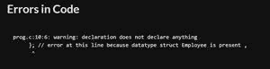

# C 中嵌套结构，示例

> 原文:[https://www . geesforgeks . org/nested-structure-in-c-with-examples/](https://www.geeksforgeeks.org/nested-structure-in-c-with-examples/)

**先决条件:** [建筑在丙](https://www.geeksforgeeks.org/structures-c/)

C 中的**嵌套结构**是结构内的结构。一个结构可以在另一个结构中声明，就像结构成员在结构中声明一样。

**语法:**

> struct name_1
> {
> 成员 1；
> 会员 2 名；
> 。
> 。
> 会员；
> 
> 结构名 _2
> {
> 成员 _ 1；
> 会员 _ 2；
> 。
> 。
> 成员 _ n；
> }，var1
> } var2；

可以使用以下语法访问嵌套结构的成员:

> 外部结构的变量名。要访问的嵌套结构数据成员的变量名

**示例:**

*   考虑有两种结构**员工(从属结构)**和另一种结构称为**组织(外部结构)**。
*   组织结构有组织名称、组织编号等数据成员。
*   雇员结构嵌套在组织结构中，它包含雇员标识、姓名、工资等数据成员。

要访问组织和员工成员，将使用以下语法:

> org . EMP . employee _ id；
> org . EMP . name；
> org . EMP . salary；
> 
> org.organisation _ name
> org . organization _ number；
> 
> 这里，组织是外部结构的结构变量，组织管理计划是内部结构员工的结构变量。

**<u>不同方式的嵌套结构</u>**

该结构可以以下列不同方式嵌套:

1.  **通过单独的嵌套结构**
2.  **采用嵌入式嵌套结构**。

**1。通过单独的嵌套结构:**在该方法中，创建了两个结构，但是从属结构(雇员)应该作为成员在主结构(组织)中使用。下面是实现该方法的 C 程序:

## C

```
// C program to implement
// the above approach
#include <stdio.h>
#include <string.h>

// Declaration of the
// dependent structure
struct Employee
{
  int employee_id;
  char name[20];
  int salary;
};

// Declaration of the
// Outer structrue
struct Organisation
{
  char organisation_name[20];
  char org_number[20];

  // Dependent structure is used
  // as a member inside the main
  // structure for implementing
  // nested structure
  struct Employee emp;
};

// Driver code
int main()
{
  // Struture variable
  struct Organisation org;

  // Print the size of organisation
  // structure
  printf("The size of structure organisation : %ld\n",
          sizeof(org));

  org.emp.employee_id = 101; 
  strcpy(org.emp.name, "Robert");
  org.emp.salary = 400000;
  strcpy(org.organisation_name,
         "GeeksforGeeks");
  strcpy(org.org_number, "GFG123768");

  // Printing the details
  printf("Organisation Name : %s\n",
          org.organisation_name); 
  printf("Organisation Number : %s\n",
          org.org_number); 
  printf("Employee id : %d\n",
          org.emp.employee_id); 
  printf("Employee name : %s\n",
          org.emp.name); 
  printf("Employee Salary : %d\n",
          org.emp.salary); 
}
```

**输出:**

> 结构组织规模:68
> 组织名称:geesforgeks
> 组织编号:GFG123768
> 员工 id : 101
> 员工姓名:Robert
> 员工工资:40 万

**2。通过嵌入嵌套结构:**使用此方法，允许在结构内部声明结构，并且它需要更少的代码行。

**情况 1:** 如果结构存在但结构变量缺失，则会出现错误。

## C

```
// C program to implement
// the above approach
#include <stdio.h>

// Declaration of the outer
// structure
struct Organisation
{
  char organisation_name[20];
  char org_number[20];

  // Declaration of the employee
  // structure
  struct Employee
  {
    int employee_id;
    char name[20];
    int salary;

  // This line will cause error because
  // datatype struct Employee is present ,
  // but Structure variable is missing.
  };
};

// Driver code
int main()
{
  // Structure variable of organisation
  struct Organisation org;
  printf("%ld", sizeof(org));
}
```

**输出:**



**注:**

每当创建嵌入式嵌套结构时，变量声明在内部结构的末尾是强制的，内部结构充当外部结构的成员。必须在内部结构的末端创建**结构变量**。

**情况 2:** 当内部结构的结构变量在内部结构的末尾声明时。下面是实现这种方法的 C 程序:

## C

```
// C program to implement
// the above approach
#include <stdio.h>
#include <string.h>

// Declaration of the main
// strcuture
struct Organisation
{
  char organisation_name[20];
  char org_number[20];

  // Declaration of the dependent
  // structure
  struct Employee
  {
    int employee_id;
    char name[20];
    int salary;

  // variable is created which acts
  // as member to Organisation structure.
  } emp;
};

// Driver code
int main()
{
  struct Organisation org;

  // Print the size of organisation
  // structure
  printf("The size of structure organisation : %ld\n",
          sizeof(org));

  org.emp.employee_id = 101; 
  strcpy(org.emp.name, "Robert");
  org.emp.salary = 400000;
  strcpy(org.organisation_name,
         "GeeksforGeeks");
  strcpy(org.org_number, "GFG123768");

  // Printing the details
  printf("Organisation Name : %s\n",
          org.organisation_name); 
  printf("Organisation Number : %s\n",
          org.org_number); 
  printf("Employee id : %d\n",
          org.emp.employee_id); 
  printf("Employee name : %s\n",
          org.emp.name); 
  printf("Employee Salary : %d\n",
          org.emp.salary); 
}
```

**输出:**

> 结构组织规模:68
> 组织名称:geesforgeks
> 组织编号:GFG123768
> 员工 id : 101
> 员工姓名:Robert
> 员工工资:40 万

**<u>嵌套结构的缺点</u>**

嵌套结构的缺点是:

*   **不可能独立存在:**需要注意的是，结构 Employee 本身并不存在。不能在程序的任何其他地方声明结构雇员类型的结构变量。
*   **不能在多个数据结构中使用:**由于在主结构中声明结构变量的限制，嵌套结构不能在多个结构中使用。因此，最推荐的方法是使用一个单独的结构，它可以用于多个数据结构

**<u>C 嵌套结构示例</u>**

下面是 C 嵌套结构的另一个例子。

## C

```
// C program to implement
// the nested strcture
#include <stdio.h>
#include <string.h>

// Declaration of Outer structure
struct College
{
  char college_name[20];
  int ranking;

  // Declaration of Inner structure
  struct Student
  {
    int student_id;
    char name[20];
    int roll_no;

  // Inner structure variable
  } student1;
};

// Driver code
int main()
{
  struct College c1 = {"GeeksforGeeks", 7,
                      {111, "Paul", 278}};

  printf("College name : %s\n",
          c1.college_name);
  printf("Ranking : %d\n",
          c1.ranking);
  printf("Student id : %d\n",
          c1.student1.student_id);
  printf("Student name : %s\n",
          c1.student1.name);
  printf("Roll no : %d\n",
          c1.student1.roll_no);
  return 0;
}
```

**输出:**

> 学院名:GeeksforGeeks
> 排名:7
> 学号:111
> 学名:保罗
> 学号:278

**注:**

结构本身不允许嵌套。

**示例:**

> 结构学生
> 
> 字符名称[50]；
> 
> 字符地址[100]；
> 
> 你是 roll_no;
> 
> 结构化学生极客；//无效
> 
> }

**<u>将嵌套结构传递给函数</u>**

嵌套结构可以通过两种方式传递到函数中:

1.  **立即传递嵌套结构变量。**
2.  **将嵌套结构成员作为参数传递给函数。**

让我们详细讨论每一种方法。

**1。一次传递嵌套结构变量:**和其他变量一样，嵌套结构变量也可以传递给函数。下面是实现这个概念的 C 程序:

## C

```
// C program to implement
// the above approach
#include <stdio.h>

// Declaration of the inner
// structure
struct Employee
{
  int employee_id;
  char name[20];
  int salary;
};

// Declaration of the Outer
// structure
struct Organisation
{
  char organisation_name[20];
  char org_number[20];

  // Nested structure
  struct Employee emp;
};

// Function show is expecting
// variable of outer structure
void show(struct Organisation);

// Driver code
int main()
{
  struct Organisation org = {"GeeksforGeeks", "GFG111",
                            {278, "Paul",5000}};

  // Organisation structure variable
  // is passed to function show
  show(org);
}

// Function shoe definition
void show(struct Organisation org )
{
  // Printing the details
  printf("Printing the Details :\n");
  printf("Organisation Name : %s\n",
          org.organisation_name); 
  printf("Organisation Number : %s\n",
          org.org_number); 
  printf("Employee id : %d\n",
          org.emp.employee_id); 
  printf("Employee name : %s\n",
          org.emp.name); 
  printf("Employee Salary : %d\n",
          org.emp.salary); 
}
```

**输出:**

> 打印详细信息:
> 组织名称:geesforgeks
> 组织编号:GFG111
> 员工 id : 278
> 员工姓名:Paul
> 员工工资:5000

**2。将嵌套结构成员作为参数传递给函数:**考虑以下示例，将员工的结构成员传递给函数 display()，该函数用于显示员工的详细信息。

## C

```
// C program to implement
// the above approach
#include <stdio.h>

// Declaration of the inner
// structure
struct Employee
{
  int employee_id;
  char name[20];
  int salary;
};

// Declaration of the Outer
// structure
struct Organisation
{
  char organisation_name[20];
  char org_number[20];

  // Nested structure
  struct Employee emp;
};

// Function show is expecting
// members of both structures
void show(char organisation_name[],
          char org_number[],
          int employee_id,
          char name[], int salary);

// Driver code
int main()
{
  struct Organisation org = {"GeeksforGeeks", "GFG111",
                            {278, "Paul",5000}};

  // Data members of both the structures
  // are passed to the function show
  show(org.organisation_name, org.org_number,
       org.emp.employee_id, org.emp.name,
       org.emp.salary);
}

// Function show definition
void show(char organisation_name[],
          char org_number[],
          int employee_id,
          char name[], int salary)
{
  // Printing the details
  printf("Printing the Details :\n");
  printf("Organisation Name : %s\n",
          organisation_name); 
  printf("Organisation Number : %s\n",
          org_number); 
  printf("Employee id : %d\n",
          employee_id); 
  printf("Employee name : %s\n",
          name); 
  printf("Employee Salary : %d\n",
          salary); 
}
```

**输出:**

> 打印详细信息:
> 组织名称:geesforgeks
> 组织编号:GFG111
> 员工 id : 278
> 员工姓名:Paul
> 员工工资:5000

**<u>访问嵌套结构</u>**

嵌套结构有两种访问方式:

1.  **使用正态变量。**
2.  **使用指针变量。**

让我们详细讨论这些方法。

**1。使用普通变量:**外部和内部结构变量被声明为普通变量，外部结构的数据成员使用单个点(。)并且使用这两个点来访问内部结构的数据成员。下面是实现这个概念的 C 程序:

## C

```
// C prorgam to implement
// the above approach
#include <stdio.h>
#include <string.h>

// Declaration of inner structure
struct college_details
{
  int college_id;
  char college_name[50];

};

// Declaration of Outer structure
struct student_detail
{
  int student_id;
  char student_name[20];
  float cgpa;

  // Inner structure variable
  struct college_details clg;
} stu;

// Driver code
int main()
{
  struct student_detail stu = {12, "Kathy", 7.8,
                              {14567, "GeeksforGeeks"}};

  // Printing the details
  printf("College ID : %d \n", stu.clg.college_id);
  printf("College Name : %s \n", stu.clg.college_name);
  printf("Student ID : %d \n", stu.student_id);
  printf("Student Name : %s \n", stu.student_name);
  printf("Student CGPA : %f \n", stu.cgpa);
  return 0;
}
```

**输出:**

> 学院 ID : 14567
> 学院名称:GeeksforGeeks
> 学生 ID : 12
> 学生名称:Kathy
> 学生 CGPA : 7.800000

**2。使用指针变量:**声明结构的一个普通变量和一个指针变量来解释两者的区别。在指针变量的情况下，点(。)和箭头(- >)将用于访问数据成员。下面是实现上述方法的 C 程序:

## C

```
// C prorgam to implement
// the above approach
#include <stdio.h>
#include <string.h>

// Declaration of inner structure
struct college_details
{
  int college_id;
  char college_name[50];

};

// Declaration of Outer structure
struct student_detail
{
  int student_id;
  char student_name[20];
  float cgpa;

  // Inner structure variable
  struct college_details clg;
} stu, *stu_ptr;

// Driver code
int main()
{
  struct student_detail stu = {12, "Kathy", 7.8,
                              {14567, "GeeksforGeeks"}};

  stu_ptr = &stu;

  // Printing the details
  printf("College ID : %d \n", stu_ptr->clg.college_id);
  printf("College Name : %s \n", stu_ptr->clg.college_name);
  printf("Student ID : %d \n", stu_ptr->student_id);
  printf("Student Name : %s \n", stu_ptr->student_name);
  printf("Student CGPA : %f \n", stu_ptr->cgpa);
  return 0;
}
```

**输出:**

> 学院 ID : 14567
> 学院名称:GeeksforGeeks
> 学生 ID : 12
> 学生名称:Kathy
> 学生 CGPA : 7.800000

嵌套结构将允许根据程序的要求创建复杂的数据类型。