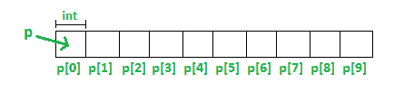

# 在 C++中为动态内存新建和删除操作符

> 原文:[https://www . geesforgeks . org/new-and-delete-operators-in-CPP-for-dynamic-memory/](https://www.geeksforgeeks.org/new-and-delete-operators-in-cpp-for-dynamic-memory/)

C/C++中的动态内存分配是指程序员手动进行内存分配。动态分配的内存分配在**堆**上，非静态和局部变量在**栈**上获得分配的内存(详见[内存布局 C 程序](https://www.geeksforgeeks.org/memory-layout-of-c-program/))。
**有哪些应用？**

*   动态分配内存的一个用途是分配可变大小的内存，除了[可变长度数组](https://www.geeksforgeeks.org/variable-length-arrays-in-c-and-c/)之外，编译器分配的内存是不可能分配可变大小的内存的。
*   最重要的用途是为程序员提供灵活性。每当我们需要或者不再需要的时候，我们都可以自由地分配和释放内存。在许多情况下，这种灵活性会有所帮助。这种情况的例子有[链表](https://www.geeksforgeeks.org/data-structures/linked-list/)、[树](https://www.geeksforgeeks.org/binary-tree-2/)等。

**与分配给正常变量的内存有何不同？**
对于“int a”、“char str[10]”等常规变量，内存会自动分配和释放。对于像“int *p = new int[10]”这样的动态分配内存，程序员有责任在不再需要时释放内存。如果程序员不释放内存，就会导致[内存泄漏](https://www.geeksforgeeks.org/what-is-memory-leak-how-can-we-avoid/)(直到程序终止内存才会释放)。
**c++中内存是如何分配/解除分配的？**
C 使用 [malloc()和 calloc()](https://www.geeksforgeeks.org/calloc-versus-malloc/) 函数在运行时动态分配内存，使用 free()函数释放动态分配的内存。C++支持这些功能，还有两个运算符**新增**和**删除**，以更好更简单的方式执行分配和释放内存的任务。
本文讲的都是新增和删除操作符。

**新操作员**

新运算符表示对空闲存储区内存分配的请求。如果有足够的内存，new 运算符初始化内存，并将新分配和初始化的内存的地址返回给指针变量。

*   **使用新运算符**的语法:要分配任何数据类型的内存，语法为:

```cpp
pointer-variable = new data-type;
```

*   这里，指针变量是数据类型的指针。数据类型可以是任何内置的数据类型，包括数组，也可以是任何用户定义的数据类型，包括结构和类。
    示例:

```cpp
// Pointer initialized with NULL
// Then request memory for the variable
int *p = NULL; 
p = new int;   

            OR

// Combine declaration of pointer 
// and their assignment
int *p = new int; 
```

*   **初始化内存:**我们还可以使用新的运算符为内置数据类型初始化内存。对于自定义数据类型，需要一个构造函数(以数据类型作为输入)来初始化值。下面是两种数据类型的初始化示例:

```cpp
pointer-variable = new data-type(value);
Example:
int *p = new int(25);
float *q = new float(75.25);

// Custom data type
struct cust
{
    int p;
    cust(int q) : p(q) {}
};

cust* var1 = new cust;    // Works fine, doesn't require constructor

        OR

cust* var1 = new cust();        // Works fine, doesn't require constructor

cust* var = new cust(25)        // Notice error if you comment this line
```

*   **分配内存块:**新运算符也用于分配类型为*数据类型为*的内存块(数组)。

```cpp
pointer-variable = new data-type[size];
```

*   其中 size(变量)指定数组中元素的数量。

```cpp
Example:
        int *p = new int[10]
```

*   为 int 类型的 10 个整数连续动态分配内存，并返回指向序列第一个元素的指针，该元素被赋给 p(一个指针)。p[0]指第一个元素，p[1]指第二个元素，以此类推。



**普通数组声明 vs 使用新的**
声明普通数组和使用新的分配内存块是有区别的。最重要的区别是，普通数组由编译器释放(如果数组是本地的，那么在函数返回或完成时释放)。然而，动态分配的数组总是保留在那里，直到它们被程序员解除分配或者程序终止。
**如果运行时内存不足怎么办？**
如果堆中没有足够的内存可供分配，新请求会抛出一个 std::bad_alloc 类型的异常来指示失败，除非“nothrow”与新运算符一起使用，在这种情况下，它会返回一个 NULL 指针(滚动到本文[中的“新运算符的异常处理”一节)。因此，在使用程序之前检查 new 产生的指针变量可能是个好主意。](https://aticleworld.com/dynamic-memory-and-new-operator-c/) 

```cpp
int *p = new(nothrow) int;
if (!p)
{
   cout << "Memory allocation failed\n";
}
```

**删除运算符**

由于释放动态分配的内存是程序员的责任，所以 C++语言为程序员提供了删除操作符。
**语法:**

```cpp
// Release memory pointed by pointer-variable
delete pointer-variable;  
```

这里，指针变量是指向*新建*创建的数据对象的指针。
示例:

```cpp
  delete p;
  delete q;
```

要释放指针变量指向的动态分配数组，请使用以下形式的*删除* :

```cpp
// Release block of memory 
// pointed by pointer-variable
delete[] pointer-variable;  

Example:
   // It will free the entire array
   // pointed by p.
   delete[] p;
```

## 卡片打印处理机（Card Print Processor 的缩写）

```cpp
// C++ program to illustrate dynamic allocation
// and deallocation of memory using new and delete
#include <iostream>
using namespace std;

int main ()
{
    // Pointer initialization to null
    int* p = NULL;

    // Request memory for the variable
    // using new operator
    p = new(nothrow) int;
    if (!p)
        cout << "allocation of memory failed\n";
    else
    {
        // Store value at allocated address
        *p = 29;
        cout << "Value of p: " << *p << endl;
    }

    // Request block of memory
    // using new operator
    float *r = new float(75.25);

    cout << "Value of r: " << *r << endl;

    // Request block of memory of size n
    int n = 5;
    int *q = new(nothrow) int[n];

    if (!q)
        cout << "allocation of memory failed\n";
    else
    {
        for (int i = 0; i < n; i++)
            q[i] = i+1;

        cout << "Value store in block of memory: ";
        for (int i = 0; i < n; i++)
            cout << q[i] << " ";
    }

    // freed the allocated memory
    delete p;
    delete r;

    // freed the block of allocated memory
    delete[] q;

    return 0;
}
```

输出:

```cpp
Value of p: 29
Value of r: 75.25
Value store in block of memory: 1 2 3 4 5 
```

**相关文章:**

*   [新建和删除的测验](https://www.geeksforgeeks.org/c-plus-plus-gq/new-and-delete-gq/)
*   [删除 vs 免费](https://www.geeksforgeeks.org/g-fact-30/)

本文由**阿卡什·古普塔**供稿。如果你喜欢 GeeksforGeeks 并想投稿，你也可以使用[write.geeksforgeeks.org](https://write.geeksforgeeks.org)写一篇文章或者把你的文章邮寄到 review-team@geeksforgeeks.org。看到你的文章出现在极客博客主页上，帮助其他极客。
如果你发现任何不正确的地方，或者你想分享更多关于上面讨论的话题的信息，请写评论。