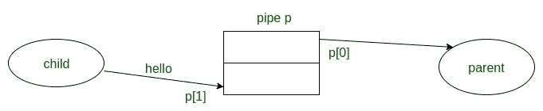
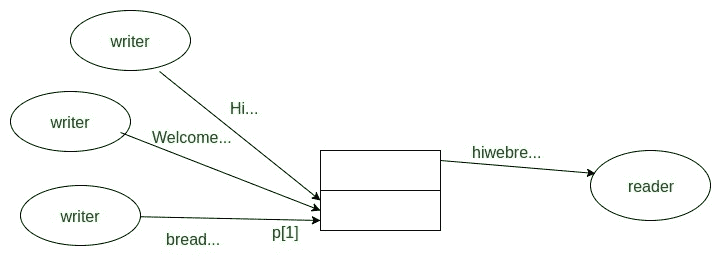

# 管道在 C 中的无阻塞输入/输出

> 原文:[https://www . geesforgeks . org/non-blocking-io-with-pipes-in-c/](https://www.geeksforgeeks.org/non-blocking-io-with-pipes-in-c/)

先决条件:[管道()系统调用](https://www.geeksforgeeks.org/pipe-system-call/)
**管道()中的 I/O 阻塞何时发生？**
考虑两个进程，一个进程实时收集数据(读取数据)，另一个进程绘制数据(写入数据)。两个过程通过管道连接，由 ***数据采集*** 过程输入数据绘制过程。两个过程的数据采集速度不同。
管道中的默认行为是，如果伙伴进程较慢，管道的写入和读取端将表现出阻塞行为。这是不好的，因为数据采集过程可以等待绘图过程(写入数据)。因此，在数据采集过程中，管道中的块读取调用和程序挂起。如果我们不想发生这种情况，我们必须在读取结束调用之前关闭写入结束进程。
简单来说，

*   读取调用获取的数据与请求的一样多，或者与管道获取的数据一样多，以较少者为准
*   如果管道是空的
    *   如果没有进程打开写端，管道上的读取将返回 EOF(返回值 0)
    *   如果某个进程为写入打开了管道，那么 read 将在预期到新数据时阻塞

**管道无堵塞输入输出**

有时，拥有不阻塞的输入/输出是很方便的，也就是说，我们不希望一个读调用阻塞另一个的输入。这个问题的解决方案是给定的函数:

```
  To specify non-blocking option:
       #include<fcntl.h> 
       int fd; 
       fcntl(fd, F_SETFL, O_NONBLOCK); 
```

*   **fd:** 文件描述符
*   **F_SETFL:** 将文件状态标志设置为 arg 指定的值。我们这里的文件访问模式仅用于 **O_NONBLOCK** 标志。
*   **O_NONBLOCK:** 用于非阻塞选项。
*   **0:** 成功返回
*   **-1:** 出错返回，设置错误号

此函数成功运行后，如果管道
**为空/满**并设置 errno 为 **EAGAIN**
**则读/写调用返回 **-1** 示例:子节点每 3 秒向父节点写一次“你好”，父节点每秒执行一次非阻塞读。**



## C

```
// C program to illustrate
// non I/O blocking calls
#include <stdio.h>
#include <unistd.h>
#include <fcntl.h> // library for fcntl function
#define MSGSIZE 6
char* msg1 =“hello”;
char* msg2 =“bye !!”;

int main()
{
    int p[2], i;

    // error checking for pipe
    if (pipe(p) < 0)
        exit(1);

    // error checking for fcntl
    if (fcntl(p[0], F_SETFL, O_NONBLOCK) < 0)
        exit(2);

    // continued
    switch (fork()) {

    // error
    case -1:
        exit(3);

    // 0 for child process
    case 0:
        child_write(p);
        break;

    default:
        parent_read(p);
        break;
    }
    return 0;
}
void parent_read(int p[])
{
    int nread;
    char buf[MSGSIZE];

    // write link
    close(p[1]);

    while (1) {

        // read call if return -1 then pipe is
        // empty because of fcntl
        nread = read(p[0], buf, MSGSIZE);
        switch (nread) {
        case -1:

            // case -1 means pipe is empty and errono
            // set EAGAIN
            if (errno == EAGAIN) {
                printf(“(pipe empty)\n”);
                sleep(1);
                break;
            }

            else {
                perror(“read”);
                exit(4);
            }

        // case 0 means all bytes are read and EOF(end of conv.)
        case 0:
            printf(“End of conversation\n”);

            // read link
            close(p[0]);

            exit(0);
        default:

            // text read
            // by default return no. of bytes
            // which read call read at that time
            printf(“MSG = % s\n”, buf);
        }
    }
}
void child_write(int p[])
{
    int i;

    // read link
    close(p[0]);

    // write 3 times "hello" in 3 second interval
    for (i = 0; i < 3; i++) {
        write(p[1], msg1, MSGSIZE);
        sleep(3);
    }

    // write "bye" one times
    write(p[1], msg2, MSGSIZE);

    // here after write all bytes then write end
    // doesn't close so read end block but
    // because of fcntl block doesn't happen..
    exit(0);
}
```

**输出:**

```
(pipe empty)
MSG=hello
(pipe empty)
(pipe empty)
(pipe empty)
MSG=hello
(pipe empty)
(pipe empty)
(pipe empty)
MSG=hello
(pipe empty)
(pipe empty)
(pipe empty)
MSG=bye!!
End of conversation
```

**原子写入管道**

原子意味着没有其他进程观察到它已经完成了一部分。如果写入的数据大小不大于 **pipe_BUF(4096 字节)**，则读取或写入 PIPE 数据是原子的。这意味着数据传输似乎是一个瞬时单位，意味着系统中没有任何其他东西可以观察到它部分完成的状态。原子输入/输出可能不会立即开始(它可能需要等待缓冲空间或数据)，但一旦开始，它就会立即完成。
高达 **PIPE_BUF (4096 字节)**的数据写入是原子的。读取或写入大量数据可能不是原子的；例如，来自共享描述符的其他进程的输出数据可以被分散。此外，一旦 **PIPE_BUF** 字符被写入，进一步的写入将被阻止，直到一些字符被读取
**示例:**进程 1 同时发送一个 100 字节的消息，进程 2 发送一个 100 字节的消息不保证顺序，但是 PIPE 将接收一个消息的所有内容，然后是所有其他内容。
对于较大的写入，在非原子写入中没有这样的保证，数据可能会混乱地混合在一起，如下所示:



***管道容量***

*   一个管道可以容纳有限数量的字节。
*   当管道已满时，写入填充管道和块
    *   它们会阻塞，直到另一个进程在管道的另一端读取到足够的数据，并在所有指定写入的数据都已传输完毕时返回
*   管道的容量至少为 512 字节，通常更多(取决于系统)

## C

```
// C program to illustrate
// finding capacity of pipe
#include <stdio.h>
#include <unistd.h>
#include <signal.h>
int count = 0;

// SIGALRM signal handler
void alrm_action(int signo)
{
    printf("Write blocked after %d characters\n", count);
    exit(0);
}
int main()
{
    int p[2];
    char c = 'x';

    // SIGALRM signal
    signal(SIGALRM, alrm_action);

    // pipe error check
    if (pipe(p) == -1)
        exit(1);

    while (1) {
        alarm(5);

        // write 'x' at one time when capacity full
        // write() block and after 5 second alarm
        write(p[1], &c, 1);

        // send signal and alrm_action handler execute.
        ++count;
        alarm(0);
    }
}
```

**输出:**

```
Write blocked after 65536 characters 
//output depend on the system so output may change in different system
```

在这里，在 while 循环第一个 5 秒报警后设置***写()*** 调用在管道中写一个字符***【x】***。**计数**变量用于计数管道中的字符写入。强> *报警(0)* 表示取消 **5** 秒的设定报警。一段时间后当管道容量满时，write()调用被阻塞，程序不执行下一条指令，5 秒后设置报警振铃并发送信号 ***SIGALRM*** 。之后 ***alram_action*** 处理程序执行并打印管道最多可以写多少个字符。
本文由 [**卡丹·帕特尔**](https://www.facebook.com/kadam.patel.750?hc_ref=NEWSFEED) 供稿。如果你喜欢 GeeksforGeeks 并想投稿，你也可以使用[write.geeksforgeeks.org](https://write.geeksforgeeks.org)写一篇文章或者把你的文章邮寄到 review-team@geeksforgeeks.org。看到你的文章出现在极客博客主页上，帮助其他极客。
如果发现有不正确的地方，或者想分享更多关于上述话题的信息，请写评论。