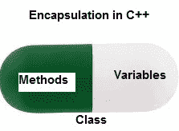

# c++中的面向对象编程

> 原文:[https://www . geesforgeks . org/面向对象-cpp 中编程/](https://www.geeksforgeeks.org/object-oriented-programming-in-cpp/)

> **目录**:
> 
> 1.  [简介](#intro)
> 2.  [级](#class)
> 3.  [物体](#obj)
> 4.  [封装](#encapsulation)
> 5.  [抽象](#abstraction)
> 6.  [多态性](#polymorphism)
> 7.  [继承](#inheritance)
> 8.  [动态绑定](#db)
> 9.  [消息传递](#mp)

面向对象编程——顾名思义在编程中使用[对象](#objects)。面向对象编程的目标是在编程中实现像继承、隐藏、多态等真实世界的实体。OOP 的主要目的是将数据和对数据进行操作的函数绑定在一起，这样除了函数之外，代码的任何其他部分都不能访问这些数据。

**面向对象编程语言的特征**


**[类](https://www.geeksforgeeks.org/c-classes-and-objects/)** :导致面向对象编程的 C++的构建块是一个类。它是用户定义的数据类型，保存自己的数据成员和成员函数，可以通过创建该类的实例来访问和使用。类就像一个对象的蓝图。

例如:考虑汽车的等级。可能会有许多不同名称和品牌的汽车，但它们都有一些共同的属性，比如它们都有 4 个轮子、速度限制、里程范围等。所以在这里，汽车是级别，车轮、限速、里程是它们的属性。

*   类是用户定义的数据类型，具有数据成员和成员函数。
*   数据成员是数据变量，成员函数是用于操作这些变量的函数，这些数据成员和成员函数一起定义了类中对象的属性和行为。
*   在上面的汽车类的例子中，数据成员将是速度限制，里程等，成员功能可以应用刹车，增加速度等。

我们可以说 C++ 中的**类是一个蓝图，代表一组具有一些共同属性和行为的对象。**

**[对象:](https://www.geeksforgeeks.org/c-classes-and-objects/)** 对象是具有某些特征和行为的可识别实体。对象是类的一个实例。当一个类被定义时，没有分配内存，但是当它被实例化时(即一个对象被创建)，内存被分配。

```cpp
class person
{
    char name[20];
    int id;
public:
    void getdetails(){}
};

int main()
{
   person p1; // p1 is a object 
}
```

对象占用内存空间，并有一个关联的地址，如帕斯卡记录或 c 语言的结构或并集

当一个程序被执行时，这些对象通过互相发送消息进行交互。

每个对象都包含数据和操作数据的代码。对象可以进行交互，而不必知道彼此数据或代码的细节，知道对象接受的消息类型和返回的响应类型就足够了。

**[封装](https://www.geeksforgeeks.org/encapsulation-in-c/)** :正常来说，封装就是将数据和信息封装在一个单元下。在面向对象编程中，封装被定义为将数据和操作它们的函数绑定在一起。

考虑一个真实的封装例子，在一个公司中，有不同的部分，如帐户部分、财务部分、销售部分等。财务科处理所有财务交易，并记录所有与财务有关的数据。同样，销售部门处理所有与销售相关的活动，并保存所有销售记录。现在可能会出现这样一种情况:出于某种原因，财务部的一名官员需要某个特定月份的所有销售数据。在这种情况下，不允许他直接访问销售部门的数据。他首先必须联系销售部门的其他官员，然后要求他提供具体数据。这就是封装。这里，销售部门的数据和能够操纵这些数据的员工被包装在一个名称“销售部门”下。



C++中的封装

封装还导致*数据抽象或隐藏*。因为使用封装也隐藏了数据。在上面的示例中，销售、财务或帐户等任何部分的数据都隐藏在任何其他部分之外。

**[抽象](https://www.geeksforgeeks.org/abstraction-in-c/)** :数据抽象是 C++中面向对象编程最本质、最重要的特征之一。抽象意味着只显示基本信息，隐藏细节。数据抽象是指只向外界提供数据的基本信息，隐藏背景细节或实现。

考虑一个男人开车的真实例子。这个人只知道踩油门会提高汽车的速度，或者踩刹车会让汽车停下来，但他不知道踩油门后速度实际上是如何提高的，他不知道汽车的内部机制或者油门、刹车等在汽车中的实施。这就是抽象。

*   *使用类的抽象*:我们可以使用类在 C++中实现抽象。该类帮助我们使用可用的访问说明符对数据成员和成员函数进行分组。类可以决定哪个数据成员对外部世界可见，哪个不可见。
*   *头文件中的抽象*:c++中还有一种抽象可以是头文件。例如，考虑 math.h 头文件中的 pow()方法。每当我们需要计算一个数的幂时，我们只需调用 math.h 头文件中的函数 pow()，并将这些数作为参数传递，而不知道函数实际上是根据什么基础算法计算数的幂的。

**[多态性:](https://www.geeksforgeeks.org/polymorphism-in-c/)** 多态性这个词的意思是有多种形式。简单地说，我们可以将多态性定义为一条消息以多种形式显示的能力。

一个人同时可以有不同的特点。喜欢一个男人的同时是一个父亲，一个丈夫，一个员工。所以同一个人在不同的情况下有不同的行为。这叫做多态性。

一个操作在不同的情况下可能表现出不同的行为。行为取决于操作中使用的数据类型。

C++支持运算符重载和函数重载。

*   *操作符重载*:使操作符在不同情况下表现出不同行为的过程称为操作符重载。
*   *函数重载*:函数重载是使用单个函数名来执行不同类型的任务。
    多态性广泛用于实现继承。

**例**:假设我们要写一个函数来加一些整数，有的时候有 2 个整数，有的时候有 3 个整数。我们可以用不同的参数编写同名的加法方法，根据参数调用相关的方法。


**[继承](https://www.geeksforgeeks.org/inheritance-in-c/)** :一个类从另一个类派生属性和特性的能力叫做继承。继承是面向对象编程最重要的特征之一。

*   **子类**:从另一个类继承属性的类叫做子类或者派生类。
*   **超类**:属性被子类继承的类称为基类或超类。
*   **可重用性**:继承支持“可重用性”的概念，即当我们想要创建一个新的类，并且已经有一个类包含了我们想要的一些代码时，我们可以从现有的类中派生出我们的新类。通过这样做，我们重用了现有类的字段和方法。

**例**:狗、猫、牛可以是动物基类的衍生类。
T3】

**动态绑定:**在动态绑定中，响应函数调用要执行的代码是在运行时决定的。C++有[虚拟函数](https://www.geeksforgeeks.org/virtual-functions-and-runtime-polymorphism-in-c-set-1-introduction/)来支持这一点。

**消息传递:**对象之间通过相互发送和接收信息进行通信。对象的消息是执行过程的请求，因此将调用接收对象中的函数来生成所需的结果。消息传递包括指定对象的名称、函数的名称和要发送的信息。

**相关文章**:

*   [类和对象](https://www.geeksforgeeks.org/c-classes-and-objects/)
*   [继承](https://www.geeksforgeeks.org/inheritance-in-c/)
*   [访问修饰符](https://www.geeksforgeeks.org/access-modifiers-in-c/)
*   [](https://www.geeksforgeeks.org/access-modifiers-in-c/)[抽象](https://www.geeksforgeeks.org/abstraction-in-c/)

本文由 **Vankayala Karunakar** 供稿。如果你发现任何不正确的地方，或者你想分享更多关于上面讨论的话题的信息，请写评论。