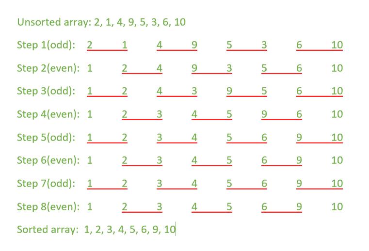

# 使用 pthreads 的奇偶换位排序/砖块排序

> 原文:[https://www . geeksforgeeks . org/奇数-偶数-换位-排序-砖块-排序-使用-pthreads/](https://www.geeksforgeeks.org/odd-even-transposition-sort-brick-sort-using-pthreads/)

[奇偶换位排序](https://www.geeksforgeeks.org/odd-even-sort-brick-sort/)是一种[并行排序算法](https://www.geeksforgeeks.org/serial-sort-vs-parallel-sort-java/)。它基于[冒泡排序技术](https://www.geeksforgeeks.org/bubble-sort/)，该技术比较数组中每两个连续的数字，如果第一个大于第二个，则交换它们，以获得升序数组。它由 2 相组成–奇数相和偶数相:

*   **奇数阶段:**将每个奇数索引元素与下一个偶数索引元素进行比较(考虑基于 1 的索引)。

*   **偶数阶段:**将每个偶数索引元素与下一个奇数索引元素进行比较。

本文使用[多线程](https://www.geeksforgeeks.org/multithreading-c-2/)的概念，具体为 [pthread](https://www.geeksforgeeks.org/multithreading-c-2/) 。在每次迭代中，每对 2 个连续元素使用并行执行的单独线程进行比较，如下所示。



**例:**

```
Input: { 2, 1, 4, 9, 5, 3, 6, 10 }
Output: 1, 2, 3, 4, 5, 6, 9, 10

Input: { 11, 19, 4, 20, 1, 22, 25, 8}
Output: 1, 4, 8, 11, 19, 20, 22, 25
```

**注意:**在基于 Linux 的系统上使用以下命令编译程序。

```
g++ program_name.cpp -pthread
```

下面是上面题目的实现:

## 卡片打印处理机（Card Print Processor 的缩写）

```
// CPP Program for Odd-Even Transposition sort
// using pthreads

#include <bits/stdc++.h>
#include <pthread.h>

using namespace std;

// size of array
#define n 8

// maximum number of threads
int max_threads = (n + 1) / 2;

int a[] = { 2, 1, 4, 9, 5, 3, 6, 10 };
int tmp;

// Function to compare and exchange
// the consecutive elements of the array
void* compare(void* arg)
{

    // Each thread compares
    // two consecutive elements of the array
    int index = tmp;
    tmp = tmp + 2;

    if ((a[index] > a[index + 1]) && (index + 1 < n)) {
        swap(a[index], a[index + 1]);
    }
}

void oddEven(pthread_t threads[])
{
    int i, j;

    for (i = 1; i <= n; i++) {
        // Odd step
        if (i % 2 == 1) {
            tmp = 0;

            // Creating threads
            for (j = 0; j < max_threads; j++)
                pthread_create(&threads[j], NULL, compare, NULL);

            // joining threads i.e. waiting
            // for all the threads to complete
            for (j = 0; j < max_threads; j++)
                pthread_join(threads[j], NULL);
        }

        // Even step
        else {
            tmp = 1;

            // Creating threads
            for (j = 0; j < max_threads - 1; j++)
                pthread_create(&threads[j], NULL, compare, NULL);

            // joining threads i.e. waiting
            // for all the threads to complete
            for (j = 0; j < max_threads - 1; j++)
                pthread_join(threads[j], NULL);
        }
    }
}

// Function to print an array
void printArray()
{
    int i;
    for (i = 0; i < n; i++)
        cout << a[i] << " ";
    cout << endl;
}

// Driver Code
int main()
{

    pthread_t threads[max_threads];

    cout << "Given array is: ";
    printArray();

    oddEven(threads);

    cout << "\nSorted array is: ";
    printArray();

    return 0;
}
```

**输出:**

```
Given array is:  2 1 4 9 5 3 6 10
Sorted array is: 1 2 3 4 5 6 9 10
```

**时间复杂度**:由于使用线程进行并行计算，时间复杂度降低到 O(N)。
**工作复杂度**:这个程序的工作复杂度是 O(N)，因为 N/2 的线程(资源)被用来对数组进行排序。所以，这个项目的工作时间复杂度是 O(N^2).