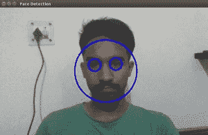

# 用于人脸检测的 OpenCV C++程序

> 原文:[https://www . geesforgeks . org/opencv-c-program-face-detection/](https://www.geeksforgeeks.org/opencv-c-program-face-detection/)

该程序使用 OpenCV 库检测网络摄像头直播流或本地机器存储的视频文件中的人脸。这个程序实时检测人脸并跟踪它。为此，它使用预先训练好的 XML 分类器。这个程序中使用的分类器具有经过训练的面部特征。不同的分类器可以用来检测不同的物体。
**运行程序的要求:**
1) OpenCV 必须安装在本地机器上。
2)在执行程序之前，必须给出分类器 XML 文件的路径。这些 XML 文件可以在 OpenCV 目录“OpenCV/data/haarcscades”中找到。
3)在捕获中使用 0。打开(0)播放网络摄像头视频。
4)为检测本地视频，提供视频路径。(capture.open("path_to_video "))。

**实施:**

```cpp
// CPP program to detects face in a video

// Include required header files from OpenCV directory
#include "/usr/local/include/opencv2/objdetect.hpp"
#include "/usr/local/include/opencv2/highgui.hpp"
#include "/usr/local/include/opencv2/imgproc.hpp"
#include <iostream>

using namespace std;
using namespace cv;

// Function for Face Detection
void detectAndDraw( Mat& img, CascadeClassifier& cascade, 
                CascadeClassifier& nestedCascade, double scale );
string cascadeName, nestedCascadeName;

int main( int argc, const char** argv )
{
    // VideoCapture class for playing video for which faces to be detected
    VideoCapture capture; 
    Mat frame, image;

    // PreDefined trained XML classifiers with facial features
    CascadeClassifier cascade, nestedCascade; 
    double scale=1;

    // Load classifiers from "opencv/data/haarcascades" directory 
    nestedCascade.load( "../../haarcascade_eye_tree_eyeglasses.xml" ) ;

    // Change path before execution 
    cascade.load( "../../haarcascade_frontalcatface.xml" ) ; 

    // Start Video..1) 0 for WebCam 2) "Path to Video" for a Local Video
    capture.open(0); 
    if( capture.isOpened() )
    {
        // Capture frames from video and detect faces
        cout << "Face Detection Started...." << endl;
        while(1)
        {
            capture >> frame;
            if( frame.empty() )
                break;
            Mat frame1 = frame.clone();
            detectAndDraw( frame1, cascade, nestedCascade, scale ); 
            char c = (char)waitKey(10);

            // Press q to exit from window
            if( c == 27 || c == 'q' || c == 'Q' ) 
                break;
        }
    }
    else
        cout<<"Could not Open Camera";
    return 0;
}

void detectAndDraw( Mat& img, CascadeClassifier& cascade,
                    CascadeClassifier& nestedCascade,
                    double scale)
{
    vector<Rect> faces, faces2;
    Mat gray, smallImg;

    cvtColor( img, gray, COLOR_BGR2GRAY ); // Convert to Gray Scale
    double fx = 1 / scale;

    // Resize the Grayscale Image 
    resize( gray, smallImg, Size(), fx, fx, INTER_LINEAR ); 
    equalizeHist( smallImg, smallImg );

    // Detect faces of different sizes using cascade classifier 
    cascade.detectMultiScale( smallImg, faces, 1.1, 
                            2, 0|CASCADE_SCALE_IMAGE, Size(30, 30) );

    // Draw circles around the faces
    for ( size_t i = 0; i < faces.size(); i++ )
    {
        Rect r = faces[i];
        Mat smallImgROI;
        vector<Rect> nestedObjects;
        Point center;
        Scalar color = Scalar(255, 0, 0); // Color for Drawing tool
        int radius;

        double aspect_ratio = (double)r.width/r.height;
        if( 0.75 < aspect_ratio && aspect_ratio < 1.3 )
        {
            center.x = cvRound((r.x + r.width*0.5)*scale);
            center.y = cvRound((r.y + r.height*0.5)*scale);
            radius = cvRound((r.width + r.height)*0.25*scale);
            circle( img, center, radius, color, 3, 8, 0 );
        }
        else
            rectangle( img, cvPoint(cvRound(r.x*scale), cvRound(r.y*scale)),
                    cvPoint(cvRound((r.x + r.width-1)*scale), 
                    cvRound((r.y + r.height-1)*scale)), color, 3, 8, 0);
        if( nestedCascade.empty() )
            continue;
        smallImgROI = smallImg( r );

        // Detection of eyes int the input image
        nestedCascade.detectMultiScale( smallImgROI, nestedObjects, 1.1, 2,
                                        0|CASCADE_SCALE_IMAGE, Size(30, 30) ); 

        // Draw circles around eyes
        for ( size_t j = 0; j < nestedObjects.size(); j++ ) 
        {
            Rect nr = nestedObjects[j];
            center.x = cvRound((r.x + nr.x + nr.width*0.5)*scale);
            center.y = cvRound((r.y + nr.y + nr.height*0.5)*scale);
            radius = cvRound((nr.width + nr.height)*0.25*scale);
            circle( img, center, radius, color, 3, 8, 0 );
        }
    }

    // Show Processed Image with detected faces
    imshow( "Face Detection", img ); 
}
```

**输出:**



人脸检测

**下一篇:** [Opencv 人脸检测 Python 程序](https://www.geeksforgeeks.org/opencv-python-program-face-detection/)
T5】参考文献:

1)[http://docs . opencv . org/2.4/modules/contrib/doc/face rec/face rec _ tutorial . html](http://docs.opencv.org/2.4/modules/contrib/doc/facerec/facerec_tutorial.html)
2)[http://docs . opencv . org/2.4/doc/tutorial/objdetect/cascade _ classifier/cascade _ classifier . html](http://docs.opencv.org/2.4/doc/tutorials/objdetect/cascade_classifier/cascade_classifier.html)

本文由**沙斯沃特·贾恩**供稿。如果你喜欢 GeeksforGeeks 并想投稿，你也可以使用[contribute.geeksforgeeks.org](http://contribute.geeksforgeeks.org)写一篇文章或者把你的文章邮寄到 contribute@geeksforgeeks.org。看到你的文章出现在极客博客主页上，帮助其他极客。

如果你发现任何不正确的地方，或者你想分享更多关于上面讨论的话题的信息，请写评论。