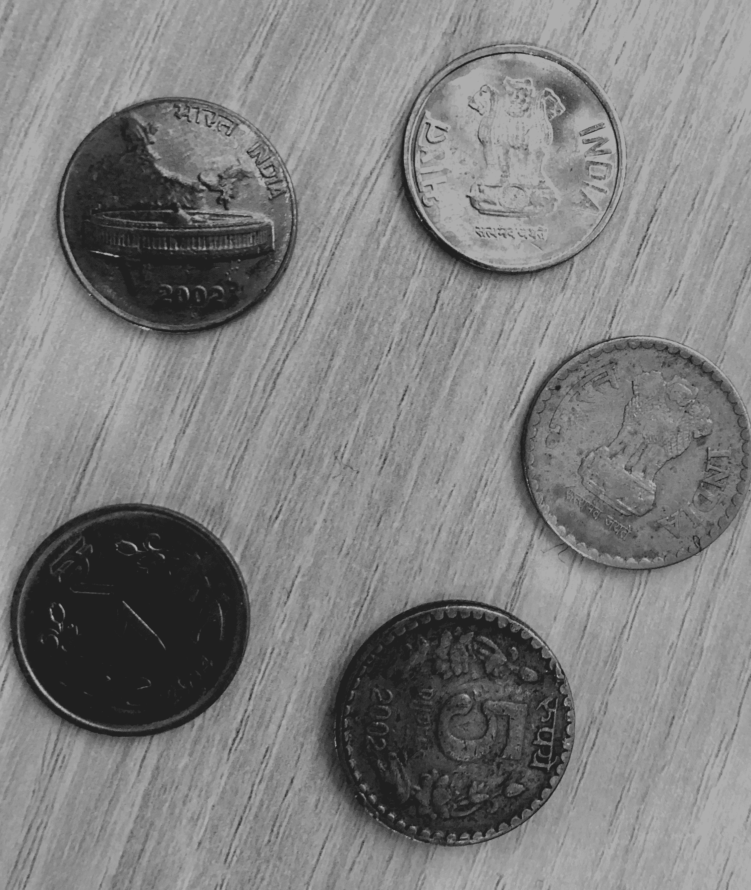

# 硬币检测 OpenCV C++ 程序

> 原文:[https://www . geesforgeks . org/opencv-c-硬币检测程序/](https://www.geeksforgeeks.org/opencv-c-program-for-coin-detection/)

以下是使用 OpenCV 工具在 C++ 中对硬币检测的 C++ 代码的解释。

[](https://media.geeksforgeeks.org/wp-content/uploads/coin-detection.jpg) 
**事情要知道:**

1.  代码只会在 Linux 环境下编译。
2.  要在 windows 中运行，请使用文件:“coin.o”并在 cmd 中运行。然而，如果它不运行(系统架构中的问题)，那么在 windows 中编译它，对代码进行适当而明显的更改，比如:用代替。
3.  编译命令:g++-w coin . CPP-o coin.exe ` pkg-config–libs opencv `
4.  运行命令:。/硬币
5.  包含硬币的图像必须与代码在同一目录中。
    在运行代码之前，请确保您的//系统上安装了 OpenCV。

**代码片段解释:**

```cpp
#include "opencv2/highgui/highgui.hpp"
// highgui - an interface to video and image capturing.

#include "opencv2/imgproc/imgproc.hpp"
// imgproc - An image processing module that for linear and non-linear
 image filtering, geometrical image transformations, color space conversion and so on.
#include <iostream>
#include <stdio.h>
// The header files for performing input and output.

using namespace cv;
// Namespace where all the C++ OpenCV functionality resides.

using namespace std;
// For input output operations.

int main()
{
    Mat image;
    // Mat object is a basic image container. image is an object of Mat.

    image=imread("coin-detection.jpg",CV_LOAD_IMAGE_GRAYSCALE);
    // Take any image but make sure its in the same folder.
    // first argument denotes the image to be loaded. 
    // second argument specifies the image format as follows: 
    // CV_LOAD_IMAGE_UNCHANGED (<0) loads the image as it is.      
    // CV_LOAD_IMAGE_GRAYSCALE ( 0) loads the image in Gray scale.      
    // CV_LOAD_IMAGE_COLOR (>0) loads the image in the BGR format. 
    // If the second argument is not there, it is implied CV_LOAD_IMAGE_COLOR.

    vector coin;
    // A vector data type to store the details of coins.

    HoughCircles(image,coin,CV_HOUGH_GRADIENT,2,20,450,60,0,0 );
    // Argument 1: Input image mode
    // Argument 2: A vector that stores 3 values: x,y and r for each circle.
    // Argument 3: CV_HOUGH_GRADIENT: Detection method.
    // Argument 4: The inverse ratio of resolution.
    // Argument 5: Minimum distance between centers.
    // Argument 6: Upper threshold for Canny edge detector.
    // Argument 7: Threshold for center detection.
    // Argument 8: Minimum radius to be detected. Put zero as default
    // Argument 9: Maximum radius to be detected. Put zero as default

    int l=coin.size();
    // Get the number of coins.

    cout<<"\n The number of coins is: "<<l<<"\n\n";

    // To draw the detected circles.
    for( size_t i = 0; i < coin.size(); i++ )
    {
    Point center(cvRound(coin[i][0]),cvRound(coin[i][1]));
    // Detect center
    // cvRound: Rounds floating point number to nearest integer.
    int radius=cvRound(coin[i][2]);
    // To get the radius from the second argument of vector coin.     
    circle(image,center,3,Scalar(0,255,0),-1,8,0);
        // circle center
        //  To get the circle outline.     
    circle(image,center,radius,Scalar(0,0,255),3,8,0);
        // circle outline
    cout<< " Center location for circle "<<i+1<<" :
        "<<center<<"\n Diameter : "<<2*radius<<"\n";
    }
    cout<<"\n";

    namedWindow("Coin Counter",CV_WINDOW_AUTOSIZE);
    // Create a window called 
    //"A_good_name". 
    // first argument: name of the window. 
    // second argument: flag- types: 
    // WINDOW_NORMAL : The user can resize the window. 
    // WINDOW_AUTOSIZE : The window size is automatically adjusted to fit the
     // displayed image() ), and you cannot change the window size manually. 
    // WINDOW_OPENGL : The window will be created with OpenGL support.

    imshow("Coin Counter",image);
    // first argument: name of the window 
    // second argument: image to be shown(Mat object)

    waitKey(0); // Wait for infinite time for a key press.

    Return 0;    // Return from main function.
}

End of explanation.
```

关于作者:

阿迪蒂亚·普拉卡什是瓦多达拉印度信息技术学院的本科生。他主要用 C++ 编写代码。他的座右铭是:目前为止一切顺利。他打板球，看超级英雄电影，踢足球，是一个回答问题的忠实粉丝。

**如果你也想在这里展示你的博客，请查看 [GBlog](http://geeksquiz.com/gblog/) 在 GeeksforGeeks 上的客座博文。**