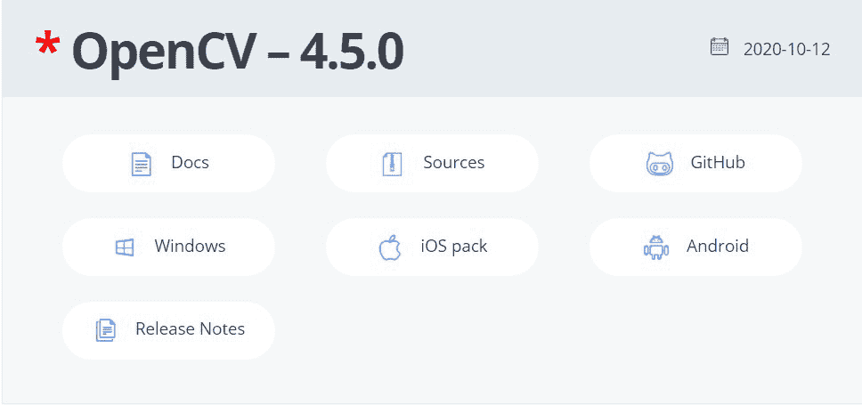
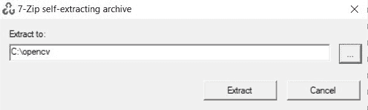
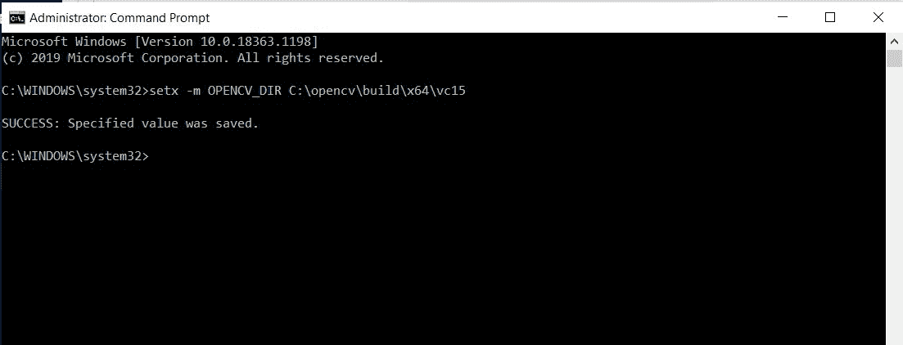
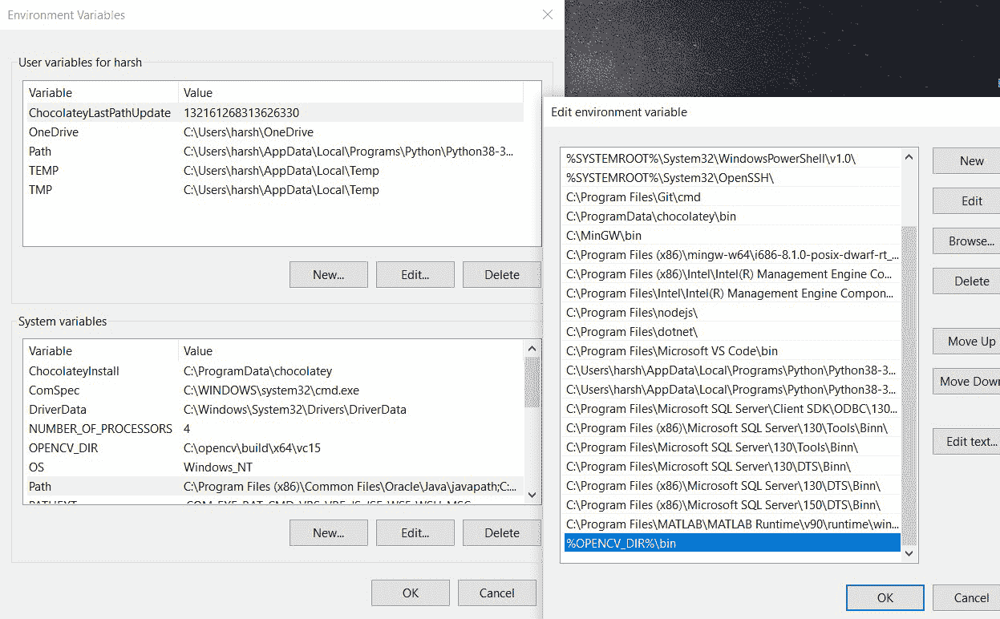
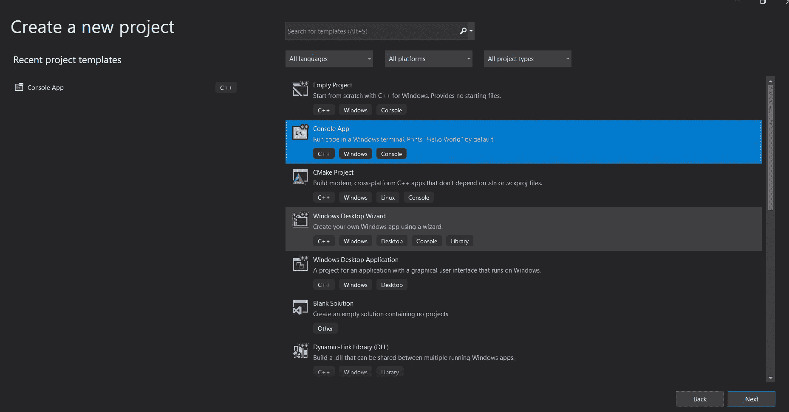
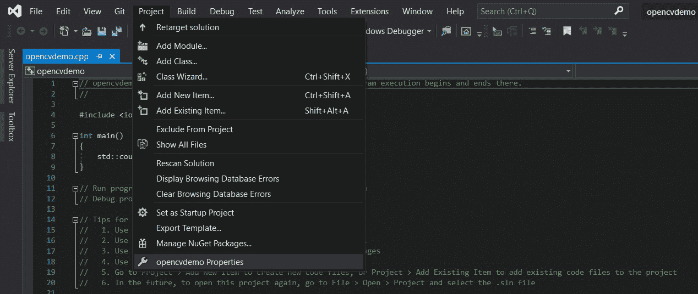
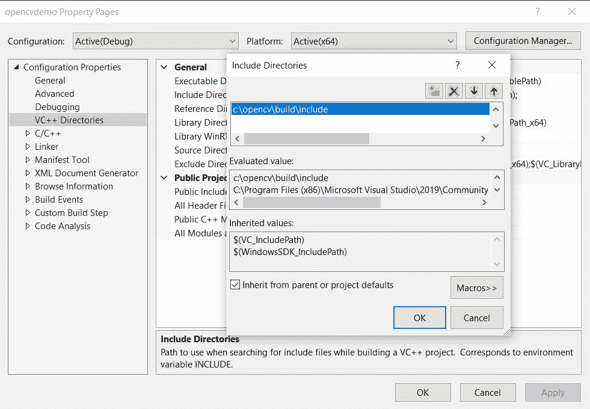
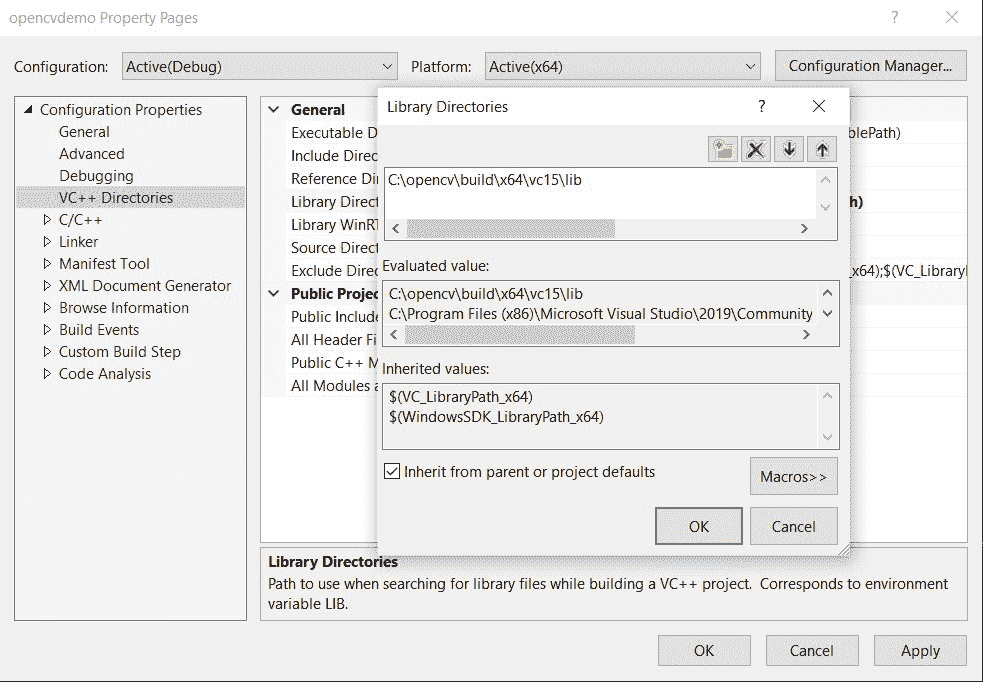
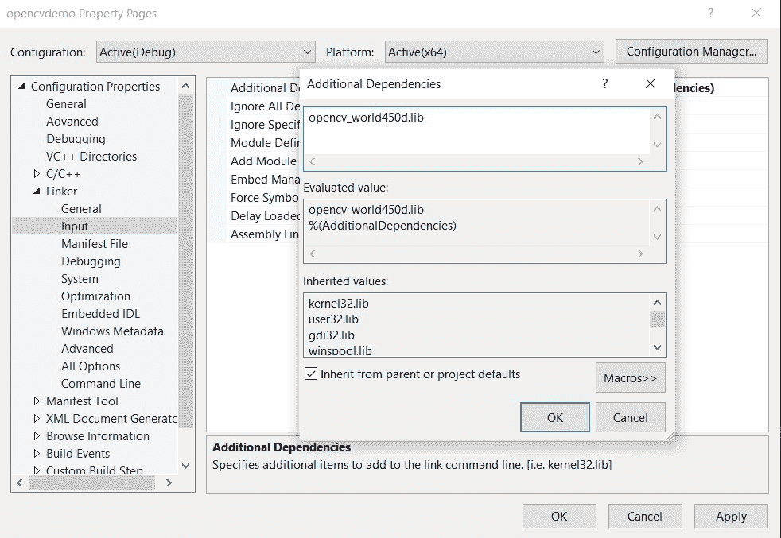

# 使用 Visual Studio 2019 的 OpenCV C++ Windows 安装程序

> 原文:[https://www . geesforgeks . org/opencv-c-windows-setup-use-visual studio-2019/](https://www.geeksforgeeks.org/opencv-c-windows-setup-using-visual-studio-2019/)

**OpenCV** 是实时计算机视觉库，提供各种实时计算机视觉、视频捕获、图像处理和机器学习功能。在 Visual Studio 中使用 OpenCV，您可以通过快速的 C++ 计算为对象检测、图像转换、视频捕获和分析构建健壮的应用程序。按照给定的步骤和说明进行 OpenCV C++ Windows 安装:

### **OpenCV 下载安装:**

按照以下步骤在本地计算机上下载并安装 OpenCV:

**第一步:**前往**[**https://opencv.org/releases/**](https://opencv.org/releases/)**，在最新版本(4.5.0)下选择 windows 按钮。您将被引导到另一个链接，安装文件将被下载。****

********

******第二步:**打开下载的文件。自解压拉链将会打开。在继续安装之前，在 C:\驱动器中创建一个名为 OpenCV 的文件夹。运行安装程序并将 zip 文件解压到创建的文件夹 C:\opencv****

********

******步骤 3:** 现在已经成功安装了 OpenCV。下一步是向系统路径添加二进制文件。用管理员权限打开命令提示符，写下命令:**setx-m OPENCV_DIR C:\ OPENCV \ build \ x64 \ vc15**这将添加 OPENCV _ DIR 作为系统变量。****

********

******第 4 步:**打开环境变量设置。转到路径并添加 **%OPENCV_DIR%\bin******

********

****OpenCV 设置在这里完成。下一步是继续进行 Visual Studio 项目配置。****

### ******Visual Studio 项目配置:******

******第一步**:启动一个新的 Visual Studio 项目，选择 C++ Console App 模板。****

********

******步骤 2:** 项目创建后，将调试更改为 x64 平台，因为我们在 *C:\opencv\build\x64\vc15* 使用 x64 版本****

********

******步骤 3:** 在项目中，打开属性选项卡。****

********

******第 4 步:**在配置属性中选择 VC++ 目录。下一步是编辑包含的目录和库目录，以添加 OpenCV 包含目录和库目录。首先选择包括目录，然后点击编辑。弹出一个新窗口。点击添加新的黄色按钮，输入 OpenCV 包含目录的路径 **C:\opencv\build\include******

********

****同样，对于库目录，选择库目录并重复上述步骤。唯一的改变是 OpenCV 目录的库目录路径，即**C:\ OpenCV \ build \ x64 \ vc15 \ lib******

********

****完成后，转到项目属性中的链接器/输入，编辑附加依赖项，将 OpenCV DLL**OpenCV _ world 450d . lib**包含在我们的链接器中。****

********

****应用所有更改并关闭属性。您的 OpenCV 设置已经完成。现在，您已经准备好使用 C++ 中的 OpenCV 构建令人惊叹的应用程序了。每次使用 Visual Studio 2019 启动新的 OpenCV 项目时，都必须重复所有这些属性更改。****

****尝试此演示代码以检查您的安装是否正常工作。****

## ****C++****

```cpp
**#include <opencv2/opencv.hpp>
#include <iostream>

using namespace cv;
using namespace std;

int main(int argc, char** argv)
{
    // Read the image file
    Mat image = imread("Image Address Here ");
    // Check for failure
    if (image.empty())
    {
        cout << "Image Not Found!!!" << endl;
        cin.get(); //wait for any key press
        return -1;
    }
    // Show our image inside a window.
    imshow("Image Window Name here", image); 

    // Wait for any keystroke in the window
    waitKey(0); 
    return 0;
}**
```