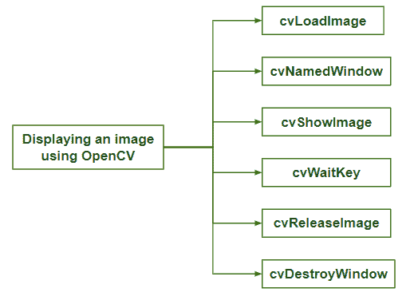

# 打开 CV |显示图像

> 原文:[https://www.geeksforgeeks.org/opencv-displaying-an-image/](https://www.geeksforgeeks.org/opencv-displaying-an-image/)

为了从种类繁多的视频或相机中读取图像文件，OpenCV 提供了大量实用程序。OpenCV 有这样一个名为 **HighGUI** 的工具包，这是它的一个实用程序的一部分。本文中使用了其中一些实用程序来显示和打开我们系统上的图像。
让我们逐行了解程序的执行

**代码:**

```
IplImage* img_file = cvLoadImage("..input\\abcd.PNG");
```

该特定行将使用高级例程加载图像–**cvLoadImage()**。它根据文件名确定要加载的文件格式，然后自动为图像数据结构分配所需的内存。人们可以从 **cvLoadImage()** 中读取大量不同的图像格式。这些图像格式可以是-**JPEG、BMP、PNG、JPE、DIB、PBM、PPM、RAS、SR 和 TIFF** 。然后，返回指向指定图像数据结构的指针。返回的指针用于操作图像及其数据。该结构为 **IplImage** 。IplImage 是 OpenCV 构造，OpenCV 使用它来处理所有不同类型的图像。这些图像可以是单通道图像、多通道图像、浮点值图像或整数值图像。
在上面的代码中，给出了图像的路径，每个用户的路径都不一样。因此，可以根据图像在用户系统上的位置进行设置。

**代码:**

```
if (!img_file->imageData)
```

使用这一行代码，可以检查图像是否真实存在。如果没有图像数据，那么，在这种情况下，我们可以使用这个很容易地检测到它。

**代码:**

```
cvNamedWindow( “Display”, CV_WINDOW_AUTOSIZE );
```

现在， **cvNamedWindow()** 是 HighGUI 库提供的另一个高级功能，它负责在屏幕上打开一个窗口。就是这个窗口有图像显示。使用这个，还可以为图像窗口指定一个名称(在上面的代码中为“显示”)。该名称在代码中进一步用于进行任何 HighGUI 调用。
第二个参数 **cvNamedWindow()** 定义了窗口属性，可以设置为 0(默认值)或 CV_WINDOW_AUTOSIZE(如上面的代码所示)。在“0”值的情况下，无论图像大小如何，窗口的大小都是相同的，并且图像将根据默认窗口大小进行缩放。在**‘CV _ WINDOW _ AUTOSIZE’**的情况下，窗口的大小可能根据图像大小而变化。窗口将根据默认图像大小进行缩放，图像将具有其真实大小。

**代码:**

```
cvShowImage("Display", img_file);
```

**cvShowImage()** 用于在现有窗口中以 **IplImage*** 指针的形式显示图像。这意味着它需要一个已经存在的窗口，该窗口是使用 cvNamedWindow()创建的。当我们调用 cvShowImage()时，图像会被重绘，并相应地调整窗口大小(如果使用 **CV_WINDOW_AUTOSIZE** 创建)。

**代码:**

```
cvWaitKey(0);
```

**cvWaitKey()** 定义为要求程序等待或停止按键。如果给它一个正的参数，那么程序将等待这个毫秒数。然后，即使没有按键，也会自动继续。否则，如上面的代码所示，使用负数或“0”意味着程序将无限期地等待按键。

**代码:**

```
cvReleaseImage( &img_file );
```

现在，一旦完成，我们就可以释放分配给映像的内存。此操作需要一个指向 IplImage*指针的指针。指针**‘img _ file’**将设置为空。

**代码:**

```
cvDestroyWindow("Display");
```

最后，也使用 **cvDestroyWindow()** 销毁窗口。它将关闭并取消分配窗口内存或任何相关的数据使用(图像缓冲区，来自 ***img_file** 的像素信息副本)。对于一个简单的程序， **cvDestroyWindow()** 或 **cvReleaseImage()** 函数不需要被使用，因为所有的资源都是由操作系统自动关闭的，但是自己去做就好了。

### **代码:使用 OpenCV 显示图像。**

```
#include <opencv2\opencv.hpp>
#include <opencv2\highgui\highgui.hpp>
#include <highlevelmonitorconfigurationapi.h>

using namespace cv;
using namespace std; 

int main(int argc, char** argv) {
    IplImage* img_file = cvLoadImage("..input\\abcd.jpg");

    if (!img_file->imageData) {
        cout << "Sorry";
        return -1;
    }

    cvNamedWindow("Display", CV_WINDOW_AUTOSIZE);
    cvShowImage("Display", img_file);
    cvWaitKey(0);
    cvReleaseImage(&img_file);
    cvDestroyWindow("Display");
}
```

**输出:**


这个程序编译、运行，然后使用内存将图像加载到窗口中，并在屏幕上的窗口中显示它。它将形成用户按键，然后关闭并退出。