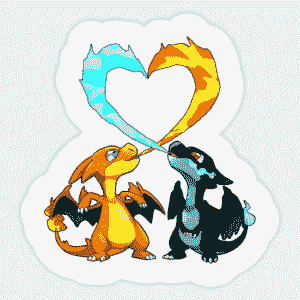
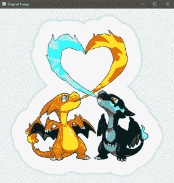
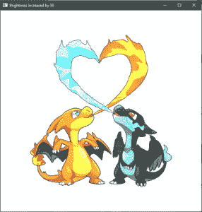
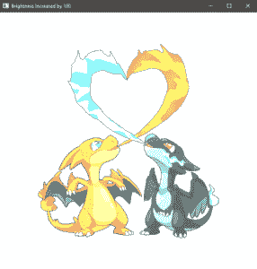
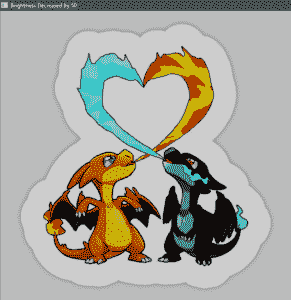
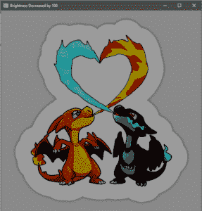

# OpenCV |手动图像亮度

> 原文:[https://www . geesforgeks . org/opencv-动手图像-亮度/](https://www.geeksforgeeks.org/opencv-hands-on-image-brightness/)

亮度意味着改变每个图像像素的值。这种变化可以通过增加或减少图像的像素值来实现，增加或减少任何常数。本文深入介绍了如何使用 OpenCV 改变图像亮度。

```cpp
Input : 
Original Image

Output : 
-> Original Image
-> Image with brightness increased by 100
-> Image with brightness increased by 50
-> Image with brightness decreased by 100
-> Image with brightness decreased by 50

```

 **代码:CPP 代码操纵图像亮度**

```cpp
// c++ code explaining how to
// increase or decrease the brightness of
// an image

// loading library files
#include <highlevelmonitorconfigurationapi.h>
#include <opencv2\highgui\highgui.hpp>
#include <opencv2\opencv.hpp>

using namespace cv;
using namespace std;

int main(int argc, char** argv)
{
    // Loading the Image File under testing
    Mat image = imread("C:\\Users\\dell\\Desktop\\abc.jpg");

    // Check whether the image is present or not
    if (image.empty()) {
        cout << "Could not open or find the image" << endl;

        // waiting for any  key to be pressed
        return -1;
    }

    // Declaring the Brightness Instances

    Mat imageBrighnessHigh50;
    // increasing the brightness level by 50
    image.convertTo(imageBrighnessHigh50, -1, 1, 50);

    Mat imageBrighnessHigh100;
    // increasing the brightness level by 100
    image.convertTo(imageBrighnessHigh100, -1, 1, 100);

    Mat imageBrighnessLow50;
    // decreasing the brightness level by 50
    image.convertTo(imageBrighnessLow50, -1, 1, -50);

    Mat imageBrighnessLow100;
    // decreasing the brightness level by 100
    image.convertTo(imageBrighnessLow100, -1, 1, -100);

    // Declaring the windows
    // for images belonging to different brightness level
    String windowNameOriginalImage = "Original Image";
    String windowNameBrightnessHigh50 = "Brightness Increased by 50";
    String windowNameWithBrightnessHigh100 = "Brightness Increased by 100";
    String windowNameBrightnessLow50 = "Brightness Decreased by 50";
    String windowNameBrightnessLow100 = "Brightness Decreased by 100";

    // Running the window instance
    // and opening it
    namedWindow(windowNameOriginalImage, WINDOW_NORMAL);
    namedWindow(windowNameBrightnessHigh50, WINDOW_NORMAL);
    namedWindow(windowNameWithBrightnessHigh100, WINDOW_NORMAL);
    namedWindow(windowNameBrightnessLow50, WINDOW_NORMAL);
    namedWindow(windowNameBrightnessLow100, WINDOW_NORMAL);

    // Loading images inside the above created Windows
    imshow(windowNameOriginalImage, image);
    imshow(windowNameBrightnessHigh50, imageBrighnessHigh50);
    imshow(windowNameWithBrightnessHigh100, imageBrighnessHigh100);
    imshow(windowNameBrightnessLow50, imageBrighnessLow50);
    imshow(windowNameBrightnessLow100, imageBrighnessLow100);

    // waiting for any key to be pressed
    waitKey(0);

    // closing all the windows instances
    // when any key is pressed.
    destroyAllWindows();

    return 0;
}
```

**输入:**


**输出:**
**原图**



**亮度等级增加 50**


**亮度等级增加 100**


**亮度等级降低 50**


**亮度等级降低 100**


## **说明:**

```cpp
// Declaring the Brightness Instances

Mat imageBrighnessHigh50;
// increasing the brightness level by 50
image.convertTo(imageBrighnessHigh50, -1, 1, 50);

Mat imageBrighnessHigh100;
// increasing the brightness level by 100
image.convertTo(imageBrighnessHigh100, -1, 1, 100);

Mat imageBrighnessLow50;
// decreasing the brightness level by 50
image.convertTo(imageBrighnessLow50, -1, 1, -50);

Mat imageBrighnessLow100;
// decreasing the brightness level by 100
image.convertTo(imageBrighnessLow100, -1, 1, -100);
```

这些代码行将图像像素值改变指定的量。最终改变的图像然后被存储到给定的输出图像。如果指定量为正(如上所述为 50)，亮度水平将增加，否则如果指定量为负，亮度水平将降低。

**MAT 函数:**
MAT 函数将每个图像像素值更改为目标数据类型，并且这些值会随着增加或减少而改变。

```cpp
Parameters : 

m      : Output Image 
rtype  : Output Image type, Output Image type is same as input
         if it is set to -ve value
alpha  : Input image pixel are multiplied with this number prior
         to its assignment to output image
beta   : adding this value to each input image pixel 

```