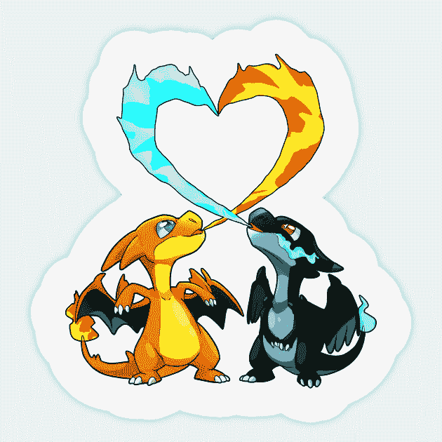
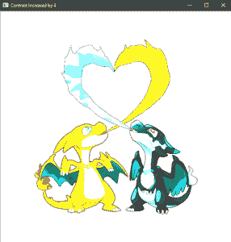
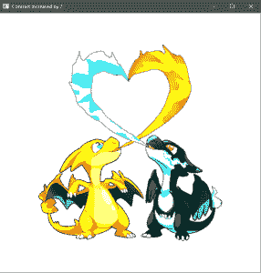
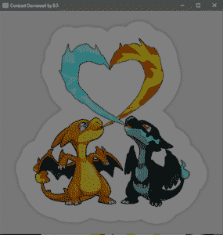
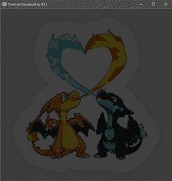

# OpenCV |动手图像对比

> 原文:[https://www . geeksforgeeks . org/opencv-动手图像-对比/](https://www.geeksforgeeks.org/opencv-hands-on-image-contrast/)

**对比度**是指改变每个图像像素的值。这种变化可以通过将图像的像素值乘以或除以任何常数来实现。本文深入介绍了如何使用 OpenCV 改变图像对比度。

```
Input : 
Original Image

Output : 
-> Original Image
-> Image with contrast increased by 4
-> Image with contrast increased by 2
-> Image with contrast decreased by .5
-> Image with contrast decreased by .25
```

**代码:增加或减少图像对比度的 CPP 代码**

## 卡片打印处理机（Card Print Processor 的缩写）

```
// c++ code explaining how to
// increase or decrease the
// contrast of an image

// loading library files
#include <highlevelmonitorconfigurationapi.h>
#include <opencv2\highgui\highgui.hpp>
#include <opencv2\opencv.hpp>

using namespace cv;
using namespace std;

int main(int argc, char** argv)
{
    // Loading the Image File under testing
    Mat image = imread("C:\\Users\\dell\\Desktop\\abc.jpg");

    // Check whether the image is present or not
    if (image.empty()) {
        cout << "Could not open or find the image" << endl;

        // waiting for any  key to be pressed
        return -1;
    }

    // Declaring the Contrast instances

    // increasing the contrast level by 100%
    Mat imageContrastHigh2;
    image.convertTo(imageContrastHigh2, -1, 2, 0);

    // increasing the contrast level by 200%
    Mat imageContrastHigh4;
    image.convertTo(imageContrastHigh4, -1, 4, 0);

    // decreasing the contrast level by 50%
    Mat imageContrastLow0_5;
    image.convertTo(imageContrastLow0_5, -1, 0.5, 0);

    // decreasing the contrast level by 75%
    Mat imageContrastLow0_25;
    image.convertTo(imageContrastLow0_25, -1, 0.25, 0);

    // Declaring the windows
    // for images belonging to different contrast level
    String windowNameOriginalImage = "Original Image";
    String windowNameContrastHigh2 = "Contrast Increased by 2";
    String windowNameContrastHigh4 = "Contrast Increased by 4";
    String windowNameContrastLow0_5 = "Contrast Decreased by 0.5";
    String windowNameContrastLow0_25 = "Contrast Decreased by 0.25";

    // Running the window instance
    // and opening it
    namedWindow(windowNameOriginalImage, WINDOW_NORMAL);
    namedWindow(windowNameContrastHigh2, WINDOW_NORMAL);
    namedWindow(windowNameContrastHigh4, WINDOW_NORMAL);
    namedWindow(windowNameContrastLow0_5, WINDOW_NORMAL);
    namedWindow(windowNameContrastLow0_25, WINDOW_NORMAL);

    // Loading images inside the above created Windows
    imshow(windowNameOriginalImage, image);
    imshow(windowNameContrastHigh2, imageContrastHigh2);
    imshow(windowNameContrastHigh4, imageContrastHigh4);
    imshow(windowNameContrastLow0_5, imageContrastLow0_5);
    imshow(windowNameContrastLow0_25, imageContrastLow0_25);

    // waiting for any key to be pressed
    waitKey(0);

    // closing all the windows instances
    // when any key is pressed.
    destroyAllWindows();

    return 0;
}
```

**输入:**



**输出:**
对比度增加 4 的图像



对比度增加 2 的图像



对比度降低. 5 的图像



对比度降低. 25 的图像



## **说明:**

## 卡片打印处理机（Card Print Processor 的缩写）

```
// Declaring the Contrast instances

// increasing the contrast level by 100%
Mat imageContrastHigh2;
image.convertTo(imageContrastHigh2, -1, 2, 0);

// increasing the contrast level by 200%
Mat imageContrastHigh4;
image.convertTo(imageContrastHigh4, -1, 4, 0);

// decreasing the contrast level by 50%
Mat imageContrastLow0_5;
image.convertTo(imageContrastLow0_5, -1, 0.5, 0);

// decreasing the contrast level by 75%
Mat imageContrastLow0_25;
image.convertTo(imageContrastLow0_25, -1, 0.25, 0);
```

这些代码行将图像像素值改变指定的量。最终改变的图像然后被存储到给定的输出图像。如果指定的数量因子大于 1，对比度将增加，否则如果指定的数量因子小于 1，对比度将降低。
**MAT 函数:**
MAT 函数将每个图像像素值更改为目标数据类型，并且这些值会随着因子相乘的程度而改变。

```
Parameters : 

m      : Output Image 
rtype  : Output Image type, Output Image type is same
        as input if it is set to -ve value
alpha  : Input image pixel are multiplied with this
        number prior to its assignment to output image
beta   : adding this value to each input image pixel 
```