# OpenCV:使用阈值分割

> 原文:[https://www . geesforgeks . org/opencv-分割-使用-阈值化/](https://www.geeksforgeeks.org/opencv-segmentation-using-thresholding/)

在本文中，对象分割的基本技术称为阈值化。
但在进入更多细节之前，下面是 OpenCV 的简要概述。

**OpenCV** (开源计算机视觉)是一个跨平台、开源的编程函数库，旨在执行各种领域的实时计算机视觉任务，例如:

*   面部识别
*   虹膜识别系统
*   手势识别
*   人机交互
*   移动机器人
*   物体识别
*   分割和识别
*   立体视觉立体视觉:来自两个摄像头的深度感知
*   增强现实

*它还包括一个健壮的统计机器学习库，该库包含许多用于支持上述领域的不同分类器。*

要使用 OpenCV，只需导入或包含所需的库，并开始利用无数可用的函数。

**阈值化**是一种非常流行的分割技术，用于将对象与其背景分离。在下面的文章中，我已经描述了用于阈值化*灰度图像(8 位)*的各种技术。

*阈值化*的过程包括将图像的每个像素值(像素强度)与指定的阈值进行比较。这将输入图像的所有像素分为两组:

1.  强度值低于阈值的像素。
2.  强度值大于阈值的像素。

根据不同的分段类型，这两个组现在被赋予不同的值。
OpenCV 支持灰度(8 位)图像的 5 种不同阈值方案，使用功能:

***双阈值(InputArray src，OutputArray dst，双 thresh，双 maxval，int 类型)***

**参数:**

*   输入图像(Mat，8 位或 32 位)*   输出阵列 dst:输出图像(大小与输入相同)*   双重阈值:设置阈值*   double maxval: maxVal，用于类型 1 和类型 2*   int type* :Specifies the type of threshold to be use. (0-4)

    **下面给出了阈值类型列表。*

    **输入图像**

    [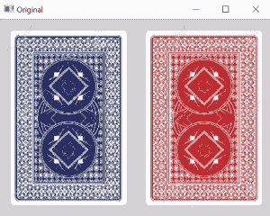](https://media.geeksforgeeks.org/wp-content/uploads/orig.png)

    在完成阈值处理之前，首先将输入的 RGB 图像转换为灰度图像。

    [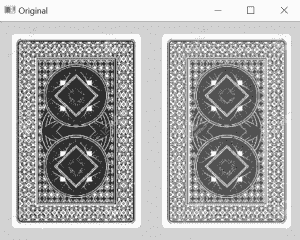](https://media.geeksforgeeks.org/wp-content/uploads/bw.png)

    **阈值类型**

    *   **Binary Threshold(int type=0)**

        [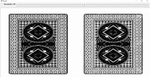](https://media.geeksforgeeks.org/wp-content/uploads/0_130.png) 
        在较早获得的两个组中，具有像素强度大于设定阈值的成员的组被分配“Max_Value”，或者在灰度的情况下，被分配值 255(白色)。
        剩余组的成员将其像素强度设置为 0(黑色)。

        [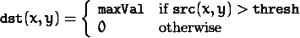](https://media.geeksforgeeks.org/wp-content/uploads/eq1.png)

        *如果源图像中(x，y)处的像素强度值大于阈值，则最终图像中的值设置为“maxVal”。*

    *   **Inverted Binary Threshold(int type=1)**

        [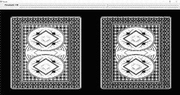](https://media.geeksforgeeks.org/wp-content/uploads/1_130.png)

        Inv。二进制阈值与二进制阈值相同。唯一的本质区别是，在投资部。二进制阈值化，像素强度大于设定阈值的组被分配“0”，而强度小于阈值的其余像素被设置为“maxVal”。

        [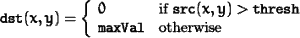](https://media.geeksforgeeks.org/wp-content/uploads/eq2.png)

        *如果源图像中(x，y)处的像素强度值大于阈值，则最终图像中的值设置为“0”，否则设置为“maxVal”。*

    *   **Truncate Thresholding(int type=2)**

        [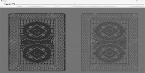](https://media.geeksforgeeks.org/wp-content/uploads/2_150.png)

        像素强度大于设定阈值的组被截断为设定阈值，或者换句话说，像素值被设定为与设定阈值相同。
        所有其他值保持不变。

        [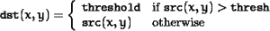](https://media.geeksforgeeks.org/wp-content/uploads/eq3.png)

        *如果源图像中(x，y)处的像素强度值大于阈值，则最终图像中的值设置为“阈值”，否则不变。*

    *   **Threshold to Zero(int type=3)**

        [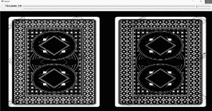](https://media.geeksforgeeks.org/wp-content/uploads/310.png)

        一种非常简单的阈值技术，其中我们将像素强度设置为“0”，对于该组中具有小于阈值的像素强度值的所有像素。

        [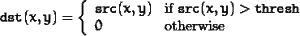](https://media.geeksforgeeks.org/wp-content/uploads/eq4.png)

        *如果源图像中(x，y)处的像素强度值大于阈值，则最终图像中(x，y)处的值不会改变。所有剩余像素都设置为“0”。*

    *   **Threshold to Zero, Inverted(int type=4)**

        [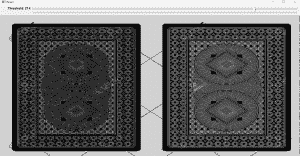](https://media.geeksforgeeks.org/wp-content/uploads/48.png)

        类似于前面的技术，这里我们将像素强度设置为“0”，对于该组中具有大于阈值的像素强度值的所有像素。

        [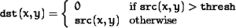](https://media.geeksforgeeks.org/wp-content/uploads/eq5.png)

        *如果源图像中(x，y)处的像素强度值大于阈值，则最终图像中(x，y)处的值设置为“0”。所有剩余的像素值保持不变。*

 **要编译 OpenCV 程序，需要在系统上安装 OpenCV 库。在接下来的几天里，我会发布一个简单的教程。
如果你已经安装了 OpenCV，用你选择的输入图像运行下面的代码。**

```
// CPP program to demonstrate segmentation
// thresholding.
#include <opencv2/highgui/highgui.hpp>
#include <opencv2/imgproc/imgproc.hpp>
#include <stdio.h>
#include <stdlib.h>

using namespace cv;

int main(int argc, char** argv)
{
    if (argc != 2) 
    {
        cout << " Usage: <Sourceprogram>"
                " <ImageToLoad>" << endl;
        return -1;
    }

    int threshold_value = 0;

    // Valid Values: 0, 1, 2, 3, 4
    int threshold_type = 2; 

    // maxVal, useful for threshold_type 1 and 2
    int maxVal = 255; 

    // Source image
    Mat src = imread(argv[1], 1);

    cvNamedWindow("Original", CV_WINDOW_NORMAL);
    imshow("Original", src);

    Mat src_gray, dst;

    // Convert the image to GrayScale
    cvtColor(src, src_gray, CV_BGR2GRAY);

    // Create a window to display results
    cvNamedWindow("Result", CV_WINDOW_NORMAL);

    createTrackbar("Threshold", "Result", 
                  &threshold_value, 255);
    while (1) 
    {
        threshold(src_gray, dst, threshold_value, 
                         maxVal, threshold_type);
        imshow("Result", dst);
        waitKey(1);
    }
}
```