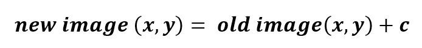
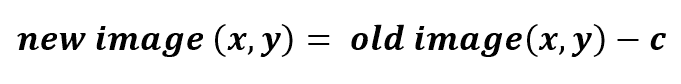
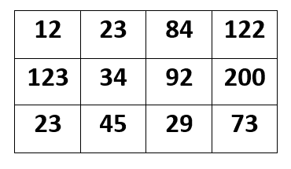
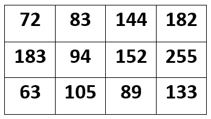
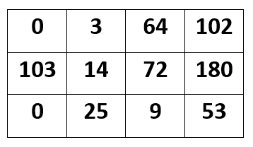

# OpenCV |理解图像中的亮度

> 原文:[https://www . geesforgeks . org/opencv-了解-图像中的亮度/](https://www.geeksforgeeks.org/opencv-understanding-brightness-in-an-image/)

在 OpenCV 中，改变图像的**亮度是一项非常基础的任务。通过改变图像亮度，意味着改变每个图像像素的值。这种变化可以通过增加或减少图像的像素值来实现，增加或减少任何常数。**

要增加图像的亮度级别，只需为每个图像像素添加一个恒定的正值。

类似地，如果希望**降低图像的亮度水平**，则为每个图像像素减去一个恒定的正值。

让我们假设下面提到的矩阵是我们的图像矩阵，像素值范围从 0 到 255，让我们假设这个图像的数据类型是 CV_8UC3

## **增加亮度:**

所以。假设我们希望将图像亮度增加 60。然后，我们为每个图像像素值添加 60，但严格禁止超出像素范围，即允许的最大限制是 255，我们的像素值不应增加 255。假设如果在任何情况下，该图像像素值超过 255，那么应该只给它最大允许值，而不是新增加的值。

**输入:**

**输出(图像像素值增加 60 后):**

让我们检查下面给出的图像矩阵，我们已经将这个值增加了 60，但是像素值“255”没有增加到 260，因为我们将 60 增加到 200，它应该是 260，但是这里没有发生这种情况，因为在这个图像中允许最大图像像素值为 255。

## **【降低亮度:**

这里，我们将像素值降低 20，并从输入图像中的每个图像像素中减去 20，但唯一重要的是任何像素的值都不应低于最小允许像素。

**输出(图像像素值减少 20 后):**

在我们的输出图像中，亮度降低了 20，在位置(0，0)，像素值等于 0，但之前该值为 12。因为从 12 减去 20 将得到负像素值(这不可能)。因此，图像像素值被设置为 0。