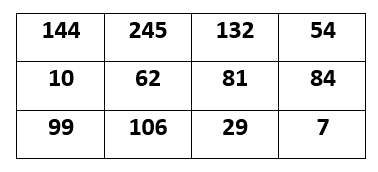
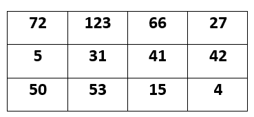

# OpenCV |理解图像中的对比度

> 原文:[https://www . geesforgeks . org/opencv-了解-图像对比/](https://www.geeksforgeeks.org/opencv-understanding-contrast-in-an-image/)

在 OpenCV 中，改变图像的**对比度是一项非常基础的任务。通过改变图像对比度，意味着改变每个图像像素的值。这种变化可以通过将图像的像素值乘以或除以任何常数来实现(意味着将每个像素与值< 1 相乘)。**

要增加图像的对比度，只需将一个恒定的正值乘以每个图像像素。

类似地，如果希望**降低图像的对比度**，则为每个图像像素乘以小于 1 的恒定正值。

让我们假设下面提到的矩阵是我们的图像矩阵，像素值在 0 到 255 之间，假设这个图像的数据类型是 **CV_8UC3** 。

## **增加对比度:**

所以。假设我们希望将图像对比度提高 2 倍。然后，我们对每个图像像素值乘以 2，但严格禁止超过像素范围，即允许的最大限制是 255，我们的像素值不应增加 255。假设如果在任何情况下，该图像像素值超过 255，那么应该只给它最大允许值，而不是新增加的值。

让我们检查下面给出的图像矩阵，我们已经将这个值乘以因子 2，但是像素值“255”没有增加到 288，因为我们将 2 乘以 144，它应该是 288，但是这里没有发生这种情况，因为在这个图像中允许最大图像像素值为 255。

## **降低对比度:**

这里，我们将对比度值减少 0.5 倍，这样 0.5 乘以输入图像中的每个图像像素，但唯一重要的是任何像素的值都不应低于最小允许像素。

在我们的输出图像中，对比度降低了 0.5 倍。