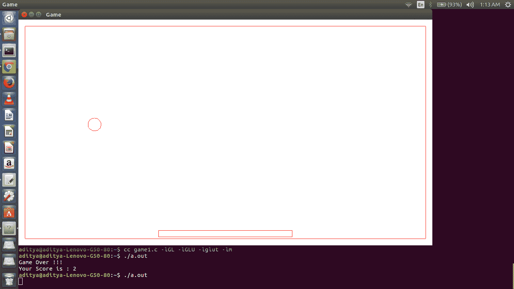

# 简单球类游戏的 OpenGL 程序

> 原文:[https://www . geesforgeks . org/OpenGL-program-simple-ball-game/](https://www.geeksforgeeks.org/opengl-program-simple-ball-game/)

先决条件–[OpenGL](https://www.geeksforgeeks.org/getting-started-with-opengl/)

OpenGL 是一个跨语言、跨平台的应用编程接口，用于渲染 2D 和三维矢量图形。利用这个，我们可以做很多设计以及动画。下面是一个使用 **OpenGL** 制作的简单游戏。

**描述:**在这种情况下，一个球从中间开始移动，并在开始时向左上方移动。但是，然后它撞上墙，改变方向，但速度保持不变。因此，它会向下移动，在那里它应该被捕获在一个矩形上(它能够在水平方向上移动)，以便继续。

**在 Ubuntu 操作系统上工作:**

```cpp
gcc filename.c -lGL -lGLU -lglut -lm 
where filename.c is the name of the file
with which this program is saved.

```

```cpp
// C program to illustrate OpenGL game
#include<stdio.h>
#include<GL/glut.h>
#include<math.h>
#define pi 3.142857

// Global Declaration
// c and d tracks the number of time 'b' and 'n' pressed respectively
// left and right indicates leftmost and rightmost index of movable rectangle
int c = 0, d = 0, left = 0, right = 0;
int m = 0, j = 1, flag1 = 0, l = 1, flag2 = 0, n = 0, score = 0, count = 1;

// Initialization function
void myInit (void)
{
    // Reset background color with white (since all three argument is 1.0)
    glClearColor(1.0, 1.0, 1.0, 0.0);

    // Set picture color to red (in RGB model)
    // as only argument corresponding to R (Red) is 1.0 and rest are 0.0
    glColor3f(1.0f, 0.0f, 0.0f);

    // Set width of point to one unit
    glPointSize(1.0);
    glMatrixMode(GL_PROJECTION);
    glLoadIdentity();

    // Set window size in X- and Y- direction
    gluOrtho2D(-620.0, 620.0, -340.0, 340.0);
}

// keyboard function : it gets active when button pressed
void keyboard(unsigned char key, int x, int y)
{
    left = -200 + 200 * (d - c);
    right = 200 + 200 * (d - c);

    // if leftmost index of window is hit
    // then rectangle will not move to left on furthure pressing of b
    // only it will move to right on pressing n
    if (left == -600)
    {
        // '110' -> Ascii value of 'n'
        // so d is incremented when n is pressed
        if (key == 110)
            d++;
    }
    // if rightmost index of window is hit
    // then rectangle will not move to right on furthure pressing of n
    // only it will move to left on pressing b
    else if (right == 600)
    {
        // '98' -> Ascii value of 'b'
        // so c is incremented when b is pressed
        if (key == 98)
            c++;
    }
    // when rectangle is in middle, then it will move into both
    // direction depending upon pressed key
    else
    {
        if (key == 98)
            c++;    
        if (key == 110)
            d++;
    }
    glutPostRedisplay();
}

void myDisplay(void)
{
    // x and y keeps point on circumference of circle
    int x, y, k;
    // outer 'for loop' is to for making motion in ball
    for (k = 0; k <= 400; k += 5)
    {    
        glClear(GL_COLOR_BUFFER_BIT);
        glBegin(GL_LINE_STRIP);
        // i keeps track of angle
        float i = 0;
        // change in m denotes motion in vertical direction and
        // change in n denotes motion in horizontal direction
        m = m + 6;
        n = n + 4;
        // drawing of circle centre at (0, 12) iterated up to 2*pi, i.e., 360 degree
        while (i <= 2 * pi)
        {
            y = 12 + 20 * cos(i);
            x = 20 * sin(i);
            i = i + 0.1;
            // flag1 is 0 to show motion in upward direction and is 1 for downward direction
            if (m == 288 && flag1 == 0)
            {
                j = -1;
                m = -288;
                flag1 = 1;
                score++;
            }
            if (m == 288 && flag1 == 1)
            {
                j = 1;
                m = -288;
                flag1 = 0;
            }
            // flag2 is 0 to show motion in rightward direction and is 1 for leftward direction
            if (n == 580 && flag2 == 0)
            {
                l = -1;
                n = -580;
                flag2 = 1;
            }
            if (n == 580 && flag2 == 1)
            {
                l = 1;
                n = -580;
                flag2 = 0;
            }
            // equation for desired motion of ball
            glVertex2i((x - l * n), (y - j * m));
        }
        glEnd();

        // these four points draws outer rectangle which determines window
        glBegin(GL_LINE_LOOP);
            glVertex2i(-600, -320);
            glVertex2i(-600, 320);
            glVertex2i(600, 320);
            glVertex2i(600, -320);
        glEnd();

        // these four points draws smaller rectangle which is for catching ball
        glBegin(GL_LINE_LOOP);
        left = -200 + 200 * (d - c);
        right = 200 + 200 * (d - c);
            glVertex2i(left, -315);
            glVertex2i(left, -295);
            glVertex2i(right, -295);
            glVertex2i(right, -315);
        glEnd();

        // following condition checks if falling ball is catched on rectangle or not
        if ((j * m) == 276)
        {
            if ((left > ((-1 * l * n) + 20)) || (right < (-1 * l * n) - 20))
            {
                printf("Game Over !!!\nYour Score is :\t%d\n", score);
                exit(0);
            }
        }
        glutSwapBuffers();
    }
}

// Driver Program
int main (int argc, char** argv)
{
    glutInit(&argc, argv);

    glutInitDisplayMode(GLUT_DOUBLE | GLUT_RGBA);
    // Declares window size
    glutInitWindowSize(1100, 600);

    // Declares window position which is (0, 0)
    // means lower left corner will indicate position (0, 0)
    glutInitWindowPosition(0, 0);

    // Name to window
    glutCreateWindow("Game");

    // keyboard function
    glutKeyboardFunc(keyboard);
    // Call to myInit()
    myInit();
    glutDisplayFunc(myDisplay);
    glutMainLoop();
}
```

下面是动画截图。这个截图就是一个例子。实际上，球会向不同的方向运动，应该在较小的矩形上接住。按下小写 **b** 可以向左移动矩形，按下小写 **n** 可以向右移动矩形。然而，这可以通过改变键盘功能中的代码来改变，其中键的 ASCII 值可以改变。



本文由[阿迪蒂亚·库马尔](https://www.linkedin.com/in/aditya-kumar-837315100/)供稿。如果你喜欢 GeeksforGeeks 并想投稿，你也可以使用[contribute.geeksforgeeks.org](http://www.contribute.geeksforgeeks.org)写一篇文章或者把你的文章邮寄到 contribute@geeksforgeeks.org。看到你的文章出现在极客博客主页上，帮助其他极客。

如果你发现任何不正确的地方，或者你想分享更多关于上面讨论的话题的信息，请写评论。