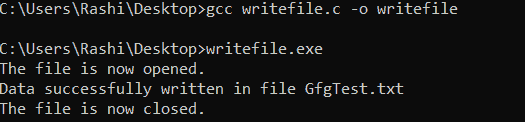
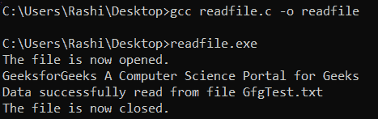
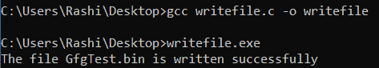
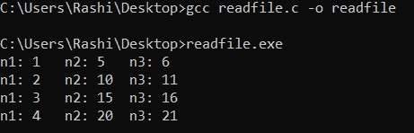
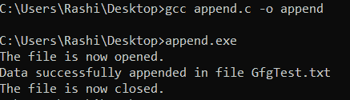
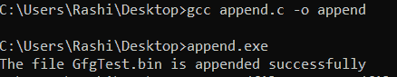
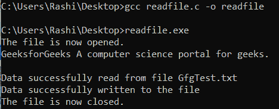
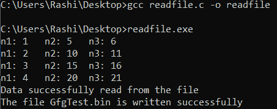

# C/c++ 标准 I/O 中的打开模式，示例

> 原文:[https://www . geesforgeks . org/open-modes-in-standard-I-o-in-c-c-with-examples/](https://www.geeksforgeeks.org/opening-modes-in-standard-i-o-in-c-c-with-examples/)

先决条件:[c++ 中的文件处理](https://www.geeksforgeeks.org/file-handling-c-classes/)

到目前为止，使用 C 程序的操作是在没有存储在任何地方的提示符/终端上完成的。但是在软件行业，大多数程序都是为了存储从程序中获取的信息而编写的。一种方法是将提取的信息存储在文件中。可以对文件执行的不同操作有:

1.  **创建新文件**(属性为“a”或“a+”或“w”或“w++”的 fopen)。
2.  **打开现有文件** (fopen)。
3.  **从文件**读取(fscanf 或 fgets)。
4.  **写入文件** (fprintf 或 fputs)。
5.  **移动到文件中的特定位置**(偏移，倒带)。
6.  **关闭文件** (fclose)。

括号中的文本表示用于执行这些操作的功能。

**为什么需要文件？**

*   **数据保存:**将数据存储在文件中有助于保存数据，即使程序终止。
*   **轻松访问数据:**当数据量很大并且存储在文件中时，访问数据变得很容易，然后可以使用 C 命令访问这些数据。
*   **可移植性:**将数据从一台计算机移动到另一台计算机变得更加容易，无需任何更改。

**<u>文件类型</u>**

每个人都应该知道这两种文件-

1.  **文本文件:**文本文件是有扩展名的普通文件。文件名中的。这些可以简单地用记事本这样的编辑器创建。打开文件后，文本将是可见的简单纯文本，内容可以很容易地编辑或删除。这些是最低的维护文件，易于阅读。但是文本文件有一些缺点，比如它们是最不安全的文件，并且占用更大的存储空间。
2.  **二进制文件:**二进制文件为”。bin "扩展名文件。这些文件中的数据以二进制形式存储，即 0 和 1。这些文件可以保存大量数据，并提供比文本文件更高的安全级别，但这些文件不容易读取。

**<u>文件操作</u>**

可以对文件执行四种基本操作:

1.  **创建新文件。**
2.  **打开现有文件。**
3.  **从文件中读取信息或向文件中写入信息。**
4.  **关闭文件。**

**<u>处理文件</u>**

使用文件时，需要声明类型文件的指针。文件和程序之间的通信需要这个文件类型指针。

> 文件* fptr

**<u>打开文件</u>**

打开文件是使用头文件 stdio.h 中的 fopen()函数完成的。

**语法:**

> fptr = fopen("file_name "，" mode ")；

**示例:**

> fopen（"D：\\geeksforgeeks\\newprogramgfg.txt"， "w"）;
> fopen（"D：\\geeksforgeeks\\oldprogramgfg.bin"， "rb"）;

*   假设文件 newprogramgfg.txt 不存在于位置 D:\geeksforgeeks 中。第一个函数创建一个名为 newprogramgfg.txt 的新文件，并按照“w”模式打开它进行写入。写入模式允许您创建和编辑(覆盖)文件内容。
*   假设第二个二进制文件 oldprogramgfg.bin 存在于位置 D:\geeksforgeeks。第二个函数打开现有文件，以二进制模式“rb”读取。读取模式只允许读取文件，不能写入文件。

**C 中的文件打开模式:**

<figure class="table">

| model | model | Meaning in the file. |
| --- | --- | --- |
| r | Open reading when it does not exist. | If the file does not exist, fopen () returns NULL. |
| 元素铷的符号 | Open in binary mode for reading. | If the file does not exist, fopen () returns NULL. |
| w | Open for writing. | If the file exists, its contents will be overwritten. If the file does not exist, it will be created. |
| 世界银行 | Open in binary mode for writing. | If the file exists, its contents will be overwritten. If the file does not exist, it will be created. |
| one | Turn on appending for. | Data is added to the end of the file. If the file does not exist, it will be created. |
| 腹肌 | Open in binary mode for appending. | Data is added to the end of the file. If the file does not exist, it will be created. |
| r+ | Open reading and writing. | If the file does not exist, fopen () returns NULL. |
| Rb+ | Open in binary mode for reading and writing. | If the file does not exist, fopen () returns NULL. |
| w+ | Open reading and writing. | If the file exists, its contents will be overwritten. If the file does not exist, it will be created. |
| WB+ | Open in binary mode for reading and writing. | If the file exists, its contents will be overwritten. If the file does not exist, it will be created. |
| a+ | Open reading and appending. | If the file does not exist, it will be created. |
| ab+ | Open in binary mode for reading and appending. | If the file does not exist, it will be created. |

</figure>

**<u>关闭文件</u>**

文件应该在读取或写入后关闭。关闭文件是使用 fclose()函数执行的。

**语法:**

> fclose(fptr)；

这里，fptr 是与要关闭的文件相关联的文件类型指针。

**<u>读写文本文件</u>**

为了读写文本文件，使用了函数 fprintf()和 fscanf()。它们是 printf()和 scanf()函数的文件版本。唯一的区别是 fprintf()和 fscanf()期望指向结构文件的指针。

**写入文本文件:**

**语法:**

> 文件*文件指针；
> 文件指针= fopen(“filename . txt”，“w”)

下面是 C 程序写的一个文本文件。

## C

```cpp
// C program to implement
// the above approach
#include <stdio.h>
#include <string.h>

// Driver code
int main()
{
    // Declare the file pointer
    FILE* filePointer;

    // Get the data to be written in file
    char dataToBeWritten[50]
        = "GeeksforGeeks-A Computer"
          + " Science Portal for Geeks";

    // Open the existing file GfgTest.c using fopen()
    // in write mode using "w" attribute
    filePointer = fopen("GfgTest.txt", "w");

    // Check if this filePointer is null
    // which maybe if the file does not exist
    if (filePointer == NULL) {
        printf("GfgTest.txt file failed to open.");
    }
    else {
        printf("The file is now opened.\n");

        // Write the dataToBeWritten into the file
        if (strlen(dataToBeWritten) > 0) {
            // writing in the file using fputs()
            fprintf(filePointer, dataToBeWritten);
            fprintf(filePointer, "\n");
        }

        // Closing the file using fclose()
        fclose(filePointer);

        printf("Data successfully written"
               + " in file GfgTest.txt\n");
        printf("The file is now closed.");
    }
    return 0;
}
```

**输出:**



**从文件中读取:**

**语法:**

> 文件*文件指针；
> 
> file pointer = fopen(" filename . txt "，" r ")；

下面是 C 程序读取的文本文件。

## C

```cpp
// C program to implement
// the above approach
#include <stdio.h>
#include <string.h>

// Driver code
int main()
{
    // Declare the file pointer
    FILE* filePointer;

    // Declare the variable for the data
    // to be read from file
    char dataToBeRead[50];

    // Open the existing file GfgTest.txt
    // using fopen() in read mode using
    // "r" attribute
    filePointer = fopen("GfgTest.txt", "r");

    // Check if this filePointer is null
    // which maybe if the file does not exist
    if (filePointer == NULL) {
        printf("GfgTest.txt file failed to open.");
    }
    else {
        printf("The file is now opened.\n");

        // Read the dataToBeRead from the file
        // using fgets() method
        while (fgets(dataToBeRead, 50,
                     filePointer)
               != NULL) {
            // Print the dataToBeRead
            printf("%s", dataToBeRead);
        }

        // Closing the file using fclose()
        fclose(filePointer);

        printf("Data successfully read"
               + " from file GfgTest.txt\n");
        printf("The file is now closed.");
    }
    return 0;
}
```

**输出:**



**<u>二进制文件读写</u>**

**写二进制文件:**

**语法:**

> 文件*文件指针；
> file pointer = fopen(" filename . bin "，" WB ")；

要将数据写入二进制文件，需要 fwrite()函数。这个函数有四个参数:

1.  要写入磁盘的数据地址。
2.  要写入磁盘的数据大小。
3.  这类数据的数量。
4.  指向要写入的文件的指针。

**语法:**

> fwrite(地址数据、大小数据、数字数据、指针文件)；

下面是实现上述方法的 C 程序:

## C++

```cpp
// C program to implement
// the above approach
#include <stdio.h>
#include <stdlib.h>

struct threeNum {
    int n1, n2, n3;
};

// Driver code
int main()
{
    int n;
    struct threeNum num;

    // Declaring the file pointer
    FILE* fptr;

    if ((fptr = fopen("C:\\GfgTest.bin",
                      "wb"))
        == NULL) {
        printf("Error! opening file");

        // Program exits if the file pointer
        // returns NULL.
        exit(1);
    }

    for (n = 1; n < 5; ++ n) {
        num.n1 = n;
        num.n2 = 5 * n;
        num.n3 = 5 * n + 1;
        fwrite(&num, sizeof(struct threeNum),
               1, fptr);
    }

    printf("The file GfgTest.bin is"
           + " written successfully");
    fclose(fptr);
    return 0;
}
```



**从二进制文件中读取:**

**语法:**

> 文件*文件指针；
> file pointer = fopen(" filename . txt "，" Rb ")；

要从二进制文件中读取数据，使用 fread(0)函数。与 fwrite()函数类似，该函数也接受四个参数。

**语法:**

> fread(addressData、sizeofData、numbersdata、pointertofile)：

下面是实现上述方法的 C 程序:

## C++

```cpp
// C program to implement
// the above approach
#include <stdio.h>
#include <stdlib.h>

struct threeNum {
    int n1, n2, n3;
};

// Driver code
int main()
{
    int n;
    struct threeNum num;

    // Declaring the file pointer
    FILE* fptr;

    if ((fptr = fopen("C:\\GfgTest.bin",
                      "rb"))
        == NULL) {
        printf("Error! opening file");

        // Program exits if the file pointer
        // returns NULL.
        exit(1);
    }

    for (n = 1; n < 5; ++ n) {
        fread(&num, sizeof(struct threeNum),
              1, fptr);
        printf("n1: %d\tn2: %d\tn3: %d",
               num.n1, num.n2, num.n3);
        printf("\n");
    }
    fclose(fptr);

    return 0;
}
```

**输出:**



**<u>在文本文件中追加内容</u>**

**语法:**

> 文件*文件指针；
> file pointer = fopen(" filename . txt "，" a ")；

在追加模式下打开文件后，任务的其余部分与在文本文件中写入内容相同。

下面是向文件追加字符串的示例:

## C++

```cpp
// C program to implement
// the above approach
#include <stdio.h>
#include <string.h>

// Driver code
int main()
{
    // Declare the file pointer
    FILE* filePointer;

    // Get the data to be appended in file
    char dataToBeWritten[100]
        = "It is a platform for"
          + " learning language"
          + " tech related topics";

    // Open the existing file GfgTest.txt using
    // fopen() in append mode using "a" attribute
    filePointer = fopen("GfgTest.txt", "a");

    // Check if this filePointer is null
    // which maybe if the file does not exist
    if (filePointer == NULL) {
        printf("GfgTest.txt file failed to open.");
    }
    else {
        printf("The file is now opened.\n");

        // Append the dataToBeWritten into the file
        if (strlen(dataToBeWritten) > 0) {
            // writing in the file using fputs()
            fprintf(filePointer, dataToBeWritten);
            fprintf(filePointer, "\n");
        }

        // Closing the file using fclose()
        fclose(filePointer);

        printf("Data successfully appended"
               + " in file GfgTest.txt\n");
        printf("The file is now closed.");
    }
    return 0;
}
```

**输出:**



**<u>在二进制文件中追加内容</u>**

**语法:**

> 文件*文件指针；
> file pointer = fopen(" filename . bin "，" ab ")；

一旦文件以追加模式打开，任务的其余部分与在二进制文件中写入内容相同。

## C++

```cpp
// C program to implement
// the above approach
#include <stdio.h>
#include <stdlib.h>

struct threeNum {
    int n1, n2, n3;
};

// Driver code
int main()
{
    int n;
    struct threeNum num;

    // Declaring the file pointer
    FILE* fptr;

    // Opening the file in
    // append mode
    if ((fptr = fopen("C:\\GfgTest.bin",
                      "ab"))
        == NULL) {
        printf("Error! opening file");

        // Program exits if the file pointer
        // returns NULL.
        exit(1);
    }

    for (n = 1; n < 10; ++ n) {
        num.n1 = n;
        num.n2 = 5 * n;
        num.n3 = 5 * n + 1;
        fwrite(&num, sizeof(struct threeNum),
               1, fptr);
    }

    printf("The file GfgTest.bin"
           + " is appended successfully");
    fclose(fptr);
    return 0;
}
```

**输出:**



**<u>打开文件进行读写</u>**

**语法:**

> 文件*文件指针；
> file pointer = fopen(" filename . txt "，" r+"；

文件是使用“r+”模式打开的，并且文件是以读写模式打开的。

## C++

```cpp
// C program to implement
// the above approach
#include <stdio.h>
#include <string.h>

// Driver code
int main()
{
    // Declare the file pointer
    FILE* filePointer;
    char dataToBeWritten[100]
        = "It is a platform for"
          + " learning language"
          + " tech related topics.";

    // Declare the variable for the data
    // to be read from file
    char dataToBeRead[50];

    // Open the existing file GfgTest.txt
    // using fopen() in read mode using
    // "r+" attribute
    filePointer = fopen("GfgTest.txt", "r+");

    // Check if this filePointer is null
    // which maybe if the file does not exist
    if (filePointer == NULL) {
        printf("GfgTest.txt file failed to open.");
    }
    else {
        printf("The file is now opened.\n");

        // Read the dataToBeRead from the file
        // using fgets() method
        while (fgets(dataToBeRead, 50,
                     filePointer)
               != NULL) {
            // Print the dataToBeRead
            printf("%s", dataToBeRead);
        }
        printf(
            "\nData successfully read"
            + " from file GfgTest.txt");

        if (strlen(dataToBeWritten) > 0) {
            // writing in the file using fprintf()
            fprintf(filePointer, dataToBeWritten);
            fprintf(filePointer, "\n");
        }

        printf("\nData successfully"
               + " written to the file");

        // Closing the file using fclose()
        fclose(filePointer);

        printf("\nThe file is now closed.");
    }
    return 0;
}
```

**输出:**



**<u>以二进制模式打开文件进行读写</u>**

**语法:**

> 文件*文件指针；
> file pointer = fopen(“filename . bin”，“Rb+”；

## C++

```cpp
// C program to implement
// the above approach
#include <stdio.h>
#include <stdlib.h>

struct threeNum {
    int n1, n2, n3;
};

// Driver code
int main()
{
    int n;
    struct threeNum num;

    // Declaring the file pointer
    FILE* fptr;

    if ((fptr = fopen("C:\\GfgTest.bin",
                      "rb"))
        == NULL) {
        printf("Error! opening file");

        // Program exits if the file pointer
        // returns NULL.
        exit(1);
    }

    for (n = 1; n < 5; ++ n) {
        fread(&num, sizeof(struct threeNum),
              1, fptr);
        printf("n1: %d\tn2: %d\tn3: %d",
               num.n1, num.n2, num.n3);
        printf("\n");
    }
    printf("Data successfully read from the file");

    for (n = 1; n < 7; ++ n) {
        num.n1 = n;
        num.n2 = 5 * n;
        num.n3 = 5 * n + 1;
        fwrite(&num, sizeof(struct threeNum),
               1, fptr);
    }

    printf("The file GfgTest.bin"
           + " is written successfully");
    fclose(fptr);

    return 0;
}
```

**输出:**



**<u>以文本模式打开文件进行读写</u>**

在这种模式下，文件以文本模式打开进行读取和写入。如果文件存在，则文件中的内容将被覆盖，如果文件不存在，则创建一个新文件。

**语法:**

> 文件*文件指针；
> file pointer = fopen(" filename . txt "，" w+"；

## C++

```cpp
// C program to implement
// the above approach
#include <stdio.h>
#include <string.h>

// Driver code
int main()
{
    // Declare the file pointer
    FILE* filePointer;
    char dataToBeWritten[100]
        = "It is a platform"
          + " for learning language"
          + " tech related topics.";

    // Declare the variable for the data
    // to be read from file
    char dataToBeRead[50];

    // Open the existing file GfgTest.txt
    // using fopen() in read mode using
    // "r+" attribute
    filePointer = fopen("GfgTest.txt", "w+");

    // Check if this filePointer is null
    // which maybe if the file does not exist
    if (filePointer == NULL) {
        printf("GfgTest.txt file failed to open.");
    }
    else {
        printf("The file is now opened.\n");

        if (strlen(dataToBeWritten) > 0) {
            // writing in the file using fprintf()
            fprintf(filePointer, dataToBeWritten);
            fprintf(filePointer, "\n");
        }

        printf("Data successfully"
               + " written to the file\n");

        // Read the dataToBeRead from the file
        // using fgets() method
        while (fgets(dataToBeRead, 50,
                     filePointer)
               != NULL) {
            // Print the dataToBeRead
            printf("%s", dataToBeRead);
        }
        printf("\nData successfully read"
               + " from file GfgTest.txt");

        // Closing the file using fclose()
        fclose(filePointer);

        printf("\nThe file is now closed.");
    }
    return 0;
}
```